# La Clean Architecture, une brève introduction 🏗️

> ⚠️ **Disclaimer**
>
> Cet article est destiné aux développeurs ayant déjà une bonne expérience. Il ne s'agit pas d'un tutoriel pour débutants, mais plutôt d'un survol d'une architecture logicielle dans le contexte du développement web moderne (ici pour Vue.js et TypeScript).
>
> Les concepts présentés ici sont le fruit de plusieurs années d'expérience en développement d'applications d'entreprise.
> Bien que la `Clean Architecture` soit puissante, elle n'est pas une solution universelle. Chaque projet a ses propres besoins et contraintes qu'il faut prendre en compte.
> Une documentation complète est en préparation.

## Pourquoi cet article ?

Beaucoup de sources diverses et variées sont disponibles sur le web (et c'est le bazar).
J'ai voulu partager ma vision de la `Clean Architecture` en m'appuyant sur des concepts que j'ai appris et expérimentés (souvent dans la douleur, mais formateur grace aux collègues).
Profitez de cet article qui synthétise et résume les concepts clés de la `Clean Architecture`.

## Introduction

La `Clean Architecture` 🏛️ est née de la volonté d'appliquer quelques principes fondamentaux du développement logiciel :
- La séparation des préoccupations (SoC) 🔄
- L'indépendance vis-à-vis des frameworks 🚀
- Les principes SOLID 🛠️
- L'approche métier (par exemple via le Domain-Driven Design (DDD) 🎯).

> 🏠 **Analogie avec la construction d'une maison**
>
> Imaginez la construction d'une maison moderne. Tout comme une maison bien conçue, la Clean Architecture repose sur des fondations solides et une organisation méthodique :
>
> - Les **fondations** (Domain Layer) représentent les règles métier essentielles, comme les plans architecturaux et les normes de construction.
> - La **structure** (Application Layer) organise et coordonne, tel un chef de chantier qui s'assure que chaque corps de métier travaille en harmonie.
> - Les **systèmes techniques** (Infrastructure Layer) sont comme la plomberie, l'électricité et la ventilation : essentiels mais remplaçables sans toucher aux murs porteurs.
> - La **décoration intérieure** (Presentation Layer) peut être modifiée selon les goûts, sans impacter la solidité de la structure.
>
> Cette approche garantit que, comme une maison bien construite, votre application reste solide, adaptable et facile à maintenir au fil du temps.

Elle vise également à répondre aux défis de flexibilité et de maintenabilité 🔧, en permettant aux applications de s'adapter aux évolutions technologiques sans impacter la logique métier.

Cette approche architecturale structure le code en couches distinctes, chacune ayant une responsabilité unique et clairement définie 🎯.

En plaçant la logique métier au centre et en s'appuyant sur les concepts du DDD pour modéliser le domaine (contexte), elle facilite la collaboration interdisciplinaire 🤝, favorise la testabilité ✅, et optimise la réutilisabilité des composants ♻️.

En limitant les effets de bord et la dette technique, la Clean Architecture crée des applications robustes 💪, testables 🧪, et évolutives 📈, prêtes à répondre aux besoins spécifiques et complexes de chaque projet.

Bien qu'il n'existe pas de modèle unique, la `Clean Architecture` propose des principes adaptables selon la complexité et les besoins spécifiques de chaque projet.

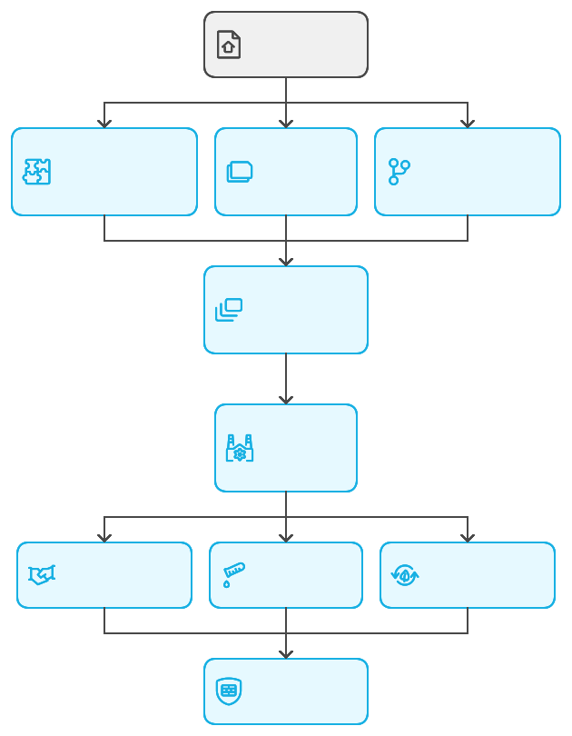

### Méthodologies de développement et Clean Architecture 🏗️

> ⚠️ Prenez bien connaissance de ce qui suit.
> ⛔ J'insiste sur ce point car c'est un sujet tr��s important.

La Clean Architecture intègre tout un écosystème de méthodologies complémentaires.
Elle représente une approche architecturale avancée qui nécessite une expertise approfondie et une maîtrise de multiples concepts.

> 🏗️ **Analogie avec la construction d'une maison familiale**
>
> Imaginez la construction d'une maison familiale confortable. Comme pour un tel projet, la Clean Architecture nécessite :
>
> - Un **bon architecte** (expertise en conception logicielle) qui sait :
>   - Dessiner des plans pratiques et fonctionnels (design patterns)
>   - Respecter les normes de construction (principes SOLID)
>   - Adapter la maison aux besoins de la famille (DDD)
>
> - Une **équipe de construction** fiable avec :
>   - Un maçon expérimenté (développeur senior)
>   - Un électricien qualifié (expert technique)
>   - Un chef de chantier organisé (architecte technique)
>
> - Une **préparation soignée** incluant :
>   - L'étude des besoins de la famille (analyse des besoins)
>   - Les plans de chaque pièce (conception par couche)
>   - Le planning des travaux (interaction entre couches)
>
> Sans ces éléments de base, comme pour une maison mal construite, le projet risque de :
> - Avoir des fissures dans les murs (bugs)
> - Être difficile à chauffer (performance)
> - Nécessiter des réparations constantes (maintenance)
> - Être inconfortable à vivre (dette technique)

Cela exige :
- 🎓 Une solide expérience en conception logicielle.
- 🧠 Une compréhension approfondie des design patterns.
- 🎯 Une maîtrise des principes SOLID et DDD (patterns tactiques).
- 🔮 Une capacité à anticiper les évolutions du système.
- 📊 Visualiser les interactions entre les couches et sous couches.

> 🚨  **ATTENTION** : Sans ces compétences, vous ne serez pas capable de distribuer les responsabilités par couche, imaginer leur interactions et la complexité de la conception.
> ⚠️ **Important** : Cette architecture n'est pas adaptée à tous les contextes ni à toutes les équipes.

Sa complexité initiale et sa courbe d'apprentissage importante nécessitent :
- 👥 Une équipe expérimentée
- 📚 Un investissement significatif en formation
- ✨ Un engagement fort dans la qualité du code
- 🎯 Une vision claire des bénéfices à long terme

#### Voici les différentes méthodologies qui sont en lien avec la Clean Architecture :

> 🏠 **Analogie avec la construction d'une maison familiale**
>
> Comme dans tout projet de construction, différentes méthodologies et expertises sont nécessaires :
>
> - **La phase de conception** 📋 est comme :
>   - Discuter avec la famille de leurs besoins (User Story Mapping)
>   - Dessiner les plans selon leur mode de vie (Domain Driven Design)
>   - Prévoir l'agencement des pièces (Event Modeling)
>   - Planifier les raccordements aux réseaux (API-First Design)
>
> - **La gestion du chantier** 📊 ressemble à :
>   - Travailler en binôme sur les tâches complexes (Pair Programming)
>   - Suivre des méthodes de construction éprouvées (Extreme Programming)
>   - Organiser le planning des artisans (Agile Scrum)
>   - Gérer les priorités et le flux de travail (Kanban)
>
> - **Les techniques de construction** 🏗️ sont comme :
>   - Respecter les normes de construction (Clean Architecture)
>   - Appliquer les règles de l'art (Principes SOLID)
>   - Séparer les circuits électriques et d'eau (CQRS Pattern)
>   - Construire par modules indépendants (Microservices)
>
> - **La sécurité et la qualité** 🔒 impliquent :
>   - Vérifier chaque étape de construction (DevOps)
>   - Tester les installations avant la pose (TDD)
>   - Installer des systèmes de sécurité (Security by Design)
>   - Contrôler la conformité (Validation système)
>
> Cette approche globale garantit une maison solide, sécurisée et adaptée aux besoins de ses habitants.

**Conception & Analyse**
- User Story Mapping : Technique visuelle pour organiser et prioriser les fonctionnalités d'un produit du point de vue utilisateur
- Domain Driven Design (DDD) : Approche de conception logicielle qui aligne l'architecture sur le modèle métier
- Event Modeling (BDD) : Méthode de modélisation qui capture le comportement du système à travers des événements métier
- API-First Design : Stratégie de développement qui priorise la conception de l'API avant l'implémentation

**Gestion de projet** 📊
- Pair Programming : Pratique de développement où deux développeurs travaillent en équipe sur un seul ordinateur
- Extreme Programming (XP) : Méthodologie agile focalisée sur les pratiques d'ingénierie logicielle et la qualité du code
- Agile Scrum - PUMA (Processus Unifié des Méthodes Agiles) : Framework agile itératif combinant les meilleures pratiques des méthodes agiles
- Kanban : Méthode de gestion visuelle du flux de travail pour optimiser la livraison continue
- Lean Management : Approche d'amélioration continue visant à éliminer le gaspillage et optimiser la valeur
- Project Management : Méthode de gestion de projet pour planifier, organiser et suivre les activités

**Architecture & Design** 🏛️
- ⭐ `Clean Architecture` ⭐ : Architecture en couches qui isole la logique métier des détails techniques
- Principes SOLID : Ensemble de cinq principes de conception orientée objet pour un code maintenable
- CQRS Pattern : Séparation des opérations de lecture et d'écriture pour une meilleure scalabilité
- Microservices : Architecture distribuée composée de services autonomes et spécialisés

**DevOps & Sécurité** 🔒
- DevOps : Intégration de la sécurité dans le cycle DevOps : Culture et pratiques unifiant le développement, les opérations et la sécurité
- Test Driven Development (TDD) : Approche de développement où les tests sont écrits avant le code
- Security by Design : Intégration de la sécurité dès la conception du système
- Validation système : Processus de vérification de la conformité du système aux exigences
- Retour d'expérience : Analyse post-mortem des incidents pour amélioration continue

**Qualité & Tests** ✅
- Automatisation des tests : Mise en place de tests automatisés pour garantir la qualité du code
- Intégration continue (CI) : Pratique d'intégration fréquente du code pour détecter les problèmes rapidement
- Déploiement continu (CD) : Automatisation du processus de déploiement pour des livraisons rapides et fiables

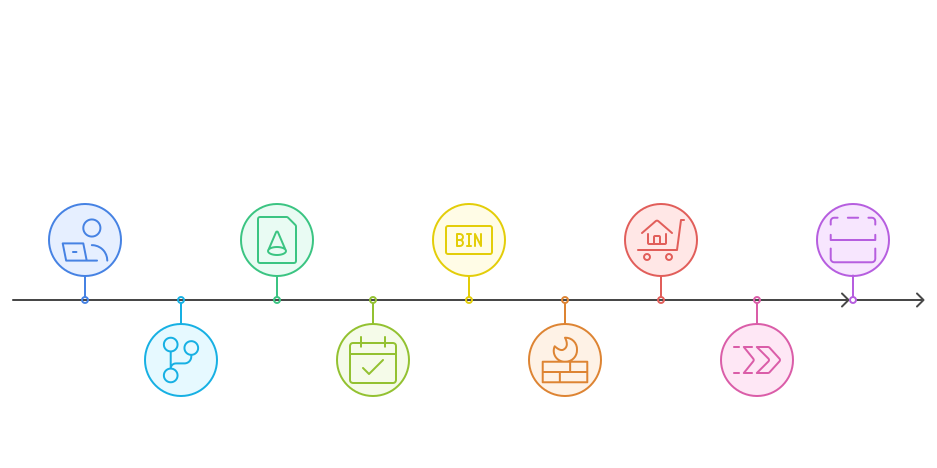

## Structure Simplifiée de la Clean Architecture 🎯

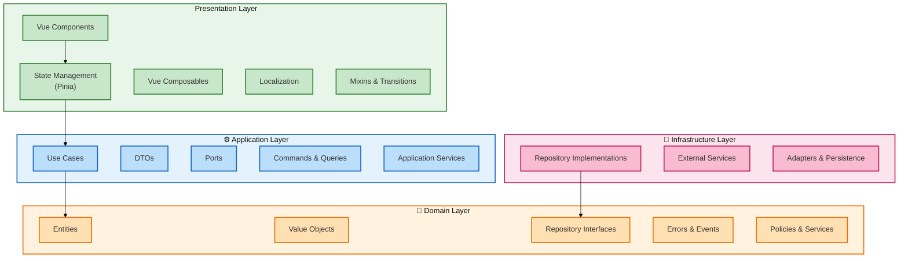

## Description des Couches 🏢

### 1. Couche Présentation (Presentation Layer) 🖥️

> 🏠 **Analogie avec une maison familiale : La décoration et l'aménagement intérieur**
>
> Imaginez la couche Présentation comme la décoration et l'aménagement intérieur de votre maison :
>
> - **Les composants Vue.js** sont comme les meubles et éléments décoratifs :
>   - Facilement remplaçables sans toucher aux murs (interchangeabilité)
>   - Adaptables selon les goûts et besoins (personnalisation)
>   - Organisés pour une utilisation pratique (ergonomie)
>
> - **Les Stores Pinia** ressemblent aux rangements et placards :
>   - Organisent et stockent ce dont on a besoin au quotidien (état)
>   - Accessibles depuis diff��rentes pièces (partage d'état)
>   - Gardent les choses ordonnées et faciles à trouver (gestion)
>
> - **Les Composables** sont comme les installations pratiques :
>   - Interrupteurs pour la lumière (interactions)
>   - Thermostats pour le chauffage (contrôles)
>   - Prises électriques (points d'accès)
>
> Cette couche est ce que les habitants voient et utilisent quotidiennement, mais elle repose entièrement sur les structures et systèmes sous-jacents de la maison.

- Dépendances Descendantes (Présentation → Application)
  - Les composants Vue.js interagissent avec la couche Application via les Use Cases
  - Les Stores Pinia coordonnent les appels aux services applicatifs
  - Les Composables encapsulent la logique d'interaction avec la couche Application
  - Flux typique : UI → Store → Application Layer → Domain Layer
- Dépendances Ascendantes (Application → Présentation)
  - La couche Application transmet des DTOs à la couche Présentation
  - Les événements applicatifs sont transmis vers la couche Présentation
  - Les erreurs et validations sont remontées vers l'interface utilisateur
  - Flux typique : Domain Layer → Application Layer → Store → UI

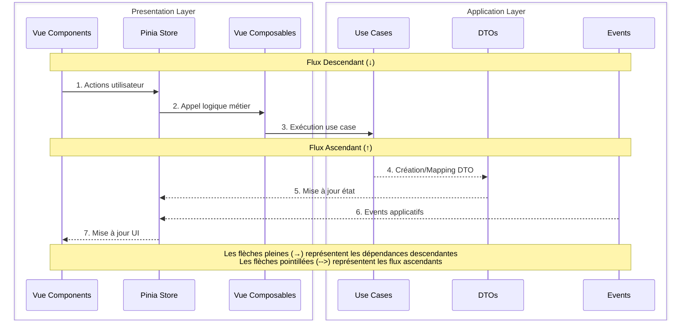

- Points Clés
  - La couche Présentation est interchangeable (Vue.js peut être remplacé par React, Angular, etc.)
  - Elle dépend uniquement de la couche Application, sans accès direct au Domain
  - Elle transforme les données pour l'affichage
  - Elle gère l'état local de l'interface utilisateur
  - Elle implémente la logique de présentation et les interactions utilisateur

### 2. Couche Application (Application Layer) ⚙️

> 🏠 **Analogie avec une maison familiale : Le chef de chantier et son équipe**
>
> Imaginez la couche Application comme l'équipe de coordination du chantier :
>
> - **Les Use Cases** sont comme les ordres de mission du chef de chantier :
>   - Coordonne les différents corps de métier (orchestration)
>   - S'assure que chaque tâche est réalisée dans le bon ordre (workflow)
>   - Vérifie que le travail correspond aux plans (validation)
>
> - **Les Services Applicatifs** ressemblent au contremaître :
>   - Traduit les plans techniques en instructions concrètes (transformation)
>   - Coordonne les équipes sur le terrain (coordination)
>   - Assure la communication entre l'architecte et les ouvriers (médiation)
>
> - **Les DTOs et Mappers** sont comme les plans de travail adaptés :
>   - Convertit les plans d'architecte en plans d'exécution (transformation)
>   - Adapte les informations pour chaque corps de métier (adaptation)
>   - Assure que tout le monde travaille avec les bonnes mesures (cohérence)
>
> Cette couche ne construit pas elle-même, mais s'assure que tout est construit correctement selon les plans de l'architecte.

La couche application agit comme un chef d'orchestre entre la couche présentation et la couche domaine.

- Dépendances Descendantes (Application → Domain)
  - Les Use Cases orchestrent les entités et services du domaine
  - Les Services applicatifs coordonnent la logique métier pure
  - Les DTOs sont transformés en entités du domaine via des mappers
  - Les commandes et requêtes CQRS interagissent avec le domaine
  - Flux typique : Use Case → Domain Entity → Domain Service

- Dépendances Ascendantes (Domain → Application)
  - Les entités du domaine sont mappées en DTOs pour la présentation
  - Les événements du domaine sont capturés et transformés en événements applicatifs
  - Les erreurs du domaine sont encapsulées et enrichies
  - Les règles métier sont validées et les résultats remontés
  - Flux typique : Domain Event → Application Event → DTO

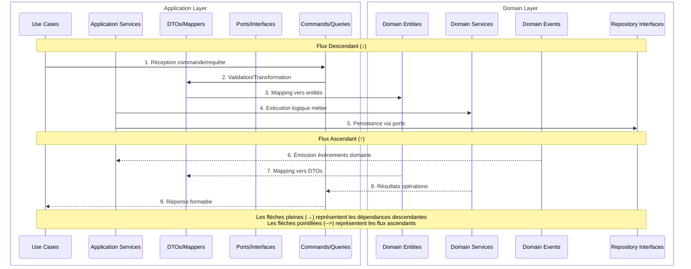

- Points Clés
  - La couche Application orchestre les interactions entre la Présentation et le Domain
  - Elle encapsule les cas d'utilisation de l'application via des Use Cases spécifiques
  - Elle maintient le Domain pur en gérant les transformations de données via les DTOs et Mappers
  - Elle implémente les patterns CQRS pour séparer les opérations de lecture (Queries) et d'écriture (Commands)
  - Elle gère la validation des données entrantes et la transformation des erreurs métier
  - Elle capture et transforme les événements du Domain en événements applicatifs
  - Elle assure l'indépendance du Domain via le principe d'inversion de dépendance (DIP)
  - Elle définit des ports (interfaces) pour les services externes et l'infrastructure
  - Elle ne contient aucune logique métier, uniquement de l'orchestration et de la coordination
  - Elle garantit la cohérence des données entre les couches via les DTOs et les Mappers

### 3. Couche Domaine (Domain Layer) 💎

> 🏠 **Analogie avec une maison familiale : Les plans d'architecte et les normes de construction**
>
> Imaginez la couche Domaine comme les fondations et les plans essentiels de la maison :
>
> - **Les Entités** sont comme les éléments structurels fondamentaux :
>   - Les murs porteurs qui soutiennent toute la maison (objets métier)
>   - Les fondations qui assurent la stabilité (règles invariantes)
>   - La charpente qui définit la forme (structure des données)
>
> - **Les Value Objects** ressemblent aux matériaux et mesures standardisés :
>   - Les dimensions normalisées des briques (données immuables)
>   - La qualité du béton pour les fondations (validations)
>   - Les normes d'isolation thermique (règles métier)
>
> - **Les Services du Domaine** sont comme les règles de construction :
>   - Le calcul de la charge supportée par les murs (logique métier)
>   - Les normes de sécurité incendie (règles critiques)
>   - Les standards d'accessibilité (contraintes métier)
>
> Cette couche représente l'essence même de la maison, ses règles fondamentales et sa structure, sans lesquelles rien ne peut tenir debout.

La couche Domain représente le cœur de l'application, contenant toute la logique métier et les règles de l'entreprise.
Cette couche est totalement indépendante et ne dépend d'aucune autre couche.

- Dépendances Descendantes
  - Le Domain n'a aucune dépendance descendante car c'est la couche la plus centrale
  - Il définit les interfaces (ports) que les autres couches doivent implémenter
  - Il contient les règles métier pures et les invariants du système
  - Il expose les contrats d'interface pour les repositories et services

- Dépendances Ascendantes
  - Les autres couches dépendent du Domain
  - L'Application Layer utilise les entités et services du Domain
  - L'Infrastructure implémente les interfaces définies par le Domain
  - Les événements du Domain sont propagés vers les couches supérieures

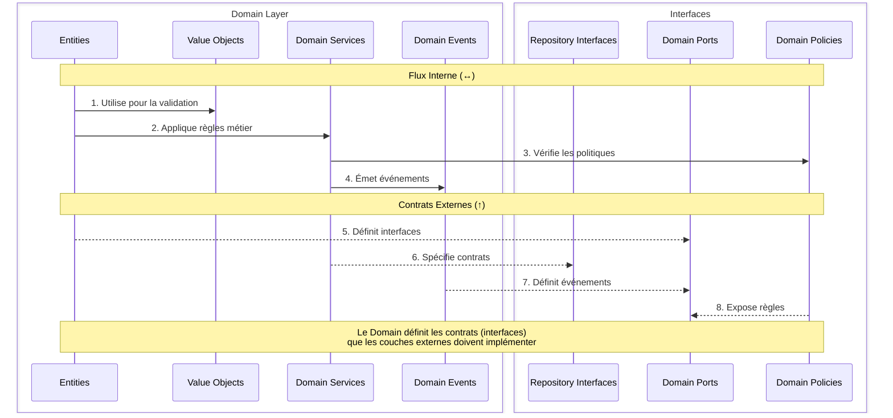

- Points Clés
  - Le Domain est le cœur de l'application, contenant toute la logique métier pure
  - Il est totalement indépendant des autres couches et frameworks
  - Il définit les entités, value objects et agrégats du système
  - Il encapsule les règles métier et les invariants du domaine
  - Il spécifie les interfaces (ports) pour les opérations externes
  - Il utilise le langage omniprésent (Ubiquitous Language) du métier
  - Il émet des événements domain pour notifier les changements d'état
  - Il applique les patterns tactiques du DDD (Domain-Driven Design)
  - Il garantit l'intégrité et la cohérence des données métier
  - Il est facilement testable car il ne dépend d'aucune infrastructure

### 4. Couche Infrastructure (Infrastructure Layer) 🔧

> 🏠 **Analogie avec une maison familiale : Les systèmes techniques et les réseaux**
>
> Imaginez la couche Infrastructure comme tous les systèmes techniques qui font fonctionner la maison :
>
> - **Les Repositories** sont comme les systèmes de rangement :
>   - Le garage qui stocke les véhicules (stockage des données)
>   - Les placards qui organisent les affaires (organisation)
>   - La cave qui archive les objets (persistance)
>
> - **Les Services Externes** ressemblent aux réseaux de la maison :
>   - L'installation électrique qui alimente tout (services essentiels)
>   - La plomberie qui distribue l'eau (flux de données)
>   - Le système de chauffage qui régule la température (services de support)
>
> - **Les Adaptateurs** sont comme les prises et connecteurs :
>   - Les prises électriques standardisées (interfaces standard)
>   - Les robinets et vannes (points d'accès)
>   - Les thermostats (contrôles)
>
> Cette couche fournit toute l'infrastructure technique nécessaire, mais peut être modernisée ou remplacée sans toucher à la structure de la maison.

La couche Infrastructure fournit les implémentations concrètes des interfaces définies par le Domain et l'Application.
Elle gère tous les détails techniques et les interactions avec les systèmes externes.

- Dépendances Descendantes (Infrastructure → Domain/Application)
  - Implémente les interfaces Repository définies par le Domain
  - Fournit les adaptateurs pour les services externes
  - Implémente les ports définis par l'Application
  - Gère la persistance et les transactions
  - Flux typique : Repository Implementation → Repository Interface

- Dépendances Ascendantes (Application/Domain → Infrastructure)
  - Aucune dépendance directe des couches supérieures
  - Communication uniquement via les interfaces (ports)
  - Injection des implémentations via l'IoC
  - Pattern Adapter pour les services externes

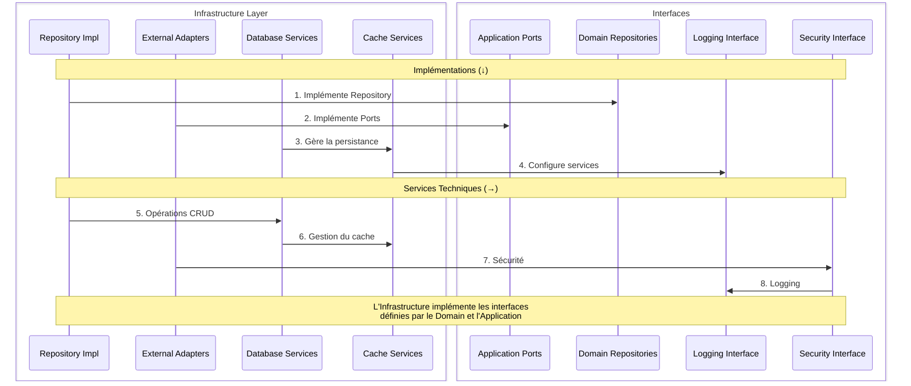

- Points Clés
  - Elle fournit les implémentations concrètes des interfaces du Domain
  - Elle isole les détails techniques du reste de l'application
  - Elle gère toutes les interactions avec les systèmes externes
  - Elle implémente les mécanismes de persistance et de cache
  - Elle configure les services techniques (logging, monitoring, sécurité)
  - Elle applique les patterns d'adaptation pour les services externes
  - Elle gère les transactions et la cohérence des données
  - Elle implémente les stratégies de résilience (retry, circuit breaker)
  - Elle s'occupe de la configuration et de l'initialisation des services
  - Elle est facilement remplaçable grâce au principe d'inversion de dépendance

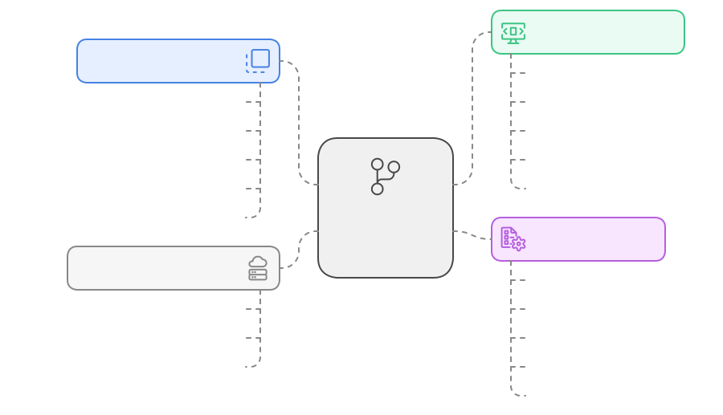

## Flux de Données et Dépendances 🔄

### Flux de Données

> 📚 Ce diagramme présente les flux de données entre les couches.

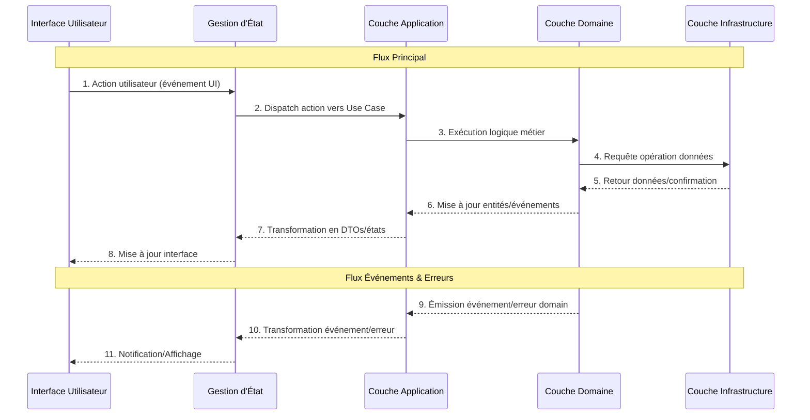

### Dépendances entre Couches

> 📚 Ce diagramme illustre les relations de dépendance entre les couches.

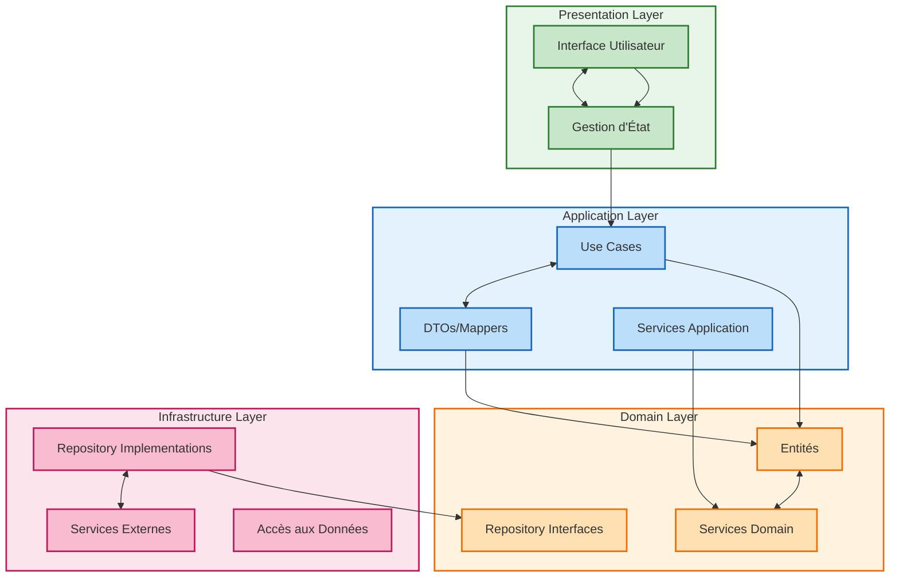

## Avantages ✅

En premier, la charge mentale.
En deuxième, pourvoir ce concentrer sur une petite portion sans s’inquiéter des effets de bord.
En troisième, moins de stress lors des déploiements.

1. **Maintenabilité** 🛠️
   - Code organisé et modulaire
   - Responsabilités bien définies
   - Facilité de modification

2. **Testabilité** 🧪
   - Tests unitaires simplifiés
   - Mocking facilité
   - Couverture optimale

3. **Évolutivité** 📈
   - Changements technologiques simples
   - Ajout de fonctionnalités facilité
   - Refactoring sécurisé

4. **Indépendance** 🔓
   - Framework comme détail
   - Logique métier protégée
   - Infrastructure flexible

## Inconvénients et Défis ⚠️

En premier, la résistance au changement et sortir de sa zone de confort.
En deuxième, la volonté de créer des application pérennes.
En troisième, la rigueur et la discipline.

1. **Complexité Initiale** 📚
   - Courbe d'apprentissage importante
   - Structure de projet plus élaborée
   - Nombre accru de fichiers et d'interfaces

2. **Surcharge de Développement** ⏳
   - Plus de code à écrire initialement
   - Création de nombreuses interfaces
   - Temps de développement initial plus long

3. **Risques de Sur-ingénierie** ⚖️
   - Tentation de créer trop d'abstractions
   - Complexité potentiellement inutile pour petits projets
   - Besoin d'équilibrer flexibilité et simplicité

4. **Défis d'Équipe** 👥
   - Nécessite une compréhension partagée
   - Formation des nouveaux développeurs
   - Discipline dans le respect de l'architecture

5. **Contraintes Techniques** 🔍
   - Overhead de performance potentiel
   - Mapping fréquent entre les couches
   - Gestion plus complexe de l'état

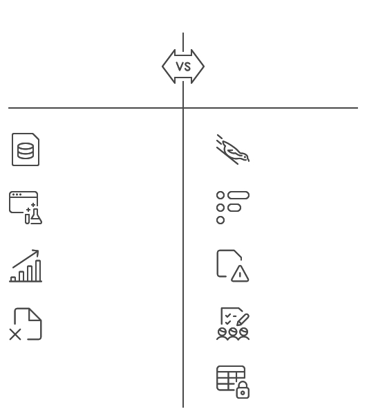

## Pour résumer 📝

La Clean Architecture offre une base solide pour développer des applications robustes, extensibles et maintenables.
La séparation des préoccupations garantit que chaque partie du code a une responsabilité unique et claire, facilitant ainsi le développement, les tests et la maintenance à long terme.

## Pour la suite 🔜

> 📚 Une documentation complète et détaillée sera bientôt disponible.

Cette documentation approfondie couvrira en détail chaque aspect de l'architecture présentée ci-dessus, avec :
- Des exemples concrets d'implémentation
- Des guides pratiques étape par étape
- Des bonnes pratiques et recommandations
- Des patterns et anti-patterns
- Des cas d'usage réels

Restez à l'écoute pour découvrir comment mettre en œuvre efficacement cette architecture dans vos projets.

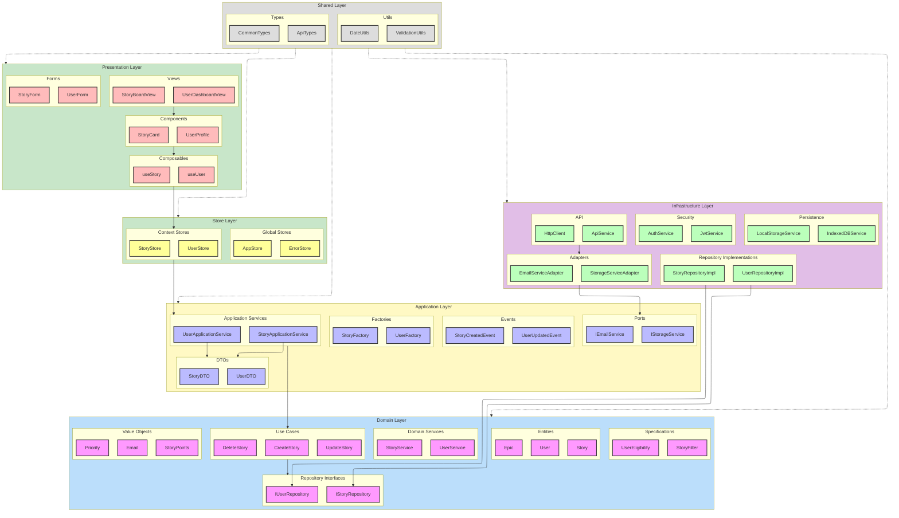
