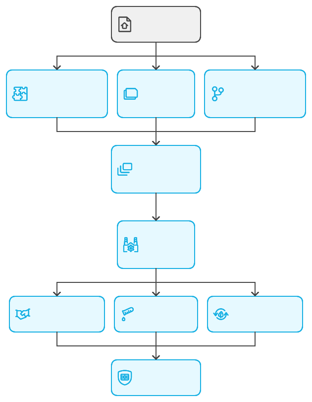
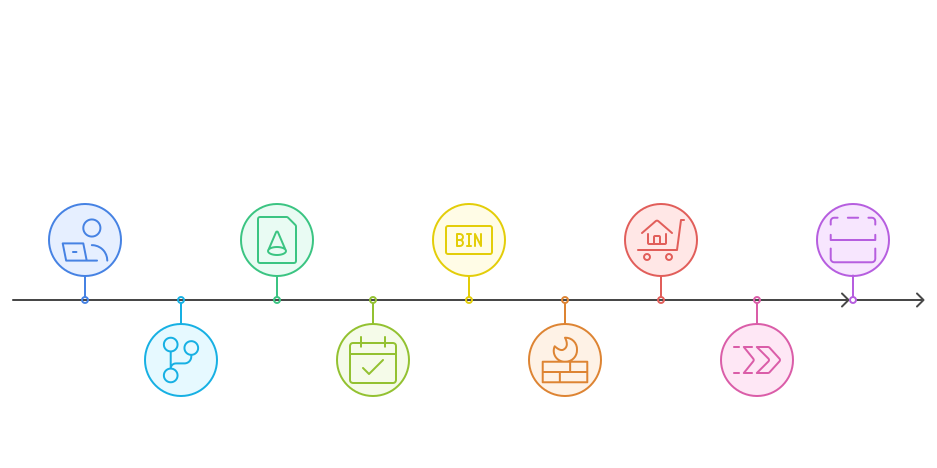
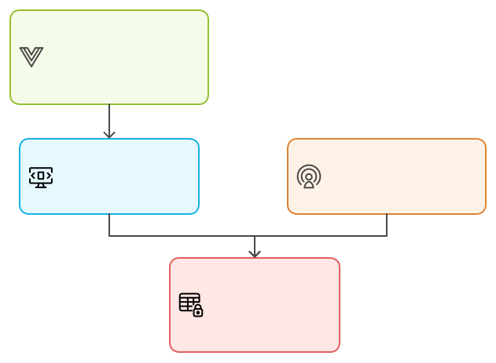
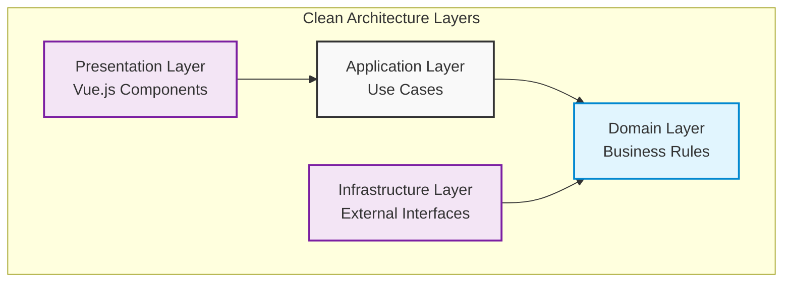
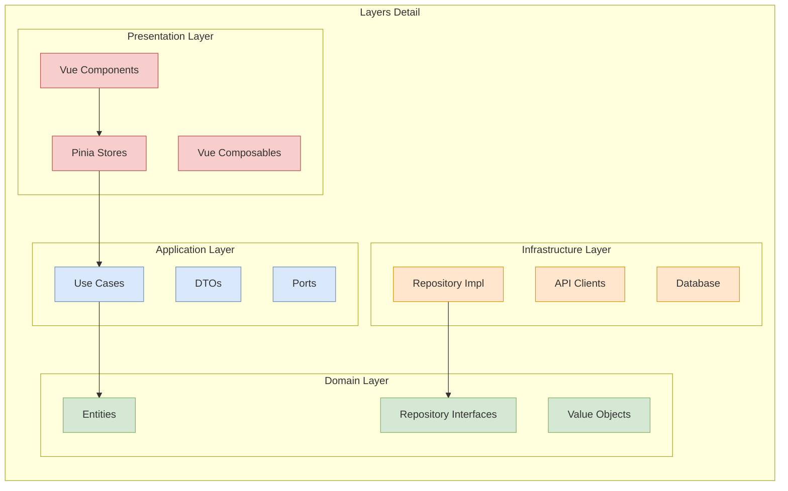
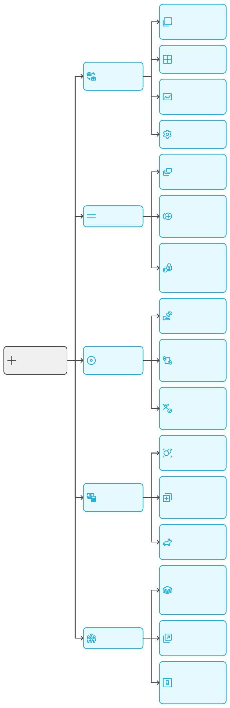
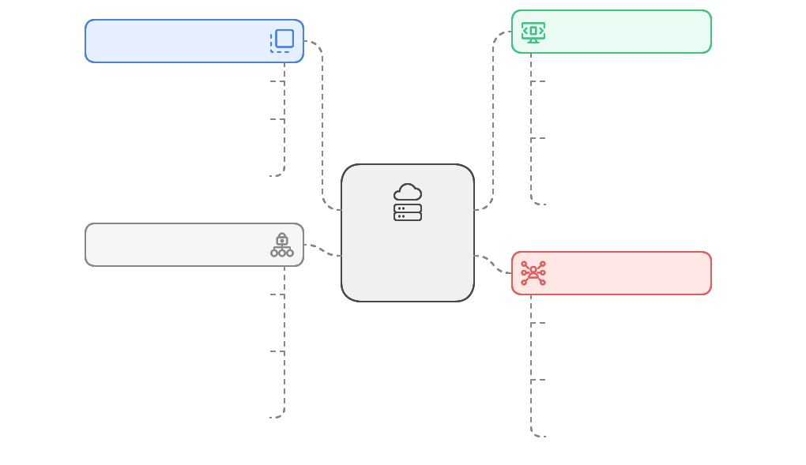
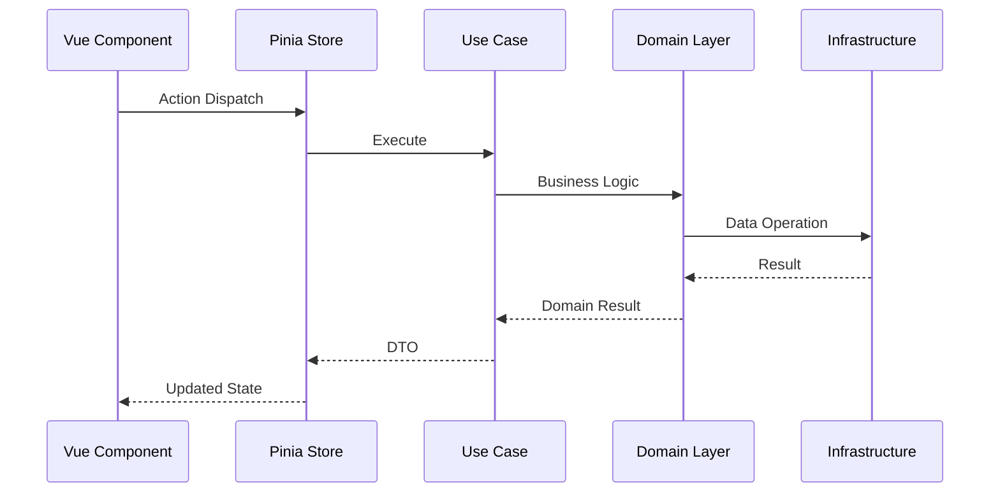
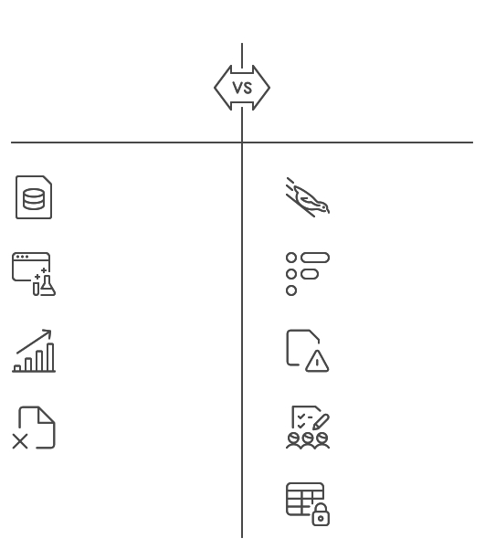
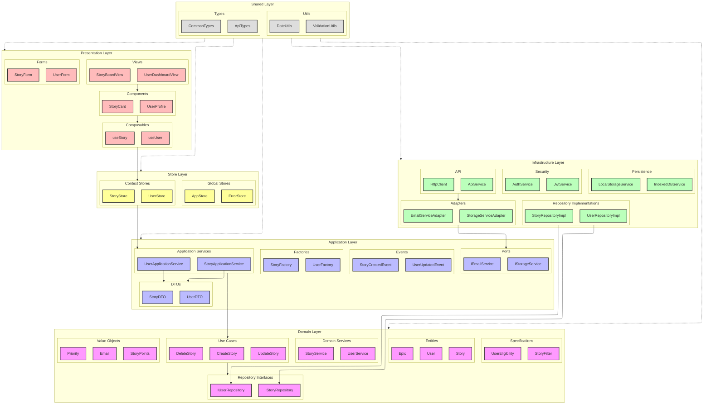

# Clean Architecture avec Vue.js et TypeScript 🏗️

## Introduction

La `Clean Architecture` 🏛️ est née de la volonté d'appliquer quatre principes fondamentaux du développement logiciel : la séparation des préoccupations (SoC) 🔄, les principes SOLID 🛠️, l'indépendance vis-à-vis des frameworks 🚀, et le Domain-Driven Design (DDD) 🎯.
Elle vise également à répondre aux défis de flexibilité et de maintenabilité 🔧, en permettant aux applications de s'adapter aux évolutions technologiques sans impacter la logique métier.
Cette approche architecturale structure le code en couches distinctes, chacune ayant une responsabilité unique et clairement définie 🎯.
En plaçant la logique métier au centre et en s'appuyant sur les concepts du DDD pour modéliser le domaine (contexte), elle facilite la collaboration interdisciplinaire 🤝, favorise la testabilité ✅, et optimise la réutilisabilité des composants ♻️.
En limitant les effets de bord et la dette technique, la Clean Architecture crée des applications robustes 💪, testables 🧪, et évolutives 📈, prêtes à répondre aux besoins spécifiques et complexes de chaque projet.

Bien qu'il n'existe pas de modèle unique, la `Clean Architecture` propose des principes adaptables selon la complexité et les besoins spécifiques de chaque projet.

La `Clean Architecture` s'appuie sur quatre principes fondamentaux :
1. **Séparation des Préoccupations** (SoC)
2. **Principes SOLID**
3. **Indépendance Technologique**
4. **Domain-Driven Design** (DDD) - Partiellement

### Méthodologies de développement et Clean Architecture 🏗️

> ⚠️ Prenez bien connaissance de ce qui suit.
> ⛔ J'insiste sur ce point car c'est un sujet très important.

La Clean Architecture intègre tout un écosystème de méthodologies complémentaires.
Elle représente une approche architecturale avancée qui nécessite une expertise approfondie et une maîtrise de multiples concepts.
Cela exige :
- 🎓 Une solide expérience en conception logicielle.
- 🧠 Une compréhension approfondie des design patterns.
- 🎯 Une maîtrise des principes SOLID et DDD (patterns tactiques).
- 🔮 Une capacité à anticiper les évolutions du système.
- 📊 Visualiser les interactions entre les couches et sous couches.

> 🚨  **ATTENTION** : Sans ces compétences, vous ne serez pas capable de distribuer les responsabilités par couche, imaginer leur interactions et la complexité de la conception.

⚠️ **Important** : Cette architecture n'est pas adaptée à tous les contextes ni à toutes les équipes.

Sa complexité initiale et sa courbe d'apprentissage importante nécessitent :
- 👥 Une équipe expérimentée
- 📚 Un investissement significatif en formation
- ✨ Un engagement fort dans la qualité du code
- 🎯 Une vision claire des bénéfices à long terme

#### Voici les différentes méthodologies qui sont en lien avec la Clean Architecture :

**Conception & Analyse** 📋
- User Story Mapping
- Domain Driven Design (DDD)
- Event Modeling (BDD)
- API-First Design

**Architecture & Design** 🏛️
- ⭐ `Clean Architecture` ⭐ <====================== Nous sommes là
- Principes SOLID
- CQRS Pattern
- Microservices

**DevOps & Sécurité** 🔒
- DevOps : Intégration de la sécurité dans le cycle DevOps
- Test Driven Development (TDD)
- Security by Design
- Validation système
- Retour d'expérience

**Qualité & Tests** ✅
- Automatisation des tests
- Intégration continue (CI)
- Déploiement continu (CD)

## Architecture Globale de la Clean Architecture 🏢

## Principes Fondamentaux 🎯

### 1. Indépendance des Frameworks 🔄
- Vue.js et autres outils sont des détails d'implémentation
- La logique métier reste stable et indépendante
- Facilite les migrations technologiques

### 2. Testabilité 🧪
- Tests unitaires sans dépendances externes
- Mocking simplifié grâce aux interfaces
- Couverture de code optimale

### 3. Indépendance de l'UI 🎨
- Interface utilisateur interchangeable
- Séparation claire présentation/logique
- Support multiple interfaces (web, mobile, CLI)

## Structure des Couches 📚

### Séparation des Préoccupations (SoC) 🔄

[📦 Vous trouverez de plus amples explications ici : 🚀 **Cours sur les Principes SOLID en JavaScript/TypeScript** 🎯](https://www.linkedin.com/pulse/cours-sur-les-principes-solid-en-javascripttypescript-giacomel--r4jce/)

La SoC est un principe fondamental qui s'aligne parfaitement avec les principes SOLID.

#### **Distribution des Responsabilités via SOLID**

**Single Responsibility (S)** 📌
Chaque couche a une responsabilité unique et clairement définie :
- 🎨 Présentation : Interface utilisateur uniquement
- ⚙️ Application : Orchestration des cas d'utilisation
- 💎 Domaine : Règles métier et entités
- 🔧 Infrastructure : Détails techniques et persistance

**Open/Closed (O)** 🔄
Les couches sont :
- Ouvertes à l'extension (nouveaux cas d'utilisation, nouvelles entités)
- Fermées à la modification (les interfaces restent stables)
- Permet d'ajouter des fonctionnalités sans modifier le code existant

**Liskov Substitution (L)** 🔄
- Les implémentations concrètes peuvent être substituées :
- Repositories concrets ⟺ Interfaces de repository
- Services d'infrastructure ⟺ Ports applicatifs
- Facilite les tests et le changement d'implémentations

**Interface Segregation (I)** 🔌
- Interfaces spécifiques pour chaque besoin :
- Ports dédiés par cas d'utilisation
- Repositories spécialisés par agrégat
- DTOs spécifiques aux besoins

**Dependency Inversion (D)** ⬆️
- Les dépendances pointent vers l'intérieur :
- Infrastructure → Application → Domaine
- Les couches internes définissent les interfaces
- Les couches externes implémentent ces interfaces

#### **Bénéfices pour l'Architecture**
- **Découplage** : Les couches sont indépendantes et peuvent évoluer séparément
- **Testabilité** : Chaque couche peut être testée isolément
- **Maintenabilité** : Les changements sont localisés et prévisibles
- **Évolutivité** : Nouvelles fonctionnalités sans impact sur l'existant

## Description des Couches 🏢

### 1. Couche Présentation (Presentation Layer) 🖥️
- **Composants Vue.js**
  - Interface utilisateur
  - Gestion des événements
  - Rendu des données
- **Stores Pinia**
  - État de l'application
  - Actions et mutations
  - Persistance locale
- **Composables Vue**
  - Logique réutilisable
  - Gestion des effets
  - Abstraction des comportements

### 2. Couche Application (Application Layer) ⚙️
- **Use Cases**
  - Orchestration des opérations
  - Validation des entrées
  - Gestion des erreurs
- **DTOs**
  - Transfert de données
  - Validation des structures
  - Mapping des données
- **Ports**
  - Interfaces des services
  - Contrats d'intégration
  - Points d'extension

### 3. Couche Domaine (Domain Layer) 💎
- **Entités**
  - Objets métier
  - Règles de validation
  - Comportements métier
- **Value Objects**
  - Objets immuables
  - Validation intrinsèque
  - Encapsulation des valeurs
- **Interfaces Repository**
  - Contrats de persistance
  - Opérations de données
  - Abstraction du stockage

### 4. Couche Infrastructure (Infrastructure Layer) 🔧
- **Implémentations Repository**
  - Persistance des données
  - Cache et optimisation
  - Gestion des transactions
- **Services Externes**
  - Intégrations API
  - Services cloud
  - Systèmes externes

## Flux de Données 🔄

## Avantages ✅

1. **Maintenabilité** 🛠️
   - Code organisé et modulaire
   - Responsabilités bien définies
   - Facilité de modification

2. **Testabilité** 🧪
   - Tests unitaires simplifiés
   - Mocking facilité
   - Couverture optimale

3. **Évolutivité** 📈
   - Changements technologiques simples
   - Ajout de fonctionnalités facilité
   - Refactoring sécurisé

4. **Indépendance** 🔓
   - Framework comme détail
   - Logique métier protégée
   - Infrastructure flexible

## Inconvénients et Défis ⚠️

1. **Complexité Initiale** 📚
   - Courbe d'apprentissage importante
   - Structure de projet plus élaborée
   - Nombre accru de fichiers et d'interfaces

2. **Surcharge de Développement** ⏳
   - Plus de code à écrire initialement
   - Création de nombreuses interfaces
   - Temps de développement initial plus long

3. **Risques de Sur-ingénierie** ⚖️
   - Tentation de créer trop d'abstractions
   - Complexité potentiellement inutile pour petits projets
   - Besoin d'équilibrer flexibilité et simplicité

4. **Défis d'Équipe** 👥
   - Nécessite une compréhension partagée
   - Formation des nouveaux développeurs
   - Discipline dans le respect de l'architecture

5. **Contraintes Techniques** 🔍
   - Overhead de performance potentiel
   - Mapping fréquent entre les couches
   - Gestion plus complexe de l'état

## Pour résumer 📝

La Clean Architecture, combinée avec Vue.js et TypeScript, offre une base solide pour développer des applications robustes et maintenables. La séparation des préoccupations garantit que chaque partie du code a une responsabilité unique et claire, facilitant ainsi le développement, les tests et la maintenance à long terme.

## Pour la suite 🔜

Nous allons nous préoccuper pour la suite de cette architecture :

