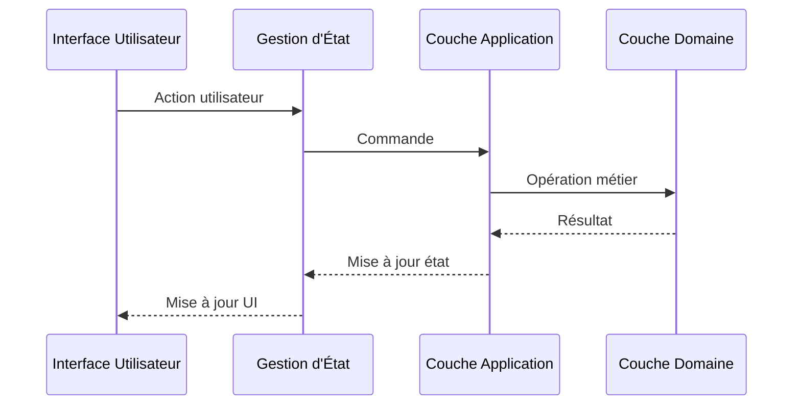

# Structure des Couches de la Clean Architecture 🏗️

## Vue d'Ensemble

La Clean Architecture organise le code en couches concentriques, chacune ayant des responsabilités spécifiques et des règles de dépendance strictes. Le principe fondamental est que les dépendances ne peuvent pointer que vers l'intérieur, vers les couches plus centrales.

## Les Couches Principales

### 1. Domain Layer (Cœur) 🎯

Le cœur de l'application, contenant la logique métier pure.

#### Composants
- **Entités** : Objets métier centraux
- **Value Objects** : Objets immuables représentant des concepts métier
- **Agrégats** : Groupes d'entités cohérents
- **Domain Events** : Événements métier
- **Domain Services** : Services spécifiques au domaine

#### Caractéristiques
- Aucune dépendance externe
- Code métier pur
- Règles de gestion centralisées
- Modèles riches en comportement

### 2. Application Layer (Use Cases) ⚙️

Orchestration des cas d'utilisation de l'application.

#### Composants
- **Use Cases** : Implémentation des cas d'utilisation
- **DTOs** : Objets de transfert de données
- **Interfaces** : Ports pour les services externes
- **Event Handlers** : Gestionnaires d'événements
- **Application Services** : Services d'orchestration

#### Responsabilités
- Orchestration du flux de données
- Validation des entrées
- Gestion des transactions
- Émission d'événements

### 3. Infrastructure Layer 🔧

Implémentation des détails techniques et interactions externes.

#### Composants
- **Repositories** : Implémentation de la persistance
- **External Services** : Services tiers
- **Frameworks** : Intégration technique
- **Database** : Accès aux données
- **Security** : Implémentation de la sécurité

#### Caractéristiques
- Détails techniques
- Intégrations externes
- Persistence des données
- Configuration système

### 4. Presentation Layer 🖥️

Interface avec les utilisateurs et systèmes externes.

#### Composants
- **Vue Components** : Composants d'interface
- **View Models** : Modèles de vue
- **Store** : Gestion d'état (Pinia)
- **Composables** : Logique réutilisable
- **Routes** : Navigation

#### Responsabilités
- Interface utilisateur
- Gestion d'état
- Navigation
- Internationalisation

## Flux de Données 🔄

## Règles de Dépendance 📋

1. **Règle de Dépendance vers l'Intérieur**
   - Les couches externes dépendent des couches internes
   - Jamais l'inverse

2. **Principe d'Inversion de Dépendance**
   - Utilisation d'interfaces pour le découplage
   - Les détails dépendent des abstractions

3. **Isolation des Couches**
   - Communication via des interfaces
   - DTOs pour le transfert de données
   - Mappers pour la conversion

## Communication Entre Couches 🔌

### 1. Entrée de Données
- UI → Store → Application → Domain
- Validation à chaque niveau
- Transformation progressive des données

### 2. Sortie de Données
- Domain → Application → Store → UI
- Mapping vers DTOs
- Adaptation pour l'affichage

## Bonnes Pratiques 📝

1. **Séparation Claire**
   - Éviter les dépendances circulaires
   - Respecter les responsabilités de chaque couche
   - Maintenir la cohésion

2. **Tests par Couche**
   - Tests unitaires du domaine
   - Tests d'intégration des use cases
   - Tests end-to-end de la présentation

3. **Documentation**
   - Interfaces clairement documentées
   - Flux de données documentés
   - Décisions d'architecture tracées

## Pour Aller Plus Loin 📚

- [Core Concepts](./01-core-concepts.md) - Concepts fondamentaux
- [Implementation Principles](./03-principles.md) - Principes d'implémentation
