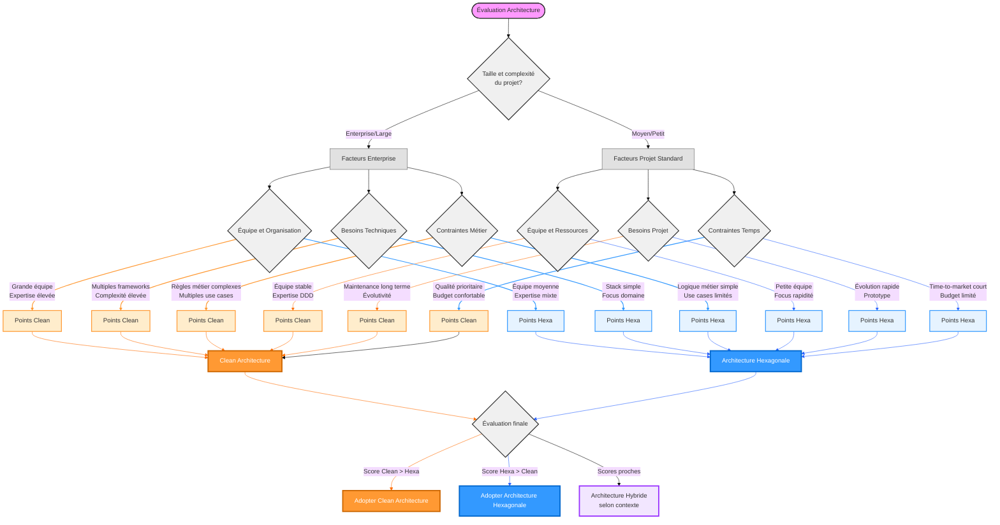

# 🔄 Clean Architecture vs Architecture Hexagonale

Ce document présente une comparaison détaillée entre la Clean Architecture et l'Architecture Hexagonale (Ports & Adapters).

## 📊 Tableau Comparatif Détaillé

| Aspect | Clean Architecture | Architecture Hexagonale |
|--------|-------------------|------------------------|
| **Origine** | Proposée par Robert C. Martin (2012) | Proposée par Alistair Cockburn (2005) |
| **Objectif Principal** | Séparation des préoccupations et indépendance des frameworks | Isolation du domaine métier et inversions de dépendances |
| **Structure** | Couches concentriques (Entities, Use Cases, Interface Adapters, Frameworks) | Structure hexagonale avec le domaine au centre |
| **Règle de Dépendance** | Les dépendances pointent vers l'intérieur uniquement | Les dépendances pointent vers le domaine |
| **Domaine Métier** | Au centre (Entities) avec règles métier pures | Au centre de l'hexagone avec logique métier |
| **Adaptateurs** | Interface Adapters (Presenters, Controllers) | Ports (Primary/Secondary) et Adapters |
| **Frameworks** | Couche la plus externe, considérés comme des détails | Adaptateurs externes, plugins interchangeables |
| **Tests** | Facilités par l'architecture en oignon | Facilités par les ports et adaptateurs |
| **Complexité** | Plus complexe, avec plus de couches distinctes | Plus simple, focus sur ports et adaptateurs |
| **Flexibilité** | Très flexible, mais avec plus de boilerplate | Flexible avec moins de structure imposée |
| **Use Cases** | Couche dédiée pour les cas d'utilisation | Intégrés dans le domaine ou les ports |
| **Interfaces** | Multiples niveaux d'abstraction | Principalement au niveau des ports |
| **Maintenance** | Plus structurée mais plus complexe | Plus simple mais moins guidée |
| **Documentation** | Abondante et détaillée | Moins de ressources disponibles |
| **Adoption** | Large adoption dans les grands projets | Populaire pour projets moyens |
| **DDD Compatibility** | Excellente intégration avec DDD | Bonne intégration avec DDD |
| **SOLID** | Application complète des principes | Focus sur Dependency Inversion |
| **Scalabilité** | Très scalable pour grands projets | Scalable mais moins structurée |
| **Learning Curve** | Courbe d'apprentissage plus raide | Plus facile à comprendre |
| **Team Size** | Idéale pour grandes équipes | Adaptée aux équipes moyennes |

## 🎯 Guide Décisionnel



### 📖 Guide d'Utilisation du Diagramme

1. **Point de Départ**
   - Commencez par évaluer la taille de votre projet

2. **Critères de Décision**
   - Suivez les questions en fonction de vos réponses
   - Chaque chemin mène à une recommandation

3. **Facteurs Clés**
   - Taille du projet
   - Expérience de l'équipe
   - Focus principal (domaine vs technique)
   - Besoins en documentation
   - Flexibilité requise
   - Complexité du projet

4. **Résultat**
   - Le chemin suivi vous mènera vers l'architecture la plus adaptée
   - Clean Architecture (orange)
   - Architecture Hexagonale (bleu)

## 🔧 Caractéristiques Techniques Détaillées

### 🏗️ Clean Architecture

1. **Structure en Couches**
   - Domain Layer (Entities, Value Objects)
   - Application Layer (Use Cases, DTOs)
   - Interface Adapters Layer
   - Frameworks & Drivers Layer

2. **Patterns Utilisés**
   - Repository Pattern
   - Factory Pattern
   - Strategy Pattern
   - CQRS (optionnel)
   - Observer Pattern

3. **Principes SOLID**
   - Single Responsibility Principle
   - Open/Closed Principle
   - Liskov Substitution Principle
   - Interface Segregation Principle
   - Dependency Inversion Principle

### 🔲 Architecture Hexagonale

1. **Structure**
   - Core Domain (centre)
   - Ports (interfaces)
   - Adapters (implémentations)

2. **Patterns Utilisés**
   - Adapter Pattern
   - Port Pattern
   - Dependency Injection
   - Observer Pattern

3. **Principes**
   - Dependency Inversion
   - Interface Segregation
   - Ports and Adapters Pattern

## 💻 Implémentation Technique

### 🧱 Clean Architecture

```typescript
// Domain Layer
export class User {
  constructor(
    public readonly id: string,
    public readonly email: string
  ) {}
}

// Application Layer
export interface UserRepository {
  save(user: User): Promise<void>;
}

export class CreateUserUseCase {
  constructor(private userRepo: UserRepository) {}

  async execute(email: string): Promise<User> {
    const user = new User(generateId(), email);
    await this.userRepo.save(user);
    return user;
  }
}

// Interface Adapters Layer
export class UserController {
  constructor(private createUser: CreateUserUseCase) {}

  async handleCreateUser(req: Request): Promise<Response> {
    const user = await this.createUser.execute(req.body.email);
    return { status: 201, body: user };
  }
}

// Infrastructure Layer
export class UserRepositoryImpl implements UserRepository {
  async save(user: User): Promise<void> {
    // Implémentation spécifique
  }
}
```

### 🎨 Architecture Hexagonale

```typescript
// Domain
export class User {
  constructor(
    public readonly id: string,
    public readonly email: string
  ) {}
}

// Ports
export interface UserPort {
  createUser(email: string): Promise<User>;
}

// Primary Adapter (API)
export class UserApiAdapter implements UserPort {
  constructor(private domain: UserPort) {}

  async createUser(email: string): Promise<User> {
    return this.domain.createUser(email);
  }
}

// Secondary Adapter (Database)
export class UserRepositoryAdapter implements UserPort {
  async createUser(email: string): Promise<User> {
    const user = new User(generateId(), email);
    // Logique de persistance
    return user;
  }
}
```

## 🤔 Critères de Choix

### ✅ Choisir Clean Architecture si :

1. **Projet**
   - Grande envergure
   - Complexité élevée
   - Long terme
   - Équipe importante

2. **Besoins**
   - Structure très détaillée
   - Guidelines précises
   - Documentation extensive
   - Scalabilité importante

3. **Équipe**
   - Expérimentée en architecture
   - Familière avec SOLID/DDD
   - Besoin de standards stricts

### ✅ Choisir Architecture Hexagonale si :

1. **Projet**
   - Taille moyenne
   - Complexité modérée
   - Évolution progressive
   - Équipe moyenne

2. **Besoins**
   - Structure flexible
   - Focus sur le domaine
   - Simplicité relative
   - Adaptabilité rapide

3. **Équipe**
   - Expérience moyenne
   - Focus sur la logique métier
   - Autonomie importante

## 🎭 Conclusion

Les deux architectures partagent des principes fondamentaux similaires mais diffèrent dans leur approche et leur niveau de détail. Le choix dépendra principalement :

- De la taille et complexité du projet
- De l'expérience de l'équipe
- Des besoins en matière de structure
- Des objectifs de maintenance à long terme
- De l'importance de la documentation
- De la volonté d'adopter le DDD

Dans les deux cas, ces architectures favorisent :
- La maintenabilité
- La testabilité
- L'évolutivité
- L'indépendance technique
- La clarté du code

Le choix final devrait être basé sur une évaluation objective des besoins spécifiques du projet plutôt que sur des préférences personnelles.


