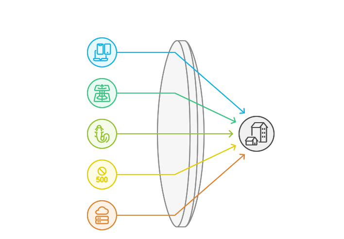

# Principes Fondamentaux de Clean Architecture 🏛️

## Pourquoi une Clean Architecture ? 🌟

La Clean Architecture émerge comme une réponse aux défis croissants de la complexité logicielle moderne.
Elle s'appuie sur des méthodologies éprouvées telles que le Domain-Driven Design (DDD), le User Story Mapping, le Behavior-Driven Development (BDD), et le Test-Driven Development (TDD) pour définir clairement les besoins d'une application.
Voici pourquoi elle est essentielle :

1. **Gestion de la Complexité** 🧩
   - Les applications modernes sont de plus en plus complexes. La Clean Architecture offre une structure claire qui aide à gérer cette complexité en séparant les préoccupations et en définissant des responsabilités distinctes pour chaque couche.

2. **Réduction de la Charge Mentale** 🧠
   - En structurant le code de manière modulaire et en définissant des responsabilités claires, la Clean Architecture réduit la charge mentale des développeurs. Cela permet de se concentrer sur des parties spécifiques du système sans être submergé par l'ensemble du projet.

3. **Alignement avec les Principes de Clean Code** 🧼
   - En intégrant des principes tels que KISS (Keep It Simple, Stupid), DRY (Don't Repeat Yourself), SOLID, et SoC (Separation of Concerns), la Clean Architecture favorise un code propre, maintenable et évolutif.

4. **Flexibilité et Adaptabilité** 🔄
   - Grâce à sa structure modulaire, la Clean Architecture permet de modifier ou de remplacer des composants sans affecter l'ensemble du système, facilitant ainsi l'adaptation aux nouvelles exigences et technologies.

5. **Amélioration de la Collaboration** 🤝
   - En utilisant des méthodologies comme le User Story Mapping et le DDD, elle facilite la communication entre les équipes techniques et non techniques, assurant que le développement reste aligné sur les besoins métier.

6. **Testabilité Accrue** 🧪
   - La séparation des préoccupations permet de tester chaque composant de manière isolée, ce qui simplifie la mise en place de tests unitaires et d'intégration, garantissant ainsi la robustesse du système.

7. **Durabilité et Pérennité** 🏗️
   - En plaçant la logique métier au centre et en isolant les détails d'implémentation, la Clean Architecture assure que le code reste pertinent et facile à maintenir à long terme.

8. **Commits Git Plus Spécifiques** 📝
   - Grâce à la séparation des préoccupations, les commits Git deviennent plus spécifiques et ciblés, facilitant le suivi des modifications et la gestion des versions.

En somme, la Clean Architecture n'est pas seulement une méthode de structuration du code, mais une philosophie qui guide le développement vers des solutions durables, flexibles et centrées sur les besoins réels des utilisateurs.

## Comment mettre en place une Clean Architecture ? 🛠️

Mettre en place une Clean Architecture nécessite une compréhension claire des principes fondamentaux et une planification rigoureuse. Voici les étapes clés pour réussir cette implémentation :

1. **Comprendre les Concepts de Base** 📚
   - Familiarisez-vous avec les principes SOLID, la séparation des préoccupations (SoC), le Domain-Driven Design (DDD) et les Designs Patterns. Ces concepts sont essentiels pour structurer votre application de manière modulaire et maintenable.

2. **Définir les Couches de l'Architecture** 🏗️
   > Pour une description détaillée des couches de l'architecture, consultez la [section dédiée dans overview.md](./01-overview.md#description-des-couches-).
   - Chaque couche a des responsabilités distinctes et bien définies
   - L'architecture suit le principe de dépendance vers l'intérieur
   - Les interfaces assurent le découplage entre les couches

3. **Utiliser des Interfaces pour l'Abstraction** 🔌
   - Implémentez des interfaces pour découpler les composants et faciliter les tests. Cela permet de remplacer facilement les implémentations sans affecter le reste du système.

4. **Adopter une Approche Modulaire** 🧩
   - Organisez votre code en modules indépendants qui peuvent être développés, testés et déployés séparément. Cela améliore la flexibilité et la réutilisabilité du code.

5. **Intégrer les Tests dès le Début** 🧪
   - Établissez une stratégie de test solide dès le début du projet. Utilisez des tests unitaires pour valider la logique métier et des tests d'intégration pour vérifier l'interaction entre les composants.

6. **Documenter et Communiquer** 📝
   - Maintenez une documentation claire et à jour de l'architecture et des décisions de conception. Cela facilite la collaboration et l'onboarding des nouveaux membres de l'équipe.

7. **Évaluer et Adapter** 🔄
   - Évaluez régulièrement l'architecture en fonction des besoins changeants du projet. Soyez prêt à adapter votre approche pour intégrer de nouvelles technologies ou répondre à de nouvelles exigences.

En suivant ces étapes, vous pouvez mettre en place une Clean Architecture qui non seulement répond aux besoins actuels de votre projet, mais qui est également prête à évoluer avec lui.

## Règles de Dépendance 📋

1. **Règle de Dépendance Entrante ⬅️**
   - **Principe** : Les dépendances doivent toujours pointer vers l'intérieur du système, c'est-à-dire que les couches externes (comme l'interface utilisateur ou l'infrastructure) dépendent des couches internes (comme le domaine).
   - **Importance** : Cela garantit que les détails d'implémentation ne contaminent pas la logique métier, permettant ainsi de maintenir l'intégrité et la stabilité du domaine.
   - **Application** : Utilisez des interfaces pour définir les contrats entre les couches. Les implémentations concrètes des services externes ou des interfaces utilisateur doivent se conformer à ces interfaces définies par les couches internes.

2. **Inversion de Dépendance 🔄**
   - **Principe** : Les modules de haut niveau ne doivent pas dépendre des modules de bas niveau. Les deux doivent dépendre d'abstractions (interfaces). Les détails doivent dépendre des abstractions, et non l'inverse.
   - **Importance** : Cela permet de découpler les composants du système, facilitant ainsi le remplacement ou la modification des implémentations sans affecter le reste du système.
   - **Application** : Créez des interfaces pour les services et les composants critiques, et injectez ces interfaces dans les modules qui en ont besoin. Utilisez des frameworks d'injection de dépendances pour gérer les relations entre les composants.

3. **Communication Entre Couches 🔁**
   - **Principe** : Les couches doivent communiquer entre elles via des objets de transfert de données (DTOs) et des événements. Cela permet de maintenir une séparation claire entre les préoccupations de chaque couche.
   - **Importance** : En utilisant des DTOs, vous pouvez contrôler les données qui traversent les couches, assurant ainsi que chaque couche ne reçoit que les informations dont elle a besoin. Les événements permettent une communication asynchrone et découpée entre les composants.
   - **Application** : Définissez des DTOs pour chaque interaction entre les couches. Utilisez des événements pour notifier les changements d'état ou les actions importantes qui doivent être traitées par d'autres parties du système.

En respectant ces règles de dépendance, vous pouvez construire un système qui est non seulement modulaire et flexible, mais aussi facile à maintenir et à faire évoluer. Ces principes sont au cœur de la Clean Architecture et assurent que votre application reste robuste face aux changements technologiques et aux nouvelles exigences métier.

## 1. Indépendance des Frameworks 🔄

- L'architecture ne dépend pas de l'existence d'une bibliothèque ou framework 🎯
- Vue.js, Pinia et autres outils sont considérés comme des détails qui peuvent être remplacés 🔧
- La logique métier reste stable indépendamment des choix technologiques ⚡

## 2. Testabilité 🧪

- La logique métier peut être testée sans UI, base de données ou serveur web ✅
- Les tests unitaires sont simples et rapides à exécuter ⚡
- Possibilité de mocker facilement les dépendances externes 🎭

## 3. Indépendance de l'UI 🖥️

- L'interface utilisateur peut changer facilement sans modifier la logique métier 🔄
- Possibilité de créer différentes interfaces (web, mobile, CLI) sur la même base 📱
- Séparation claire entre la présentation et la logique 🎯

## 4. Indépendance de la Base de Données 💾

- La logique métier n'est pas liée à une base de données spécifique 🔓
- Possibilité de changer de système de stockage sans impacter le domaine 🔄
- Abstraction de la persistance via des interfaces 🎭

## 5. Indépendance des Services Externes 🌐

- Le cœur de l'application ne dépend pas des services externes 🛡️
- Les intégrations sont des détails d'implémentation remplaçables 🔄
- Utilisation d'interfaces pour abstraire les dépendances externes 🎭
