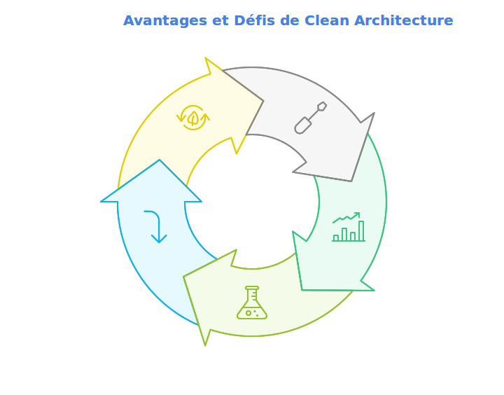
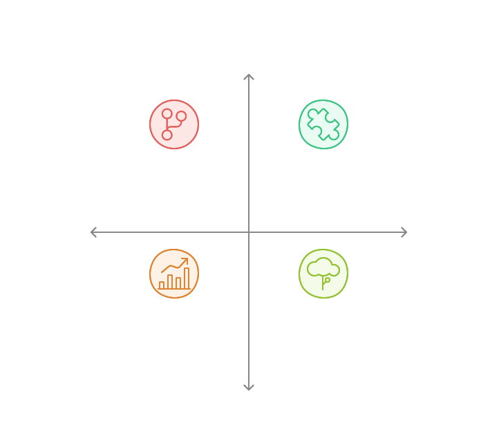

# Objectifs et Bénéfices de Clean Architecture 🎯

## 1. Maintenabilité 🛠️

### Avantages
- Séparation claire des responsabilités
- Code modulaire et facilement modifiable
- Réduction de la dette technique

### Impact
- Facilite les modifications et évolutions
- Réduit le coût de maintenance
- Améliore la compréhension du code

### Inconvénients
- Structure de projet plus complexe
- Plus de fichiers à gérer
- Temps de setup initial plus long

## 2. Scalabilité 📈

### Avantages
- Architecture modulaire permettant une croissance organique
- Facilité d'ajout de nouvelles fonctionnalités
- Performance optimisable par couche

### Impact
- Supporte la croissance de l'application
- Permet l'évolution indépendante des composants
- Facilite l'optimisation ciblée

### Inconvénients
- Overhead de performance potentiel
- Complexité accrue avec la taille
- Gestion plus complexe des dépendances

## 3. Testabilité 🧪

### Avantages
- Tests unitaires simplifiés
- Tests d'intégration ciblés
- Couverture de code optimale

### Impact
- Améliore la qualité du code
- Réduit les régressions
- Facilite le refactoring

### Inconvénients
- Plus de tests à écrire et maintenir
- Setup des tests plus complexe
- Mocks et stubs plus nombreux

## 4. Flexibilité 🔄

### Avantages
- Changements technologiques facilités
- Adaptation rapide aux nouveaux besoins
- Évolution progressive possible

### Impact
- Réduit le couplage technologique
- Facilite l'adoption de nouvelles technologies
- Permet une évolution incrémentale

### Inconvénients
- Abstractions parfois complexes
- Surcharge cognitive pour l'équipe
- Risque de sur-ingénierie

## 5. Réutilisabilité ♻️

### Avantages
- Composants et logique métier réutilisables
- Partage de code entre projets
- Standardisation des pratiques

### Impact
- Accélère le développement
- Améliore la cohérence
- Facilite la formation des équipes

### Inconvénients
- Risque de généralisation excessive
- Complexité accrue des composants
- Maintenance des dépendances partagées

