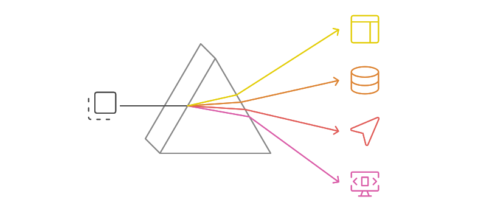
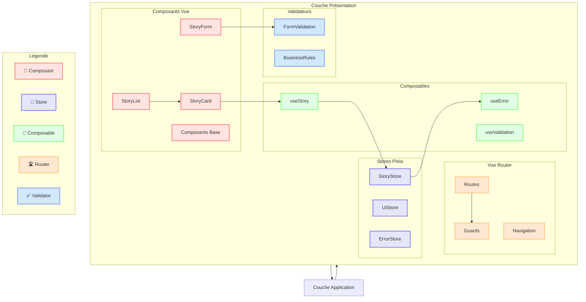
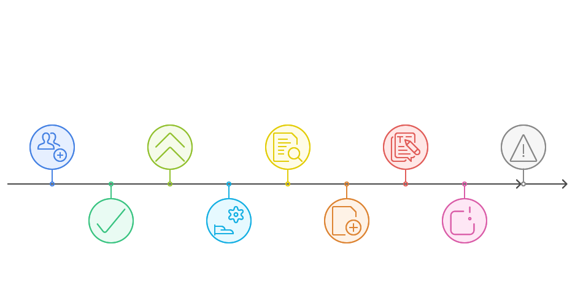
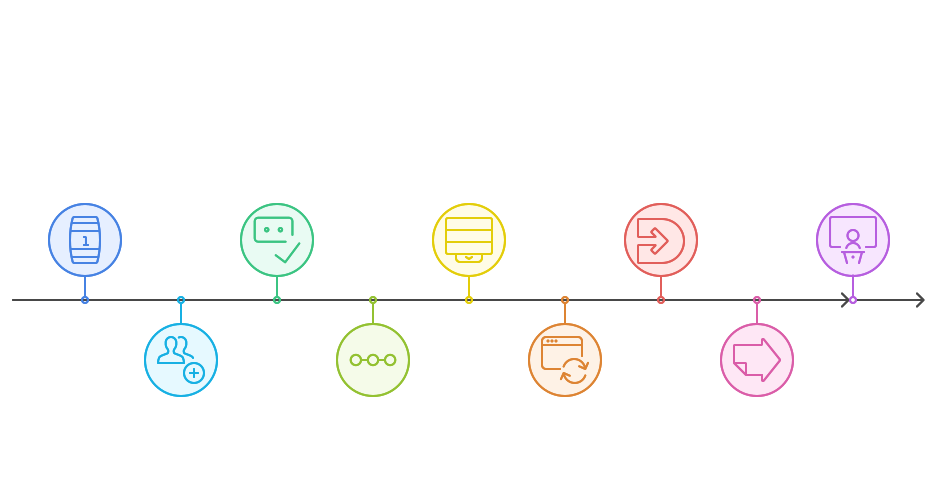
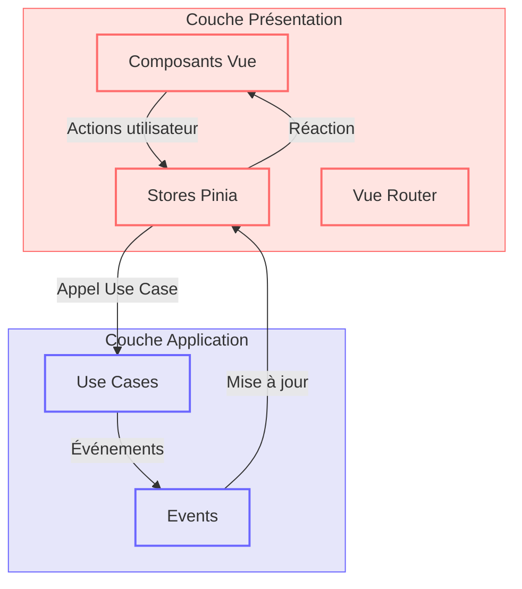
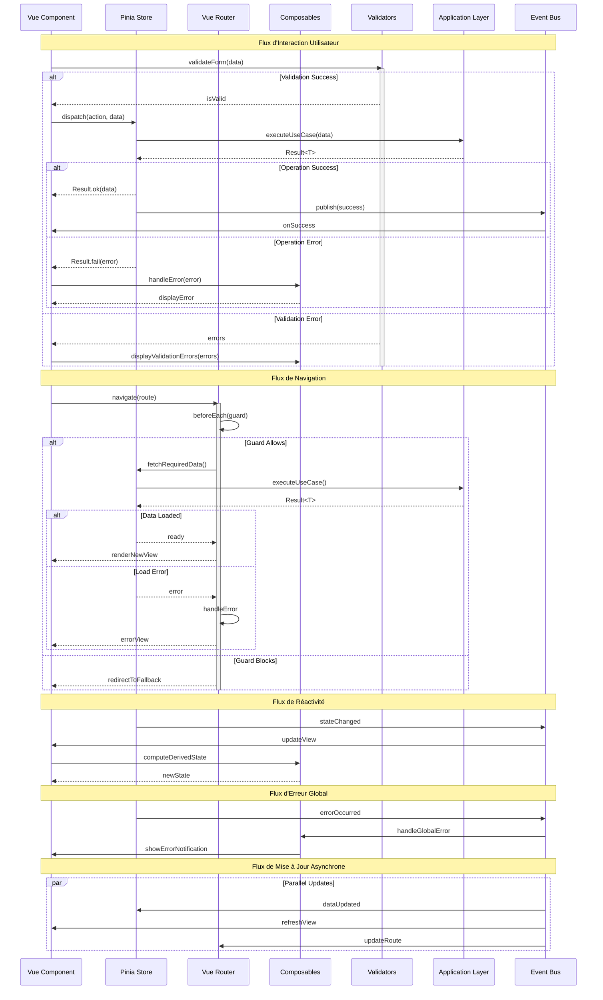

# Couche Présentation (Presentation Layer) 🎨




## Vue d'ensemble 🔍

La couche présentation est responsable de l'interface utilisateur et de l'interaction avec l'utilisateur. Dans une application Vue.js, elle comprend :

- Composants Vue.js 🧩
- Stores Pinia 🏪
- Vue Router 🛣️
- Composables 🎣
- Gestion de l'état UI 🔄



## Structure 🏗️




### Components (`/contexts/*/presentation/components`) 🧩
```typescript
// src/contexts/story/presentation/components/StoryForm.vue
<script setup lang="ts">
import { ref, computed } from "vue";
import { useStoryStore } from "../store/story.store";
import type { CreateStoryDTOInterface } from "@/contexts/story/application/dtos/story.dto";
import { useI18n } from "vue-i18n";
import { useToast } from "@/shared/composables/useToast";
import { useValidation } from "@/shared/composables/useValidation";
import { storyValidationRules } from "../validation/story.validation";
import { useErrorHandler } from "@/shared/composables/useErrorHandler";

interface PropsInterface {
  initialData?: Partial<CreateStoryDTOInterface>;
}

const props = withDefaults(defineProps<PropsInterface>(), {
  initialData: () => ({})
});

const emit = defineEmits<{
  (event: "submit", data: CreateStoryDTOInterface): void;
  (event: "cancel"): void;
}>();

// Services et composables
const store = useStoryStore();
const { t } = useI18n();
const toast = useToast();
const errorHandler = useErrorHandler();

// État du formulaire
const form = reactive({
  title: props.initialData?.title ?? "",
  description: props.initialData?.description ?? "",
  points: props.initialData?.points ?? 0
});

// Validation
const { isValid, errors, validate } = useValidation(form, storyValidationRules);

// Gestion des événements
const handleSubmit = async () => {
  try {
    const validationResult = await validate();
    
    if (!validationResult.isSuccess) {
      toast.error(t("errors.invalidForm"));
      return;
    }

    emit("submit", form);
  } catch (error) {
    errorHandler.handle(error);
  }
};

const handleCancel = () => {
  emit("cancel");
};
</script>

<template>
  <form @submit.prevent="handleSubmit" class="story-form">
    <BaseInput
      v-model="form.title"
      :label="t('story.title')"
      :error="errors.title"
      required
    />
    <BaseTextarea
      v-model="form.description"
      :label="t('story.description')"
      :error="errors.description"
      required
    />
    <BaseNumberInput
      v-model="form.points"
      :label="t('story.points')"
      :error="errors.points"
    />
    <div class="actions">
      <BaseButton 
        type="submit" 
        :disabled="!isValid"
        data-test="submit-button"
      >
        {{ t("common.submit") }}
      </BaseButton>
      <BaseButton 
        type="button" 
        variant="secondary" 
        @click="handleCancel"
        data-test="cancel-button"
      >
        {{ t("common.cancel") }}
      </BaseButton>
    </div>
  </form>
</template>
```

```typescript
// src/contexts/story/presentation/validation/story.validation.ts
import { z } from "zod";
import type { ValidationRulesInterface } from "@/shared/interfaces/validation.interface";

export const storyValidationRules: ValidationRulesInterface = {
  title: z.string()
    .min(3, "Title must be at least 3 characters")
    .max(100, "Title must not exceed 100 characters"),
    
  description: z.string()
    .min(10, "Description must be at least 10 characters")
    .max(1000, "Description must not exceed 1000 characters"),
    
  points: z.number()
    .int("Points must be an integer")
    .min(1, "Points must be at least 1")
    .max(21, "Points must not exceed 21")
};
```


### Stores (`/contexts/*/presentation/store`) 🏪
```typescript
// src/contexts/story/presentation/store/story.store.ts
import { defineStore } from "pinia";
import type { StoryDTOInterface } from "@/contexts/story/application/dtos/story.dto";
import type { CreateStoryDTOInterface } from "@/contexts/story/application/dtos/create-story.dto";
import type { FetchStoryUseCaseInterface } from "@/contexts/story/application/use-cases/fetch-story.use-case";
import type { CreateStoryUseCaseInterface } from "@/contexts/story/application/use-cases/create-story.use-case";
import type { ErrorHandlerInterface } from "@/shared/interfaces/error-handler.interface";

interface StoryStateInterface {
  stories: Map<string, StoryDTOInterface>;
  currentStory: StoryDTOInterface | null;
  isLoading: boolean;
  error: ErrorInterface | null;
}

interface StoryUseCasesInterface {
  fetchStory: FetchStoryUseCaseInterface;
  createStory: CreateStoryUseCaseInterface;
}

export const useStoryStore = defineStore("story", {
  state: (): StoryStateInterface => ({
    stories: new Map(),
    currentStory: null,
    isLoading: false,
    error: null
  }),

  getters: {
    getStoryById: (state) => {
      return (id: string) => state.stories.get(id);
    },
    
    sortedStories: (state) => {
      return Array.from(state.stories.values())
        .sort((a, b) => b.updatedAt.localeCompare(a.updatedAt));
    }
  },

  actions: {
    // Injection des dépendances via le constructeur
    constructor(
      private readonly useCases: StoryUseCasesInterface,
      private readonly errorHandler: ErrorHandlerInterface
    ) {},

    async fetchStory(id: string) {
      try {
        this.isLoading = true;
        this.error = null;
        
        const result = await this.useCases.fetchStory.execute(id);
        
        if (result.isSuccess) {
          this.stories.set(id, result.value);
        } else {
          this.error = this.errorHandler.handle(result.error);
        }
      } catch (error) {
        this.error = this.errorHandler.handle(error);
      } finally {
        this.isLoading = false;
      }
    },

    async createStory(data: CreateStoryDTOInterface) {
      try {
        this.isLoading = true;
        this.error = null;
        
        const result = await this.useCases.createStory.execute(data);
        
        if (result.isSuccess) {
          this.stories.set(result.value.id, result.value);
        } else {
          this.error = this.errorHandler.handle(result.error);
        }
      } catch (error) {
        this.error = this.errorHandler.handle(error);
      } finally {
        this.isLoading = false;
      }
    }
  }
});

// Configuration du store
export function setupStoryStore() {
  const useCases: StoryUseCasesInterface = {
    fetchStory: container.get(FetchStoryUseCaseInterface),
    createStory: container.get(CreateStoryUseCaseInterface)
  };
  
  const errorHandler = container.get(ErrorHandlerInterface);
  
  return useStoryStore(useCases, errorHandler);
}
```

### Composables (`/contexts/*/presentation/composables`) 🎣
```typescript
// src/contexts/story/presentation/composables/useStory.ts
import { ref, computed } from "vue";
import type { StoryDTOInterface } from "@/contexts/story/application/dtos/story.dto";
import type { UpdateStoryDTOInterface } from "@/contexts/story/application/dtos/update-story.dto";
import type { ResultInterface } from "@/shared/types/result";
import type { ErrorInterface } from "@/shared/types/error";
import { useErrorHandler } from "@/shared/composables/useErrorHandler";
import { useLoading } from "@/shared/composables/useLoading";
import { useI18n } from "vue-i18n";
import { useToast } from "@/shared/composables/useToast";

interface StoryServiceInterface {
  getById(id: string): Promise<ResultInterface<StoryDTOInterface>>;
  update(data: UpdateStoryDTOInterface): Promise<ResultInterface<void>>;
}

export function useStory(
  id: string,
  storyService: StoryServiceInterface
) {
  // Services partagés
  const errorHandler = useErrorHandler();
  const { isLoading, withLoading } = useLoading();
  const { t } = useI18n();
  const toast = useToast();
  
  // État local
  const error = ref<ErrorInterface | null>(null);
  const story = ref<StoryDTOInterface | null>(null);
  
  // Getters
  const isValid = computed(() => story.value !== null);
  const canUpdate = computed(() => isValid.value && !isLoading.value);
  
  // Actions
  async function fetchStory(): Promise<ResultInterface<void>> {
    return withLoading(async () => {
      try {
        error.value = null;
        const result = await storyService.getById(id);
        
        if (result.isSuccess && result.value) {
          story.value = result.value;
          return ResultInterface.ok();
        } else {
          error.value = result.error;
          errorHandler.handle(result.error);
          return ResultInterface.fail(result.error);
        }
      } catch (e) {
        const err = errorHandler.handle(e);
        error.value = err;
        return ResultInterface.fail(err);
      }
    });
  }
  
  async function updateStory(
    data: UpdateStoryDTOInterface
  ): Promise<ResultInterface<void>> {
    return withLoading(async () => {
      try {
        error.value = null;
        
        const result = await storyService.update({
          ...data,
          id
        });
        
        if (result.isSuccess) {
          toast.success(t("story.updateSuccess"));
          await fetchStory(); // Rafraîchir les données
          return ResultInterface.ok();
        } else {
          error.value = result.error;
          errorHandler.handle(result.error);
          return ResultInterface.fail(result.error);
        }
      } catch (e) {
        const err = errorHandler.handle(e);
        error.value = err;
        return ResultInterface.fail(err);
      }
    });
  }
  
  // Setup initial
  onMounted(() => {
    fetchStory();
  });
  
  // Cleanup
  onUnmounted(() => {
    story.value = null;
    error.value = null;
  });
  
  return {
    // État
    story: readonly(story),
    error: readonly(error),
    isLoading: readonly(isLoading),
    
    // Getters
    isValid: readonly(isValid),
    canUpdate: readonly(canUpdate),
    
    // Actions
    fetchStory,
    updateStory
  };
}

// Exemple d'utilisation
export function useStoryWithDependencies(id: string) {
  const storyService = inject<StoryServiceInterface>(StoryServiceKey);
  
  if (!storyService) {
    throw new Error("StoryService not provided");
  }
  
  return useStory(id, storyService);
}
```

## Responsabilités 📋



1. **Gestion de l'Interface Utilisateur** 🖼️
   - Rendu des composants
   - Gestion des événements utilisateur
   - Validation des entrées utilisateur
   - Feedback visuel

2. **Gestion de l'État** 🔄
   - État local des composants
   - État global via Pinia
   - Synchronisation avec la couche application

3. **Navigation** 🧭
   - Routage avec Vue Router
   - Guards de navigation
   - Transitions entre vues

4. **Interaction avec la Couche Application** 🔌
   - Appel des use cases
   - Transformation des données pour l'affichage
   - Gestion des erreurs UI

## Bonnes Pratiques ✨

1. **Séparation des Responsabilités** 🎯
   - Composants petits et focalisés
   - Logique extraite dans des composables
   - État géré via Pinia

2. **Performance** ⚡
   - Utilisation de computed properties
   - Lazy loading des composants
   - Optimisation des re-renders

3. **Réutilisabilité** ♻️
   - Composants génériques
   - Composables partagés
   - Styles modulaires

4. **Accessibilité** ♿
   - ARIA labels
   - Gestion du focus
   - Support clavier

## Anti-Patterns à Éviter ⚠️

### 1. Logique Métier dans les Composants ❌

```typescript
// ❌ Mauvais : Logique métier dans le composant
<script setup lang="ts">
import type { StoryDTOInterface } from "@/contexts/story/application/dtos/story.dto";

// ❌ Logique métier qui devrait être dans le domaine
function calculateStoryPriority(story: StoryDTOInterface) {
  return story.points > 8 && story.urgency === "HIGH" 
    ? "CRITICAL" 
    : "NORMAL";
}

// ❌ Règles métier qui devraient être dans le domaine
function validateStoryRules(story: StoryDTOInterface) {
  return story.points <= 21 && story.dependencies.length < 5;
}
</script>

// ✅ Bon : Utilisation des services du domaine
<script setup lang="ts">
import { inject, computed } from "vue";
import type { StoryDTOInterface } from "@/contexts/story/application/dtos/story.dto";
import type { StoryServiceInterface } from "@/contexts/story/domain/services/story.service";

interface PropsInterface {
  story: StoryDTOInterface;
}

const props = defineProps<PropsInterface>();
const storyService = inject<StoryServiceInterface>("StoryService");

if (!storyService) {
  throw new Error("StoryService not provided");
}

const priority = computed(() => storyService.getPriority(props.story));
const isValid = computed(() => storyService.validate(props.story));
</script>
```

### 2. État Global Excessif ❌

```typescript
// ❌ Mauvais : Trop d'état global et de logique métier dans le store
<script setup lang="ts">
import { useGlobalStore } from "@/stores/global.store";

const store = useGlobalStore();
// ❌ Accès à trop de données globales
const { stories, users, settings, notifications, temporaryData, businessRules } = storeToRefs(store);
</script>

// ✅ Bon : État minimal et focalisé avec composables
<script setup lang="ts">
import { useStories } from "@/composables/useStories";
import { useAuth } from "@/composables/useAuth";

// Chaque composable gère son propre état
const { stories, currentStory, isLoading } = useStories();
const { currentUser } = useAuth();
</script>
```

### 3. Composants Monolithiques ❌

```typescript
// ❌ Mauvais : Composant monolithique avec trop de responsabilités
<script setup lang="ts">
import { ref, computed } from "vue";
import type { StoryDTOInterface } from "@/types/story";

// ❌ Trop de logique et de responsabilités
const stories = ref<StoryDTOInterface[]>([]);
const filters = ref({ /* filtres complexes */ });
const sorting = ref({ /* logique de tri */ });
const pagination = ref({ /* état pagination */ });
const validation = ref({ /* règles validation */ });
const formatting = ref({ /* logique formatage */ });
// ... 100+ lignes de logique
</script>

<template>
  <!-- ❌ Template trop long et complexe -->
  <!-- 500+ lignes de template -->
</template>

// ✅ Bon : Composants petits et focalisés
<script setup lang="ts">
import { computed } from "vue";
import type { StoryDTOInterface } from "@/types/story";
import { useDateFormatter } from "@/composables/useDateFormatter";
import { useI18n } from "vue-i18n";

interface PropsInterface {
  story: StoryDTOInterface;
}

const props = defineProps<PropsInterface>();
const { formatDate } = useDateFormatter();
const { t } = useI18n();

const formattedDate = computed(() => formatDate(props.story.createdAt));
const statusLabel = computed(() => t(`story.status.${props.story.status}`));
</script>
```

### 4. Couplage Direct avec l'Infrastructure ❌

```typescript
// ❌ Mauvais : Appel direct à l'API dans le composant
<script setup lang="ts">
import axios from "axios";
import type { StoryDTOInterface } from "@/types/story";

async function saveStory(data: StoryDTOInterface) {
  const response = await axios.post("/api/stories", data);
  return response.data;
}
</script>

// ✅ Bon : Utilisation des services via injection
<script setup lang="ts">
import { inject } from "vue";
import type { StoryDTOInterface } from "@/types/story";
import type { StoryServiceInterface } from "@/services/story.service";

const storyService = inject<StoryServiceInterface>("StoryService");

if (!storyService) {
  throw new Error("StoryService not provided");
}

async function handleSave(data: StoryDTOInterface) {
  const result = await storyService.save(data);
  // Gestion du résultat
}
</script>
```

### 5. Props Drilling Excessif ❌

```typescript
// ❌ Mauvais : Props drilling à travers de multiples composants
<script setup lang="ts">
interface PropsInterface {
  stories: StoryDTOInterface[];
  users: UserDTOInterface[];
  permissions: PermissionsInterface;
  settings: SettingsInterface;
}

const props = defineProps<PropsInterface>();
</script>

<template>
  <StoryBoard v-bind="props">
    <StoryList v-bind="props">
      <StoryCard v-bind="props" />
    </StoryList>
  </StoryBoard>
</template>

// ✅ Bon : Utilisation de l'injection ou des composables
<script setup lang="ts">
import { useStories } from "@/composables/useStories";
import { useAuth } from "@/composables/useAuth";

// Chaque composant accède directement à ce dont il a besoin
const { stories } = useStories();
const { currentUser, permissions } = useAuth();
</script>
```

### 6. Gestion Incohérente des Erreurs ❌

```typescript
// ❌ Mauvais : Gestion des erreurs inconsistante
<script setup lang="ts">
async function handleSubmit() {
  try {
    await saveStory(data);
  } catch (e) {
    console.error(e); // ❌ Log direct
    alert("Error!"); // ❌ UI inconsistante
  }
}
</script>

// ✅ Bon : Gestion centralisée des erreurs
<script setup lang="ts">
import { useErrorHandler } from "@/composables/useErrorHandler";
import { useToast } from "@/composables/useToast";
import { useI18n } from "vue-i18n";

const errorHandler = useErrorHandler();
const toast = useToast();
const { t } = useI18n();

async function handleSubmit() {
  const result = await errorHandler.handle(
    () => saveStory(data)
  );
  
  if (result.isSuccess) {
    toast.success(t("story.saveSuccess"));
  }
}
</script>
```

Ces anti-patterns doivent être évités car ils :
- Violent les principes de Clean Architecture
- Rendent le code difficile à maintenir
- Compliquent les tests
- Créent des couplages indésirables
- Augmentent la dette technique

## Flux d'Échanges avec les Autres Couches 🔄

### 1. Communication Descendante (Présentation → Application) ⬇️

```typescript
// Composant vers Use Case
<script setup lang="ts">
import { useStoryStore } from "@/stores/story.store";
import type { CreateStoryDTOInterface } from "@/types/story.dto";

const store = useStoryStore();

async function handleCreateStory(data: CreateStoryDTOInterface) {
  // La couche présentation communique avec la couche application via les use cases
  const result = await store.createStory(data);
  // Gestion du résultat UI
}
</script>
```

### 2. Communication Ascendante (Application → Présentation) ⬆️

```typescript
// Réception des événements du domaine
<script setup lang="ts">
import { onMounted } from "vue";
import { useEventBus } from "@/shared/composables/useEventBus";

const eventBus = useEventBus();

onMounted(() => {
  // Écoute des événements venant des couches inférieures
  eventBus.on("story.created", (story) => {
    // Mise à jour de l'UI
    toast.success(t("story.createSuccess"));
    // Rafraîchissement des données
    refreshStories();
  });
});
</script>
```

### 3. Flux de Données Bidirectionnels 🔁

```typescript
// Store comme médiateur entre les couches
export const useStoryStore = defineStore("story", {
  state: (): StoryStateInterface => ({
    stories: new Map(),
    currentStory: null,
    isLoading: false,
    error: null
  }),

  actions: {
    // ⬇️ Vers la couche application
    async createStory(data: CreateStoryDTOInterface) {
      const result = await this.useCases.createStory.execute(data);
      
      if (result.isSuccess) {
        // ⬆️ Mise à jour de l'état UI
        this.stories.set(result.value.id, result.value);
      }
      
      return result;
    },

    // ⬆️ Réception des mises à jour
    handleStoryUpdated(event: StoryUpdatedEventInterface) {
      this.stories.set(event.story.id, event.story);
    }
  }
});
```

### 4. Gestion des Erreurs Inter-Couches ⚡

```typescript
// Gestion centralisée des erreurs entre les couches
<script setup lang="ts">
import { useErrorHandler } from "@/shared/composables/useErrorHandler";
import type { ErrorInterface } from "@/shared/types/error";

const errorHandler = useErrorHandler();

// Traitement des erreurs venant des couches inférieures
async function handleOperation() {
  try {
    await someOperation();
  } catch (error) {
    // Transformation des erreurs techniques en erreurs UI
    const uiError = errorHandler.handle(error as ErrorInterface);
    // Affichage approprié pour l'utilisateur
    displayError(uiError);
  }
}
</script>
```

### 5. Synchronisation de l'État 🔄

```typescript
// Synchronisation de l'état entre les couches
<script setup lang="ts">
import { useStorySync } from "@/composables/useStorySync";

const { 
  syncState,    // ⬇️ Synchronisation vers le bas
  handleUpdate, // ⬆️ Réception des mises à jour
  isInSync      // État de synchronisation
} = useStorySync();

// Synchronisation bidirectionnelle
watch(
  () => store.stories,
  async (stories) => {
    if (!isInSync.value) {
      await syncState(stories);
    }
  }
);

// Écoute des mises à jour
onMounted(() => {
  eventBus.on("story.updated", handleUpdate);
});
</script>
```

### 6. Diagramme des Flux 📊



Cette organisation des flux permet de :
- Maintenir une séparation claire des responsabilités
- Garantir une communication unidirectionnelle des données
- Faciliter le débogage et les tests
- Assurer une meilleure maintenabilité
- Permettre une évolution indépendante des couches

## Diagramme de séquence

