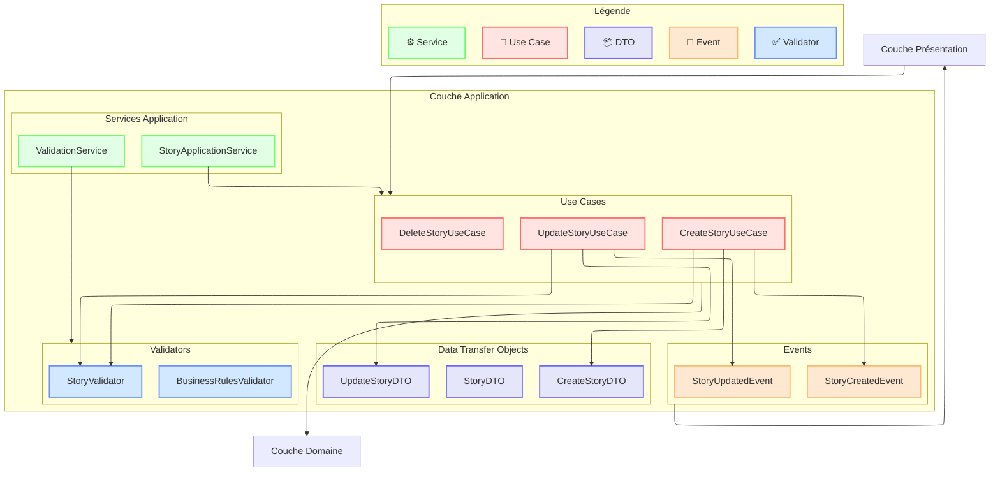
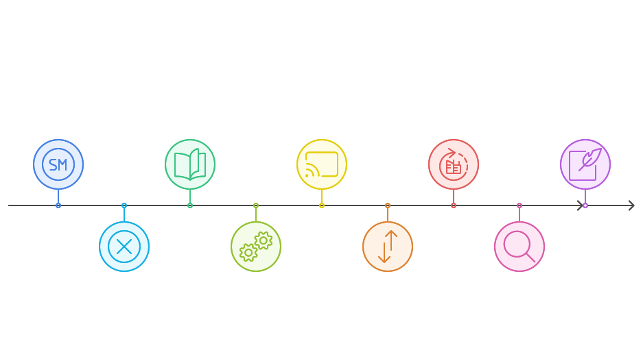
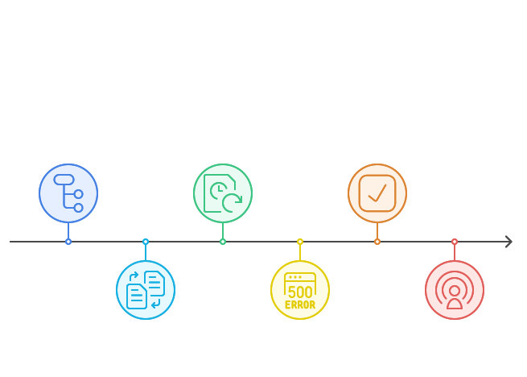
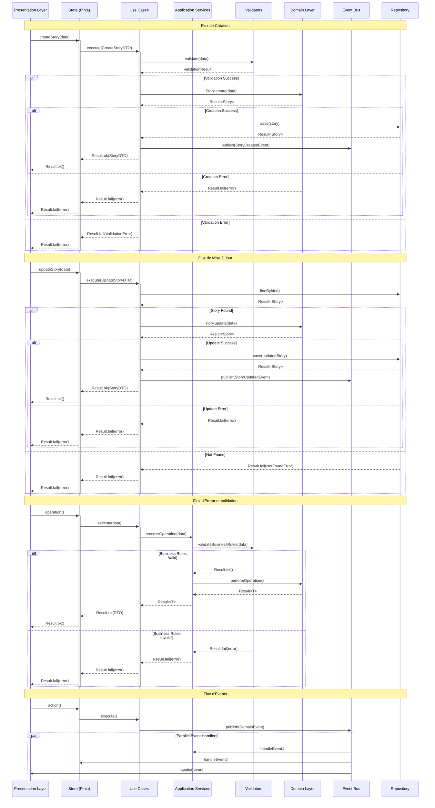

# Couche Application (Application Layer)

## Vue d'ensemble

La couche application orchestre les cas d'utilisation de l'application en coordonnant les flux de données entre la couche présentation et la couche domaine.
Elle agit comme un chef d'orchestre qui dirige les différentes opérations sans contenir de logique métier.




## Composants Principaux



### 2. Use Cases 🎯

```typescript
// src/contexts/story/application/use-cases/create-story.use-case.ts
import type { StoryRepositoryInterface } from "@/contexts/story/domain/repositories/story.repository";
import type { CreateStoryDTOInterface } from "../dtos/story.dto";
import type { StoryDTOInterface } from "../dtos/story.dto";
import type { ResultInterface } from "@/shared/types/result";
import type { EventBusInterface } from "@/shared/interfaces/event-bus.interface";
import type { LoggerInterface } from "@/shared/interfaces/logger.interface";
import { StoryCreatedEvent } from "../events/story-created.event";
import { ValidationError } from "@/shared/errors/validation.error";

export interface CreateStoryUseCaseInterface {
  execute(request: CreateStoryDTOInterface): Promise<ResultInterface<StoryDTOInterface>>;
}

export class CreateStoryUseCase implements CreateStoryUseCaseInterface {
  constructor(
    private readonly storyRepository: StoryRepositoryInterface,
    private readonly eventBus: EventBusInterface,
    private readonly logger: LoggerInterface
  ) {}

  async execute(request: CreateStoryDTOInterface): Promise<ResultInterface<StoryDTOInterface>> {
    try {
      this.logger.debug("Creating story", { request });

      // 1. Validation de la requête
      const validationResult = await this.validateRequest(request);
      if (validationResult.isFailure) {
        return Result.fail(validationResult.error);
      }

      // 2. Création de l'entité via factory
      const storyResult = await Story.create({
        title: request.title,
        description: request.description,
        points: request.points,
        assigneeId: request.assigneeId
      });

      if (storyResult.isFailure) {
        return Result.fail(storyResult.error);
      }

      // 3. Persistence
      const saveResult = await this.storyRepository.save(storyResult.value);
      if (saveResult.isFailure) {
        return Result.fail(saveResult.error);
      }

      // 4. Publication de l'événement
      await this.eventBus.publish(new StoryCreatedEvent(saveResult.value));

      // 5. Retour du DTO
      return Result.ok(StoryMapper.toDTO(saveResult.value));

    } catch (error) {
      this.logger.error("Failed to create story", error);
      return Result.fail(new ApplicationError("Failed to create story", error));
    }
  }

  private async validateRequest(request: CreateStoryDTOInterface): Promise<ResultInterface<void>> {
    const validator = new CreateStoryValidator();
    return validator.validate(request);
  }
}

// Exemple d'utilisation
export function setupCreateStoryUseCase(): CreateStoryUseCaseInterface {
  return new CreateStoryUseCase(
    container.get(StoryRepositoryInterface),
    container.get(EventBusInterface),
    container.get(LoggerInterface)
  );
}
```

```typescript
// src/contexts/story/application/use-cases/update-story.use-case.ts
export interface UpdateStoryUseCaseInterface {
  execute(request: UpdateStoryDTOInterface): Promise<ResultInterface<StoryDTOInterface>>;
}

export class UpdateStoryUseCase implements UpdateStoryUseCaseInterface {
  constructor(
    private readonly storyRepository: StoryRepositoryInterface,
    private readonly eventBus: EventBusInterface,
    private readonly logger: LoggerInterface
  ) {}

  async execute(request: UpdateStoryDTOInterface): Promise<ResultInterface<StoryDTOInterface>> {
    try {
      this.logger.debug("Updating story", { request });

      // 1. Récupération de l'entité existante
      const existingStoryResult = await this.storyRepository.findById(request.id);
      if (existingStoryResult.isFailure) {
        return Result.fail(existingStoryResult.error);
      }

      // 2. Mise à jour de l'entité
      const updateResult = existingStoryResult.value.update(request);
      if (updateResult.isFailure) {
        return Result.fail(updateResult.error);
      }

      // 3. Persistence
      const saveResult = await this.storyRepository.save(updateResult.value);
      if (saveResult.isFailure) {
        return Result.fail(saveResult.error);
      }

      // 4. Publication de l'événement
      await this.eventBus.publish(new StoryUpdatedEvent(saveResult.value));

      // 5. Retour du DTO
      return Result.ok(StoryMapper.toDTO(saveResult.value));

    } catch (error) {
      this.logger.error("Failed to update story", error);
      return Result.fail(new ApplicationError("Failed to update story", error));
    }
  }
}
```


1. **Interfaces Explicites**
   - Interfaces pour chaque use case
   - Types stricts pour les paramètres et retours

2. **Injection de Dépendances**
   - Repository injecté via l'interface
   - Event bus pour la communication
   - Logger pour le monitoring

3. **Gestion des Erreurs**
   - Utilisation du type `Result`
   - Logging des erreurs
   - Messages d'erreur explicites

4. **Séparation des Responsabilités**
   - Validation séparée
   - Logique métier dans le domaine
   - Events pour la communication

5. **Clean Code**
   - Nommage explicite
   - Fonctions courtes et focalisées
   - Documentation claire

### 2. DTOs (Data Transfer Objects) 📦

Les DTOs définissent la structure des données échangées entre les couches.

```typescript
// src/contexts/story/application/dtos/story.dto.ts
// Base DTO pour les propriétés communes
export interface BaseStoryDTOInterface {
  readonly id: string;
  readonly title: string;
  readonly status: string;
  readonly createdAt: string;
  readonly updatedAt: string;
}

// DTO pour la création
export interface CreateStoryDTOInterface {
  readonly title: string;
  readonly description: string;
  readonly points: number;
  readonly assigneeId?: string;
  readonly tags?: string[];
}

// DTO pour la mise à jour
export interface UpdateStoryDTOInterface {
  readonly id: string;
  readonly title?: string;
  readonly description?: string;
  readonly points?: number;
  readonly status?: string;
  readonly assigneeId?: string;
  readonly tags?: string[];
}

// DTO détaillé pour l'affichage
export interface StoryDetailDTOInterface extends BaseStoryDTOInterface {
  readonly description: string;
  readonly points: number;
  readonly assignee?: UserReferenceDTOInterface;
  readonly tags: string[];
  readonly metrics: StoryMetricsDTOInterface;
}

// DTO de référence pour les relations
export interface StoryReferenceDTOInterface {
  readonly id: string;
  readonly title: string;
  readonly status: string;
}

// DTO pour les métriques
export interface StoryMetricsDTOInterface {
  readonly complexity: number;
  readonly priority: number;
  readonly estimatedTime: number;
}

// DTO pour les relations
export interface UserReferenceDTOInterface {
  readonly id: string;
  readonly name: string;
  readonly avatar?: string;
}
```

```typescript
//src/contexts/story/application/mappers/story.mapper.ts
import type { StoryEntityInterface } from "@/contexts/story/domain/entities/story.entity";
import type { StoryDetailDTOInterface } from "../dtos/story.dto";
import type { MapperInterface } from "@/shared/interfaces/mapper.interface";

export class StoryMapper implements MapperInterface<StoryEntityInterface, StoryDetailDTOInterface> {
  constructor(
    private readonly userMapper: UserMapperInterface
  ) {}

  toDTO(entity: StoryEntityInterface): StoryDetailDTOInterface {
    return {
      id: entity.id.value,
      title: entity.title.value,
      description: entity.description.value,
      status: entity.status.value,
      points: entity.points.value,
      assignee: entity.assignee 
        ? this.userMapper.toReferenceDTO(entity.assignee)
        : undefined,
      tags: Array.from(entity.tags),
      createdAt: entity.createdAt.toISOString(),
      updatedAt: entity.updatedAt.toISOString(),
      metrics: {
        complexity: entity.calculateComplexity(),
        priority: entity.calculatePriority(),
        estimatedTime: entity.calculateEstimatedTime()
      }
    };
  }

  toDomain(dto: StoryDetailDTOInterface): ResultInterface<StoryEntityInterface> {
    try {
      const storyResult = StoryEntity.create({
        id: StoryId.create(dto.id),
        title: StoryTitle.create(dto.title),
        description: StoryDescription.create(dto.description),
        status: StoryStatus.fromString(dto.status),
        points: StoryPoints.create(dto.points),
        tags: new Set(dto.tags)
      });

      if (storyResult.isFailure) {
        return Result.fail(storyResult.error);
      }

      return Result.ok(storyResult.value);
    } catch (error) {
      return Result.fail(new MapperError("Failed to map DTO to domain", error));
    }
  }
}
```

1. **Immutabilité**
   - Utilisation de `readonly` pour tous les champs
   - Pas de setters, uniquement des getters
   - Protection contre les modifications accidentelles

2. **Séparation des Responsabilités**
   - DTOs spécifiques pour chaque cas d'utilisation
   - Séparation claire des données de référence
   - DTOs dédiés pour les métriques

3. **Type Safety**
   - Types stricts pour chaque propriété
   - Pas de types `any` ou implicites

4. **Mappers**
   - Bidirectionnelle DTO ↔ Entity
   - Gestion des erreurs avec `Result`
   - Injection des dépendances pour les mappers liés

5. **Validation**
   - Validation lors de la conversion vers le domaine
   - Gestion des erreurs explicite
   - Respect des règles métier


Cette structure permet de :
- Maintenir une séparation claire entre le domaine et l'application
- Faciliter la validation des données
- Améliorer la maintenabilité
- Garantir la type safety
- Simplifier les tests

## Responsabilités 📋




La couche application agit comme un chef d'orchestre entre la couche présentation et la couche domaine. Ses responsabilités principales sont :

### 1. Orchestration des Flux 🎯
- Coordination des cas d'utilisation
- Séquencement des opérations
- Gestion du workflow applicatif
- Maintien de la cohérence des opérations

### 2. Transformation des Données 🔄
- Conversion des données entre les couches
- Adaptation des formats (DTO ↔ Entités)
- Validation des entrées/sorties
- Formatage des réponses

### 3. Gestion des Événements 📡
- Publication des événements applicatifs
- Coordination des effets de bord
- Notification des changements d'état
- Synchronisation entre les composants

### 4. Gestion des Erreurs 🛡️
- Capture et transformation des erreurs techniques
- Enrichissement du contexte d'erreur
- Logging et monitoring
- Retour des résultats appropriés

### 5. Sécurité et Validation ✅
- Validation des données entrantes
- Vérification des autorisations
- Application des règles de sécurité
- Contrôle des accès aux ressources

### 6. Communication Inter-Couches 🔌
- Interface avec la couche présentation
- Délégation vers la couche domaine
- Abstraction des détails d'implémentation
- Maintien des contrats d'interface

La couche application ne contient pas de logique métier mais assure la coordination et la communication entre les différentes parties du système tout en maintenant leur indépendance.

## Bonnes Pratiques 🌟

### 1. Séparation des Responsabilités 🎯

```typescript
// ✅ Bon : Use Case avec une seule responsabilité
export class CreateStoryUseCase implements CreateStoryUseCaseInterface {
  async execute(request: CreateStoryDTOInterface): Promise<ResultInterface<StoryDTOInterface>> {
    // Uniquement la logique de création
  }
}

// ❌ Mauvais : Use Case avec multiples responsabilités
export class StoryUseCase {
  async createStory() { /* ... */ }
  async updateStory() { /* ... */ }
  async deleteStory() { /* ... */ }
  async validateStory() { /* ... */ }
}
```

### 2. Gestion des Erreurs 🛡️

```typescript
// ✅ Bon : Gestion explicite et typée des erreurs
export class UpdateStoryUseCase implements UpdateStoryUseCaseInterface {
  async execute(request: UpdateStoryDTOInterface): Promise<ResultInterface<void>> {
    try {
      this.logger.debug("Updating story", { request });
      
      if (!request.id) {
        return Result.fail(new ValidationError("Story ID is required"));
      }

      const result = await this.storyRepository.update(request);
      
      if (result.isFailure) {
        this.logger.error("Failed to update story", result.error);
        return Result.fail(result.error);
      }

      return Result.ok();
    } catch (error) {
      this.logger.error("Unexpected error during story update", error);
      return Result.fail(new ApplicationError("Failed to update story", error));
    }
  }
}

// ❌ Mauvais : Erreurs non gérées ou mal typées
export class UpdateStoryUseCase {
  async execute(data: any) {
    const story = await this.repository.findById(data.id);
    await this.repository.save(story);
    return story;
  }
}
```

### 3. Injection de Dépendances 💉

```typescript
// ✅ Bon : Dépendances injectées et interfaces
export class StoryApplicationService {
  constructor(
    private readonly storyRepository: StoryRepositoryInterface,
    private readonly eventBus: EventBusInterface,
    private readonly logger: LoggerInterface
  ) {}
}

// ❌ Mauvais : Dépendances instanciées directement
export class StoryService {
  private repository = new StoryRepository();
  private eventBus = new EventBus();
}
```

### 4. DTOs et Validation 📝

```typescript
// ✅ Bon : DTOs immutables et validation
export interface CreateStoryDTOInterface {
  readonly title: string;
  readonly description: string;
  readonly points: number;
}

export class CreateStoryValidator implements ValidatorInterface<CreateStoryDTOInterface> {
  validate(dto: CreateStoryDTOInterface): ResultInterface<void> {
    const schema = z.object({
      title: z.string().min(3).max(100),
      description: z.string().min(10),
      points: z.number().int().min(1).max(21)
    });

    try {
      schema.parse(dto);
      return Result.ok();
    } catch (error) {
      return Result.fail(new ValidationError("Invalid story data", error));
    }
  }
}

// ❌ Mauvais : DTOs mutables sans validation
interface StoryDTO {
  title: string;
  description: string;
  points: number;
  validate(): boolean;  // ❌ Validation dans le DTO
}
```

### 5. Communication par Événements 📡

```typescript
// ✅ Bon : Événements typés et immutables
export interface StoryCreatedEventInterface extends DomainEventInterface {
  readonly type: "STORY.CREATED";
  readonly storyId: string;
  readonly timestamp: Date;
}

export class StoryCreatedEvent implements StoryCreatedEventInterface {
  readonly type = "STORY.CREATED" as const;
  readonly timestamp: Date;

  constructor(
    readonly storyId: string,
    readonly metadata?: Record<string, unknown>
  ) {
    this.timestamp = new Date();
    Object.freeze(this);
  }
}

// ❌ Mauvais : Événements non typés et mutables
export class StoryEvent {
  type: string;
  data: any;
  timestamp: Date;
}
```

### 6. Logging et Monitoring 📊

```typescript
// ✅ Bon : Logging structuré et contextualisé
export class CreateStoryUseCase {
  async execute(request: CreateStoryDTOInterface): Promise<ResultInterface<StoryDTOInterface>> {
    this.logger.info("Creating story", {
      context: "CreateStoryUseCase",
      data: { title: request.title },
      correlationId: this.correlationId
    });

    // ... logique ...

    if (result.isFailure) {
      this.logger.error("Failed to create story", {
        context: "CreateStoryUseCase",
        error: result.error,
        correlationId: this.correlationId
      });
    }
  }
}

// ❌ Mauvais : Logging inconsistant
export class StoryService {
  createStory(data: any) {
    console.log("Creating story");
    // ... logique ...
    console.error("Error occurred");
  }
}
```

### 7. Tests Unitaires 🧪

```typescript
// ✅ Bon : Tests isolés et complets
describe("CreateStoryUseCase", () => {
  let useCase: CreateStoryUseCase;
  let repository: MockStoryRepository;
  let eventBus: MockEventBus;

  beforeEach(() => {
    repository = new MockStoryRepository();
    eventBus = new MockEventBus();
    useCase = new CreateStoryUseCase(repository, eventBus);
  });

  it("should create a story successfully", async () => {
    const request = createMockStoryRequest();
    const result = await useCase.execute(request);

    expect(result.isSuccess).toBe(true);
    expect(repository.save).toHaveBeenCalledWith(expect.any(Story));
    expect(eventBus.publish).toHaveBeenCalledWith(
      expect.any(StoryCreatedEvent)
    );
  });
});

// ❌ Mauvais : Tests couplés et incomplets
describe("StoryService", () => {
  it("creates story", async () => {
    const service = new StoryService();
    const result = await service.createStory({ title: "Test" });
    expect(result).toBeTruthy();
  });
});
```

Ces bonnes pratiques permettent de :
- Maintenir un code propre et maintenable
- Faciliter les tests et le débogage
- Assurer la séparation des responsabilités
- Garantir la robustesse de l'application
- Améliorer la traçabilité des erreurs

## Anti-Patterns à Éviter ⚠️

### 1. Logique Métier dans la Couche Application ❌

```typescript
// ❌ Mauvais : Logique métier dans le Use Case
export class CompleteStoryUseCase implements CompleteStoryUseCaseInterface {
  async execute(id: string): Promise<ResultInterface<void>> {
    const story = await this.repository.findById(id);
    
    // ❌ Ces règles devraient être dans le domaine
    if (story.points > 13 || !story.hasTests) {
      return Result.fail(new ValidationError("Story cannot be completed"));
    }
    
    if (story.assignee === null) {
      return Result.fail(new ValidationError("Story must be assigned"));
    }
  }
}

// ✅ Bon : Logique métier dans le domaine
export class CompleteStoryUseCase implements CompleteStoryUseCaseInterface {
  async execute(id: string): Promise<ResultInterface<void>> {
    const storyResult = await this.repository.findById(id);
    if (storyResult.isFailure) {
      return Result.fail(storyResult.error);
    }

    // La logique métier est dans l'entité
    const completionResult = storyResult.value.complete();
    if (completionResult.isFailure) {
      return Result.fail(completionResult.error);
    }

    return this.repository.save(storyResult.value);
  }
}
```

### 2. DTOs Anémiques ou Trop Riches ❌

```typescript
// ❌ Mauvais : DTO avec comportement
export class StoryDTO {
  id: string;
  title: string;
  points: number;

  // ❌ Les DTOs ne devraient pas avoir de comportement
  calculatePriority(): number {
    return this.points * this.urgency;
  }

  validate(): boolean {
    return this.points <= 21;
  }
}

// ✅ Bon : DTO simple et immutable
export interface StoryDTOInterface {
  readonly id: string;
  readonly title: string;
  readonly points: number;
}
```

### 3. Dépendances Directes vers l'Infrastructure ❌

```typescript
// ❌ Mauvais : Dépendance directe à l'infrastructure
export class UpdateStoryUseCase {
  constructor(
    private readonly axios: AxiosInstance,  // ❌ Dépendance directe
    private readonly localStorage: Storage   // ❌ Dépendance directe
  ) {}
}

// ✅ Bon : Dépendances via interfaces
export class UpdateStoryUseCase {
  constructor(
    private readonly repository: StoryRepositoryInterface,
    private readonly eventBus: EventBusInterface
  ) {}
}
```

### 4. Gestion Incohérente des Erreurs ❌

```typescript
// ❌ Mauvais : Gestion des erreurs inconsistante
export class CreateStoryUseCase {
  async execute(dto: CreateStoryDTOInterface) {
    try {
      const story = await this.repository.save(dto);
      return story;
    } catch (e) {
      console.error(e);  // ❌ Log direct
      throw e;           // ❌ Erreur non transformée
    }
  }
}

// ✅ Bon : Gestion des erreurs cohérente
export class CreateStoryUseCase {
  async execute(dto: CreateStoryDTOInterface): Promise<ResultInterface<StoryDTOInterface>> {
    try {
      this.logger.debug("Creating story", { dto });

      const validationResult = await this.validator.validate(dto);
      if (validationResult.isFailure) {
        return Result.fail(validationResult.error);
      }

      const result = await this.repository.save(dto);
      if (result.isFailure) {
        this.logger.error("Failed to create story", { error: result.error });
        return Result.fail(result.error);
      }

      return Result.ok(result.value);
    } catch (error) {
      const applicationError = new ApplicationError(
        "Unexpected error during story creation",
        error
      );
      this.logger.error(applicationError.message, { error });
      return Result.fail(applicationError);
    }
  }
}
```

### 5. État dans les Use Cases ❌

```typescript
// ❌ Mauvais : État maintenu dans le Use Case
export class StoryUseCase {
  private cachedStories: Map<string, StoryDTOInterface> = new Map();

  async getStory(id: string) {
    if (this.cachedStories.has(id)) {
      return this.cachedStories.get(id);
    }
    // ...
  }
}

// ✅ Bon : Use Case sans état
export class GetStoryUseCase implements GetStoryUseCaseInterface {
  constructor(
    private readonly repository: StoryRepositoryInterface,
    private readonly cache: CacheServiceInterface
  ) {}

  async execute(id: string): Promise<ResultInterface<StoryDTOInterface>> {
    // La gestion du cache est déléguée au repository ou au service de cache
    return this.repository.findById(id);
  }
}
```

### 6. Validation Incohérente ❌

```typescript
// ❌ Mauvais : Validation dispersée
export class CreateStoryUseCase {
  async execute(dto: CreateStoryDTOInterface) {
    // ❌ Validation directe dans le use case
    if (!dto.title || dto.title.length < 3) {
      throw new Error("Invalid title");
    }

    if (dto.points > 21) {
      throw new Error("Invalid points");
    }
  }
}

// ✅ Bon : Validation centralisée
export class CreateStoryUseCase {
  constructor(
    private readonly validator: ValidatorInterface<CreateStoryDTOInterface>
  ) {}

  async execute(dto: CreateStoryDTOInterface): Promise<ResultInterface<StoryDTOInterface>> {
    const validationResult = await this.validator.validate(dto);
    if (validationResult.isFailure) {
      return Result.fail(validationResult.error);
    }
    // ...
  }
}
```

Ces anti-patterns doivent être évités car ils :
- Violent les principes de Clean Architecture
- Créent des couplages indésirables
- Rendent le code difficile à tester
- Compliquent la maintenance
- Augmentent la dette technique
- Réduisent la réutilisabilité du code

## Diagramme de séquence

