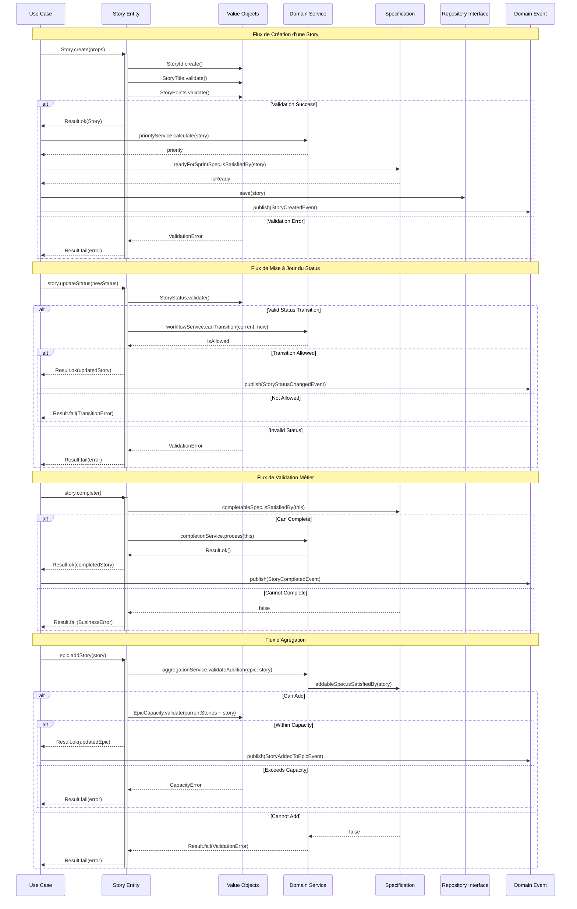

# Couche Domaine (Domain Layer) 💎

## Vue d'ensemble

La couche domaine est le cœur de l'application. Elle contient toute la logique métier et les règles de l'application. Cette couche doit être pure, sans dépendances externes, et totalement indépendante des autres couches.

> 🔗 Pour voir la place de cette couche dans l'architecture globale, consultez le [diagramme général](../01-introduction/01-overview.md#structure-simplifiée-de-la-clean-architecture-).

```mermaid
---
config:
  layout: elk
---
graph TB
    classDef entity fill:#FFE4E1,stroke:#FF6B6B,stroke-width:2px;
    classDef valueObject fill:#E6E6FA,stroke:#6B66FF,stroke-width:2px;
    classDef service fill:#E1FFE4,stroke:#6BFF6B,stroke-width:2px;
    classDef repository fill:#FFE8D1,stroke:#FFB86B,stroke-width:2px;
    classDef specification fill:#D1E8FF,stroke:#6B8EFF,stroke-width:2px;
    classDef factory fill:#FFE8E8,stroke:#FF8888,stroke-width:2px;
    classDef policy fill:#E8FFE8,stroke:#88FF88,stroke-width:2px;

    subgraph DomainLayer["Couche Domaine - Détails"]
        subgraph Entities["Entités"]
            Story["Story"]
            Epic["Epic"]
            Sprint["Sprint"]
            User["User"]
        end

        subgraph ValueObjects["Value Objects"]
            StoryPoints["StoryPoints"]
            StoryStatus["StoryStatus"]
            StoryTitle["StoryTitle"]
            StoryId["StoryId"]
            Priority["Priority"]
            SprintDates["SprintDates"]
        end

        subgraph DomainServices["Services Domaine"]
            PriorityService["PriorityService"]
            EstimationService["EstimationService"]
            SprintPlanningService["SprintPlanningService"]
        end

        subgraph Repositories["Interfaces Repository"]
            StoryRepo["StoryRepository"]
            EpicRepo["EpicRepository"]
            SprintRepo["SprintRepository"]
        end

        subgraph Specifications["Spécifications"]
            ReadySpec["ReadyForSprintSpec"]
            PrioritySpec["HighPrioritySpec"]
            CompleteSpec["CompletableSpec"]
        end

        subgraph Factories["Factories"]
            StoryFactory["StoryFactory"]
            SprintFactory["SprintFactory"]
        end

        subgraph Policies["Policies"]
            StoryPolicy["StoryPolicy"]
            SprintPolicy["SprintPolicy"]
        end

        %% Relations détaillées
        Story --> Epic
        Story --> Sprint
        Story --> StoryPoints
        Story --> StoryStatus
        Story --> StoryTitle
        Story --> StoryId
        Story --> Priority
        Sprint --> SprintDates
        Sprint --> User

        PriorityService --> Story
        EstimationService --> Story
        SprintPlanningService --> Sprint

        StoryRepo -.-> Story
        EpicRepo -.-> Epic
        SprintRepo -.-> Sprint

        ReadySpec -.-> Story
        PrioritySpec -.-> Story
        CompleteSpec -.-> Story

        StoryFactory --> Story
        SprintFactory --> Sprint

        StoryPolicy --> Story
        SprintPolicy --> Sprint
    end

    %% Application des styles
    class Story,Epic,Sprint,User entity;
    class StoryPoints,StoryStatus,StoryTitle,StoryId,Priority,SprintDates valueObject;
    class PriorityService,EstimationService,SprintPlanningService service;
    class StoryRepo,EpicRepo,SprintRepo repository;
    class ReadySpec,PrioritySpec,CompleteSpec specification;
    class StoryFactory,SprintFactory factory;
    class StoryPolicy,SprintPolicy policy;

    %% Légende
    subgraph Légende
        E["🏛️ Entité"]
        VO["💎 Value Object"]
        S["⚙️ Service"]
        R["📚 Repository"]
        SP["🎯 Specification"]
        F["🏭 Factory"]
        P["📋 Policy"]
    end

    class E entity;
    class VO valueObject;
    class S service;
    class R repository;
    class SP specification;
    class F factory;
    class P policy;
```



## Composants Principaux

### 1. Entités (Entities) 🏛️

```typescript
// src/contexts/story/domain/entities/story.entity.ts
import type { StoryIdValueObjectInterface } from "../value-objects/story-id.value-object";
import type { StoryTitleValueObjectInterface } from "../value-objects/story-title.value-object";
import type { StoryPointsValueObjectInterface } from "../value-objects/story-points.value-object";
import type { StoryStatusValueObjectInterface } from "../value-objects/story-status.value-object";
import type { ResultInterface } from "@/shared/types/result";
import { DomainError } from "@/shared/errors/domain.error";

export interface StoryPropsInterface {
  readonly id: StoryIdValueObjectInterface;
  readonly title: StoryTitleValueObjectInterface;
  readonly description: string;
  readonly points: StoryPointsValueObjectInterface;
  readonly status: StoryStatusValueObjectInterface;
  readonly assigneeId?: string;
  readonly tags: Set<string>;
  readonly createdAt: Date;
  readonly updatedAt: Date;
}

export interface StoryEntityInterface {
  readonly id: StoryIdValueObjectInterface;
  readonly props: Readonly<StoryPropsInterface>;

  equals(other: StoryEntityInterface): boolean;
  canBeCompleted(): boolean;
  complete(): ResultInterface<void>;
  update(props: Partial<StoryPropsInterface>): ResultInterface<StoryEntityInterface>;
}

export class StoryEntity implements StoryEntityInterface {
  private constructor(private readonly _props: StoryPropsInterface) {
    Object.freeze(this);
  }

  public static create(props: StoryPropsInterface): ResultInterface<StoryEntityInterface> {
    try {
      // Validation des invariants
      if (!props.title || !props.points || !props.status) {
        return Result.fail(new DomainError("Invalid story properties"));
      }

      const story = new StoryEntity({
        ...props,
        createdAt: props.createdAt ?? new Date(),
        updatedAt: props.updatedAt ?? new Date(),
        tags: props.tags ?? new Set()
      });

      return Result.ok(story);
    } catch (error) {
      return Result.fail(new DomainError("Failed to create story", error));
    }
  }

  // Getters
  get id(): StoryIdValueObjectInterface {
    return this._props.id;
  }

  get props(): Readonly<StoryPropsInterface> {
    return this._props;
  }

  // Méthodes métier
  public equals(other: StoryEntityInterface): boolean {
    if (other === null || other === undefined) {
      return false;
    }
    return this.id.equals(other.id);
  }

  public canBeCompleted(): boolean {
    return this.props.points.isEstimated() &&
           !this.props.status.isCompleted() &&
           Boolean(this.props.assigneeId);
  }

  public complete(): ResultInterface<void> {
    if (!this.canBeCompleted()) {
      return Result.fail(new DomainError("Story cannot be completed"));
    }

    const newStatus = StoryStatus.completed();
    if (newStatus.isFailure) {
      return Result.fail(newStatus.error);
    }

    return Result.ok();
  }

  public update(props: Partial<StoryPropsInterface>): ResultInterface<StoryEntityInterface> {
    return StoryEntity.create({
      ...this._props,
      ...props,
      updatedAt: new Date()
    });
  }

  // Méthodes de calcul
  public calculateComplexity(): number {
    return this.props.points.value * this.getDependencyFactor();
  }

  private getDependencyFactor(): number {
    // Logique métier pour calculer le facteur de dépendance
    return 1.0;
  }
}
```

### 2. Value Objects 💎

```typescript
// src/contexts/story/domain/value-objects/story-points.value-object.ts
export interface StoryPointsValueObjectInterface {
  readonly value: number;

  equals(other: StoryPointsValueObjectInterface): boolean;
  isEstimated(): boolean;
  isHighEffort(): boolean;
}

export class StoryPointsValueObject implements StoryPointsValueObjectInterface {
  private static readonly VALID_POINTS = [1, 2, 3, 5, 8, 13, 21] as const;
  private static readonly HIGH_EFFORT_THRESHOLD = 8;

  private constructor(private readonly _value: number) {
    this.validate();
    Object.freeze(this);
  }

  public static create(points: number): ResultInterface<StoryPointsValueObjectInterface> {
    try {
      return Result.ok(new StoryPointsValueObject(points));
    } catch (error) {
      return Result.fail(new DomainError("Invalid story points", error));
    }
  }

  get value(): number {
    return this._value;
  }

  private validate(): void {
    if (!StoryPointsValueObject.VALID_POINTS.includes(this._value)) {
      throw new DomainError(`Invalid story points: ${this._value}`);
    }
  }

  public equals(other: StoryPointsValueObjectInterface): boolean {
    if (other === null || other === undefined) {
      return false;
    }
    return this.value === other.value;
  }

  public isEstimated(): boolean {
    return this.value > 0;
  }

  public isHighEffort(): boolean {
    return this.value >= StoryPointsValueObject.HIGH_EFFORT_THRESHOLD;
  }
}
```

### 3. Services de Domaine 🔧

```typescript
// src/contexts/story/domain/services/story-priority.service.ts
export interface StoryPriorityServiceInterface {
  calculatePriority(story: StoryEntityInterface): ResultInterface<number>;
  isPriorityHigh(story: StoryEntityInterface): boolean;
}

export class StoryPriorityService implements StoryPriorityServiceInterface {
  constructor(
    private readonly configService: StoryConfigServiceInterface
  ) {}

  public calculatePriority(story: StoryEntityInterface): ResultInterface<number> {
    try {
      const baseScore = this.calculateBaseScore(story);
      const urgencyFactor = this.getUrgencyFactor(story);
      const complexityFactor = this.getComplexityFactor(story);

      const priority = baseScore * urgencyFactor * complexityFactor;

      return Result.ok(Math.round(priority));
    } catch (error) {
      return Result.fail(new DomainError("Failed to calculate priority", error));
    }
  }

  public isPriorityHigh(story: StoryEntityInterface): boolean {
    const priorityResult = this.calculatePriority(story);
    if (priorityResult.isFailure) return false;

    const threshold = this.configService.getHighPriorityThreshold();
    return priorityResult.value > threshold;
  }

  private calculateBaseScore(story: StoryEntityInterface): number {
    return story.points.value * this.getBusinessValueFactor(story);
  }

  private getBusinessValueFactor(story: StoryEntityInterface): number {
    return story.businessValue.isHigh() ? 1.5 : 1.0;
  }

  private getUrgencyFactor(story: StoryEntityInterface): number {
    return story.urgency.isHigh() ? 1.3 : 1.0;
  }

  private getComplexityFactor(story: StoryEntityInterface): number {
    return story.complexity.isHigh() ? 0.7 : 1.0;
  }
}
```

### 4. Interfaces des Repositories 📚

```typescript
// src/contexts/story/domain/repositories/story.repository.ts
export interface StoryRepositoryInterface {
  findById(id: StoryIdValueObject): Promise<ResultInterface<StoryEntityInterface>>;
  findByIds(ids: StoryIdValueObject[]): Promise<ResultInterface<StoryEntityInterface[]>>;
  findAll(criteria?: StoryCriteriaInterface): Promise<ResultInterface<StoryEntityInterface[]>>;
  save(story: StoryEntityInterface): Promise<ResultInterface<StoryEntityInterface>>;
  update(story: StoryEntityInterface): Promise<ResultInterface<StoryEntityInterface>>;
  delete(id: StoryIdValueObject): Promise<ResultInterface<void>>;
  exists(id: StoryIdValueObject): Promise<ResultInterface<boolean>>;
}

export interface StoryCriteriaInterface {
  readonly status?: StoryStatusValueObject;
  readonly assigneeId?: string;
  readonly sprintId?: string;
  readonly tags?: string[];
  readonly fromDate?: Date;
  readonly toDate?: Date;
  readonly orderBy?: {
    field: keyof StoryEntityInterface;
    direction: "asc" | "desc";
  };
  readonly pagination?: {
    page: number;
    limit: number;
  };
}

export interface StorySpecificationInterface {
  isSatisfiedBy(story: StoryEntityInterface): boolean;
  and(other: StorySpecificationInterface): StorySpecificationInterface;
  or(other: StorySpecificationInterface): StorySpecificationInterface;
  not(): StorySpecificationInterface;
}

// Exemple de spécification
export class StoryReadyForSprintSpecification implements StorySpecificationInterface {
  constructor(
    private readonly configService: StoryConfigServiceInterface
  ) {}

  public isSatisfiedBy(story: StoryEntityInterface): boolean {
    return story.isEstimated() &&
           story.hasAcceptanceCriteria() &&
           !story.isBlocked() &&
           story.points.value <= this.configService.getMaxPointsPerStory();
  }

  public and(other: StorySpecificationInterface): StorySpecificationInterface {
    return new AndSpecification<StoryEntityInterface>(this, other);
  }

  public or(other: StorySpecificationInterface): StorySpecificationInterface {
    return new OrSpecification<StoryEntityInterface>(this, other);
  }

  public not(): StorySpecificationInterface {
    return new NotSpecification<StoryEntityInterface>(this);
  }
}
```

1. **Services de Domaine**
   - Logique métier pure
   - Injection des dépendances via interfaces
   - Gestion des erreurs avec Result
   - Immutabilité des données

2. **Interfaces des Repositories**
   - Contrats clairs et typés
   - Critères de recherche flexibles
   - Spécifications pour les règles métier
   - Gestion des erreurs cohérente

3. **Spécifications**
   - Pattern Specification implémenté
   - Combinaison de règles possible
   - Réutilisabilité des règles
   - Testabilité améliorée

4. **Gestion des Erreurs**
   - Utilisation du type Result
   - Erreurs métier spécifiques
   - Contexte d'erreur enrichi
   - Traçabilité des erreurs

Cette structure permet de :
- Maintenir la logique métier pure et isolée
- Faciliter les tests unitaires
- Assurer la cohérence du domaine
- Améliorer la maintenabilité

## Règles et Principes

1. **Immutabilité**
   - Toutes les entités et objets valeur sont immutables
   - Utilisation de `Object.freeze()`
   - Création de nouvelles instances pour les modifications

2. **Encapsulation**
   - Validation interne des règles métier
   - Pas d'exposition des détails d'implémentation
   - Interface publique minimale

3. **Règles Métier**
   - Toute la logique métier dans cette couche
   - Validation des invariants
   - Règles de domaine explicites

## Responsabilités 📋

La couche domaine est le cœur de l'application et a des responsabilités spécifiques et cruciales :

### 1. Logique Métier Pure 🧠
- Encapsulation des règles métier
- Validation des invariants du domaine
- Définition des comportements métier
- Garantie de la cohérence des données

### 2. Définition des Contrats 📝
- Interfaces des repositories
- Contrats des services domaine
- Spécifications des règles métier
- Définition des événements domaine

### 3. Protection des Données 🛡️
- Garantie de l'intégrité des données
- Validation des états valides
- Protection des invariants
- Encapsulation des modifications

### 4. Modélisation du Domaine 🎯
- Définition des entités
- Création des value objects
- Relations entre les objets
- Agrégats et leurs frontières

### 5. Règles de Validation 📊
- Validation des règles métier
- Vérification des contraintes
- Maintien de la cohérence
- Gestion des cas limites

### 6. Indépendance Technique 🔒
- Aucune dépendance externe
- Pas de code infrastructure
- Logique pure uniquement
- Isolation complète du technique

La couche domaine doit rester pure et isolée des détails techniques, se concentrant uniquement sur la représentation et la logique du domaine métier. Elle constitue le cœur stable de l'application autour duquel les autres couches s'organisent.

## Bonnes Pratiques 🌟

### 1. Entités Immutables 🛡️

```typescript
// ✅ Bon : Entité immutable avec création contrôlée
export class StoryEntity {
  private constructor(private readonly props: StoryPropsInterface) {
    Object.freeze(this);
  }

  public static create(props: StoryPropsInterface): ResultInterface<StoryEntity> {
    // Validation et création
    return Result.ok(new StoryEntity(props));
  }

  // Modification retournant une nouvelle instance
  public updateTitle(title: string): ResultInterface<StoryEntity> {
    return StoryEntity.create({ ...this.props, title });
  }
}

// ❌ Mauvais : Entité mutable avec setters
export class StoryEntity {
  private title: string;

  setTitle(title: string): void {
    this.title = title; // Mutation directe ❌
  }
}
```

### 2. Value Objects Validés 💎

```typescript
// ✅ Bon : Value Object avec validation stricte
export class EmailValueObject {
  private constructor(private readonly email: string) {
    this.validate();
    Object.freeze(this);
  }

  public static create(email: string): ResultInterface<EmailValueObject> {
    try {
      return Result.ok(new EmailValueObject(email));
    } catch (error) {
      return Result.fail(new DomainError("Invalid email", error));
    }
  }

  private validate(): void {
    if (!this.isValidEmail(this.email)) {
      throw new DomainError(`Invalid email format: ${this.email}`);
    }
  }
}

// ❌ Mauvais : Value Object sans validation
export class Email {
  constructor(public email: string) {} // Pas de validation ❌
}
```

### 3. Règles Métier Encapsulées 📦

```typescript
// ✅ Bon : Règles métier encapsulées dans le domaine
export class SprintEntity {
  public canAddStory(story: StoryEntity): boolean {
    return this.hasCapacity() &&
           story.isEstimated() &&
           !this.hasStory(story.id) &&
           this.isWithinSprintCapacity(story.points);
  }

  private hasCapacity(): boolean {
    return this.currentPoints < this.maxPoints;
  }
}

// ❌ Mauvais : Règles métier exposées
export class Sprint {
  public stories: Story[];
  public maxPoints: number;

  // Règles métier accessibles de l'extérieur ❌
  public currentPoints: number;
  public isLocked: boolean;
}
```

### 4. Gestion des Erreurs Domaine 🚨

```typescript
// ✅ Bon : Erreurs domaine spécifiques
export class DomainError extends Error {
  constructor(
    message: string,
    public readonly code: string,
    public readonly details?: unknown
  ) {
    super(message);
    this.name = this.constructor.name;
  }
}

export class InvalidStoryPointsError extends DomainError {
  constructor(points: number) {
    super(
      `Invalid story points: ${points}`,
      "INVALID_STORY_POINTS",
      { points }
    );
  }
}

// ❌ Mauvais : Erreurs génériques
throw new Error("Invalid points"); // ❌ Erreur trop générique
```

### 5. Spécifications Composables 🔄

```typescript
// ✅ Bon : Spécifications composables
export class StoryReadyForSprintSpecification implements SpecificationInterface<Story> {
  isSatisfiedBy(story: Story): boolean {
    return story.isEstimated() && !story.isBlocked();
  }
}

export class HighPriorityStorySpecification implements SpecificationInterface<Story> {
  isSatisfiedBy(story: Story): boolean {
    return story.priority.isHigh();
  }
}

// Utilisation composée
const readyHighPrioritySpec = new StoryReadyForSprintSpecification()
  .and(new HighPriorityStorySpecification());

// ❌ Mauvais : Logique de validation dispersée
if (story.points > 0 && !story.blocked && story.priority === "high") { // ❌
  // ...
}
```

### 6. Services Domaine Purs 🧪

```typescript
// ✅ Bon : Service domaine pur
export class StoryPrioritizationService {
  calculatePriority(story: Story): number {
    return this.getBaseScore(story) *
           this.getUrgencyFactor(story) *
           this.getComplexityFactor(story);
  }

  private getBaseScore(story: Story): number {
    return story.points.value * story.businessValue.factor;
  }
}

// ❌ Mauvais : Service avec dépendances externes
export class StoryService {
  constructor(private api: ApiClient) {} // ❌ Dépendance externe

  async getPriority(story: Story): Promise<number> {
    const config = await this.api.getConfig(); // ❌ Appel externe
    return story.points * config.factor;
  }
}
```

### 7. Tests Domaine Isolés 🧪

```typescript
// ✅ Bon : Tests domaine purs
describe("Story", () => {
  it("should calculate points correctly", () => {
    const story = Story.create({
      points: StoryPoints.create(5),
      complexity: Complexity.HIGH
    });

    expect(story.calculateEffort()).toBe(7.5);
  });
});

// ❌ Mauvais : Tests avec dépendances externes
describe("Story", () => {
  it("should validate story", async () => {
    const api = new ApiClient(); // ❌ Dépendance externe
    const story = new Story(api);

    await story.validate(); // ❌ Appel asynchrone
  });
});
```

Ces bonnes pratiques permettent de :
- Maintenir un domaine pur et isolé
- Garantir l'intégrité des données
- Faciliter les tests
- Améliorer la maintenabilité
- Renforcer l'encapsulation
- Assurer la cohérence du domaine

## Anti-Patterns à Éviter ⚠️

### 1. Dépendances Externes dans le Domaine ❌

```typescript
// ❌ Mauvais : Dépendances externes directes
export class StoryEntity {
  constructor(
    private readonly axios: AxiosInstance,  // ❌ Dépendance HTTP
    private readonly localStorage: Storage   // ❌ Dépendance stockage
  ) {}

  async validate(): Promise<boolean> {
    const response = await this.axios.get('/api/validate-story'); // ❌ Appel HTTP
    return response.data.isValid;
  }
}

// ✅ Bon : Domaine pur sans dépendances
export class StoryEntity {
  private constructor(private readonly props: StoryPropsInterface) {
    Object.freeze(this);
  }

  public validate(): ResultInterface<void> {
    if (!this.props.title || this.props.title.length < 3) {
      return Result.fail(new ValidationError("Title too short"));
    }
    return Result.ok();
  }
}
```

### 2. État Mutable ❌

```typescript
// ❌ Mauvais : Objets mutables avec setters
export class StoryEntity {
  private _status: string;
  private _points: number;

  setStatus(status: string): void {
    this._status = status;  // ❌ Mutation directe
  }

  setPoints(points: number): void {
    this._points = points;  // ❌ Mutation directe
  }
}

// ✅ Bon : Objets immutables avec création de nouvelles instances
export class StoryEntity {
  private constructor(private readonly props: StoryPropsInterface) {
    Object.freeze(this);
  }

  public withStatus(status: StoryStatusValueObject): ResultInterface<StoryEntity> {
    return StoryEntity.create({
      ...this.props,
      status,
      updatedAt: new Date()
    });
  }
}
```

### 3. Logique Métier Hors du Domaine ❌

```typescript
// ❌ Mauvais : Règles métier dans la couche application
export class CompleteStoryUseCase {
  execute(story: StoryEntity) {
    // ❌ Règles métier dans le use case
    if (story.points > 13 || !story.hasTests) {
      throw new Error("Cannot complete story");
    }

    if (story.assignee === null) {
      throw new Error("Story must be assigned");
    }
  }
}

// ✅ Bon : Règles métier dans le domaine
export class StoryEntity {
  public canComplete(): boolean {
    return this.hasValidPoints() &&
           this.hasRequiredTests() &&
           this.isAssigned();
  }

  public complete(): ResultInterface<void> {
    if (!this.canComplete()) {
      return Result.fail(new DomainError("Story cannot be completed"));
    }
    return Result.ok();
  }
}
```

### 4. Anemic Domain Model ❌

```typescript
// ❌ Mauvais : Modèle anémique (juste des données)
export class StoryEntity {
  public id: string;
  public title: string;
  public status: string;
  public points: number;

  // ❌ Pas de comportement, juste des getters/setters
  getId(): string { return this.id; }
  setTitle(title: string): void { this.title = title; }
}

// ✅ Bon : Modèle riche avec comportement
export class StoryEntity {
  private constructor(private readonly props: StoryPropsInterface) {
    Object.freeze(this);
  }

  public canBeEstimated(): boolean {
    return !this.props.status.isCompleted() &&
           this.hasRequiredInformation();
  }

  public estimate(points: StoryPoints): ResultInterface<StoryEntity> {
    if (!this.canBeEstimated()) {
      return Result.fail(new DomainError("Story cannot be estimated"));
    }
    return this.update({ points });
  }
}
```

### 5. Violation de l'Encapsulation ❌

```typescript
// ❌ Mauvais : Exposition des détails internes
export class SprintEntity {
  public stories: StoryEntity[] = [];  // ❌ Propriété publique
  public maxPoints: number;            // ❌ Propriété publique

  addStory(story: StoryEntity): void {
    this.stories.push(story);  // ❌ Pas de validation
  }
}

// ✅ Bon : Encapsulation forte
export class SprintEntity {
  private readonly stories: Map<string, StoryEntity>;

  public addStory(story: StoryEntity): ResultInterface<void> {
    if (!this.canAddStory(story)) {
      return Result.fail(new DomainError("Cannot add story to sprint"));
    }

    this.stories.set(story.id.value, story);
    return Result.ok();
  }

  private canAddStory(story: StoryEntity): boolean {
    return this.hasCapacity(story.points) &&
           !this.hasStory(story.id);
  }
}
```

### 6. Dépendances Circulaires ❌

```typescript
// ❌ Mauvais : Dépendances circulaires entre entités
export class StoryEntity {
  constructor(private readonly epic: EpicEntity) {}

  moveToEpic(newEpic: EpicEntity): void {
    this.epic.removeStory(this);
    newEpic.addStory(this);
    this.epic = newEpic;  // ❌ Référence circulaire
  }
}

// ✅ Bon : Relations unidirectionnelles via identifiants
export class StoryEntity {
  public moveToEpic(newEpicId: EpicId): ResultInterface<void> {
    if (this.props.epicId.equals(newEpicId)) {
      return Result.fail(new DomainError("Story already in this epic"));
    }

    return this.update({ epicId: newEpicId });
  }
}
```

### 7. Tests Non Isolés ❌

```typescript
// ❌ Mauvais : Tests avec dépendances externes
describe("StoryEntity", () => {
  let api: ApiClient;
  let db: Database;

  beforeEach(async () => {
    api = new ApiClient();  // ❌ Dépendance externe
    db = await Database.connect();  // ❌ Dépendance externe
  });

  it("should validate story", async () => {
    const story = new StoryEntity(api, db);
    await story.validate();  // ❌ Test asynchrone avec dépendances
  });
});

// ✅ Bon : Tests unitaires purs
describe("StoryEntity", () => {
  it("should validate story", () => {
    const storyResult = StoryEntity.create({
      title: "Valid Title",
      points: StoryPoints.create(5).value,
      status: StoryStatus.create("TODO").value
    });

    expect(storyResult.isSuccess).toBe(true);
    expect(storyResult.value.validate().isSuccess).toBe(true);
  });
});
```

Ces anti-patterns doivent être évités car ils :
- Violent les principes de la Clean Architecture
- Compromettent l'intégrité du domaine
- Rendent le code difficile à tester
- Créent des couplages indésirables
- Compliquent la maintenance
- Augmentent la dette technique
- Réduisent la réutilisabilité

## Diagramme de séquence



