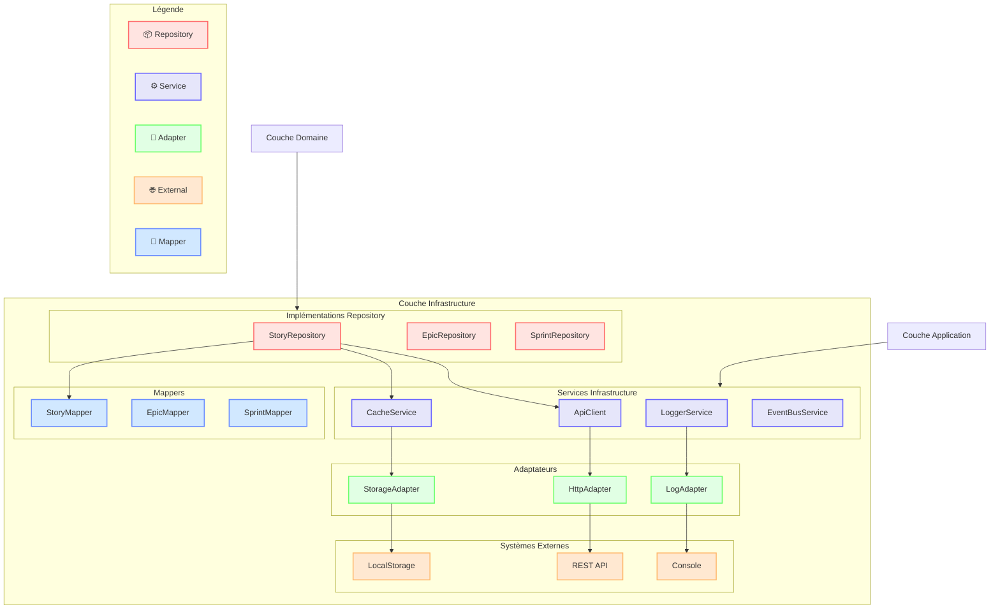
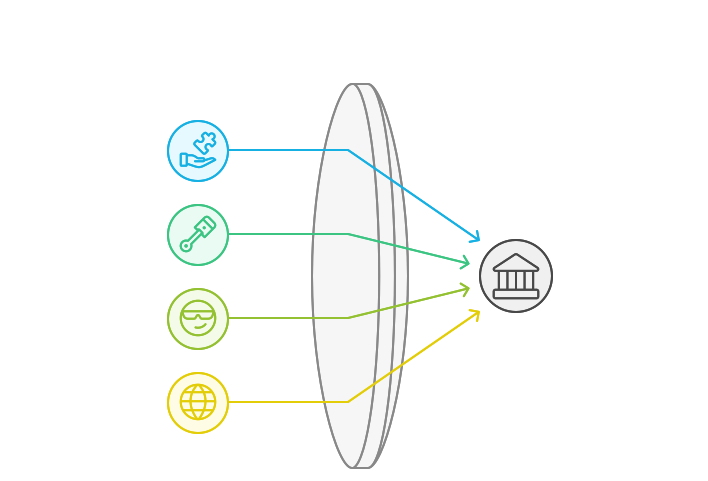
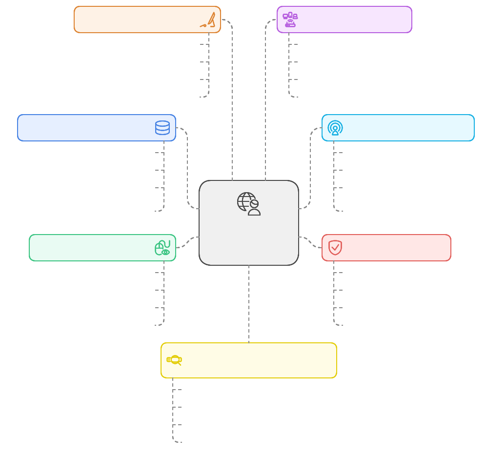
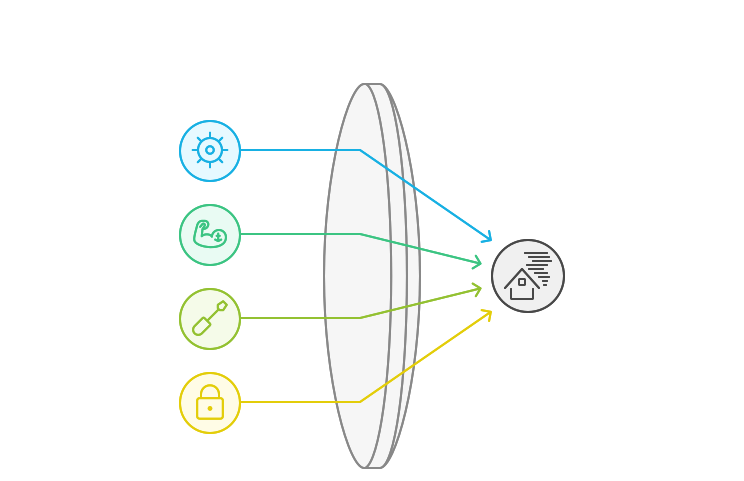
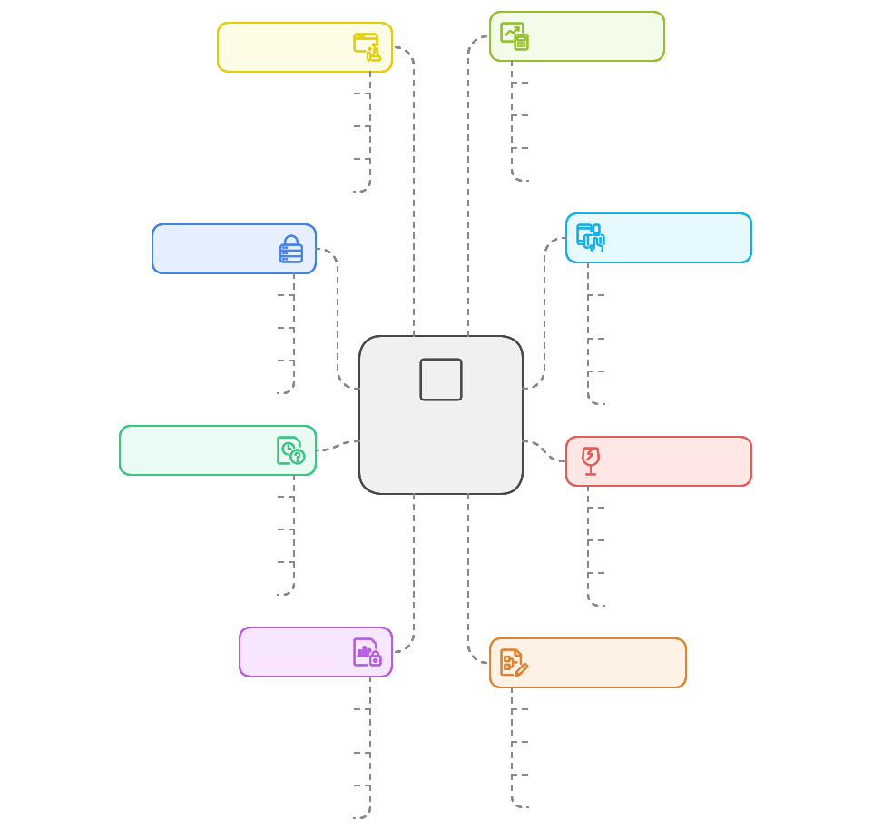
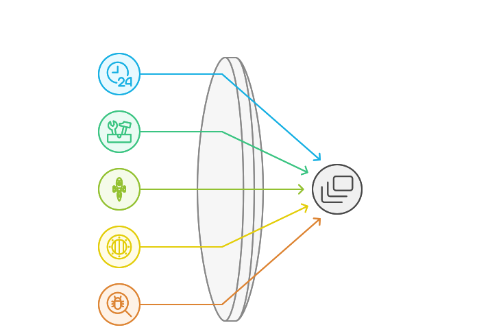
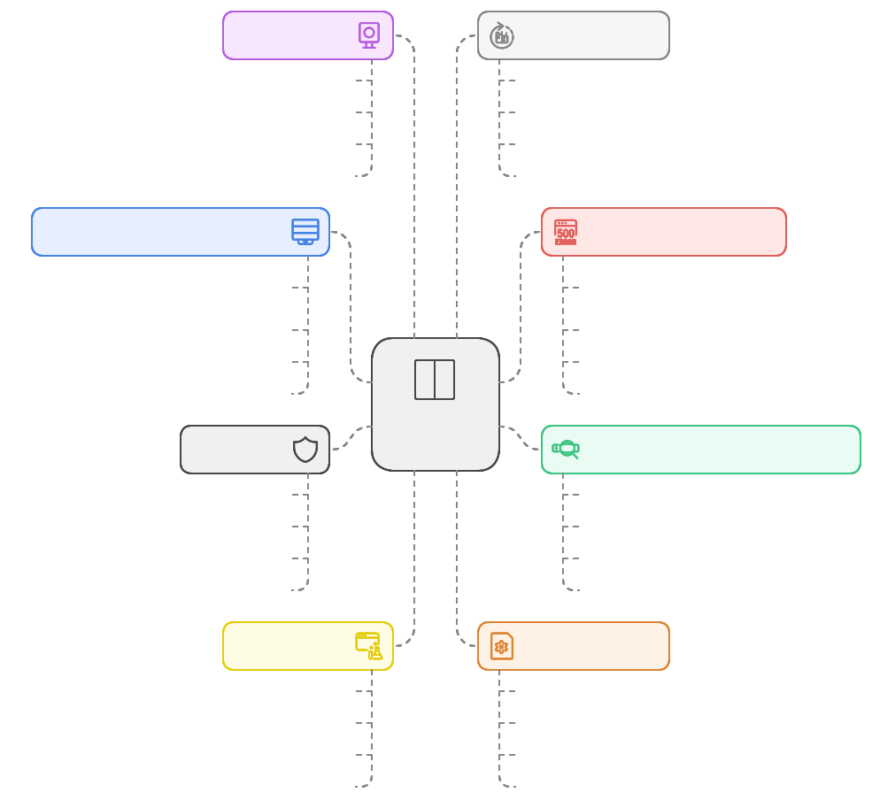
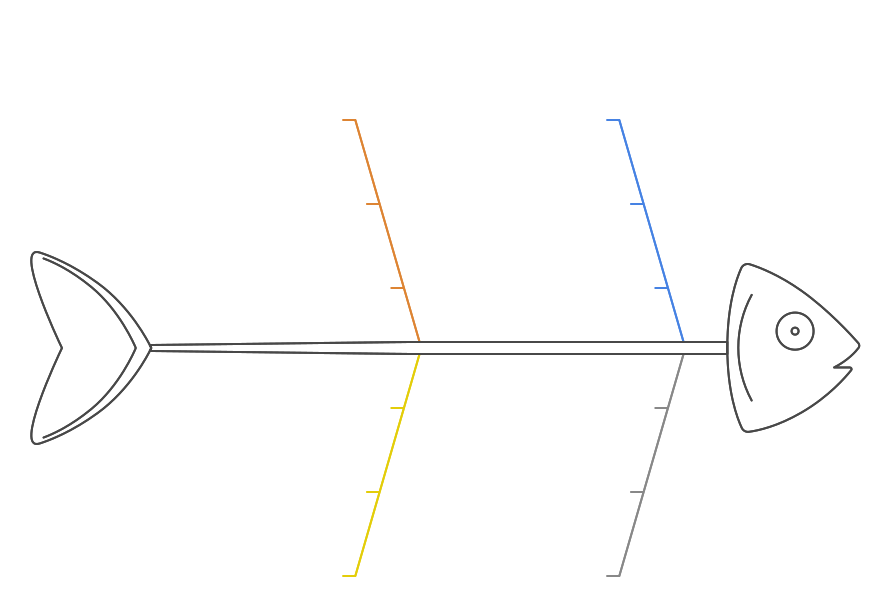
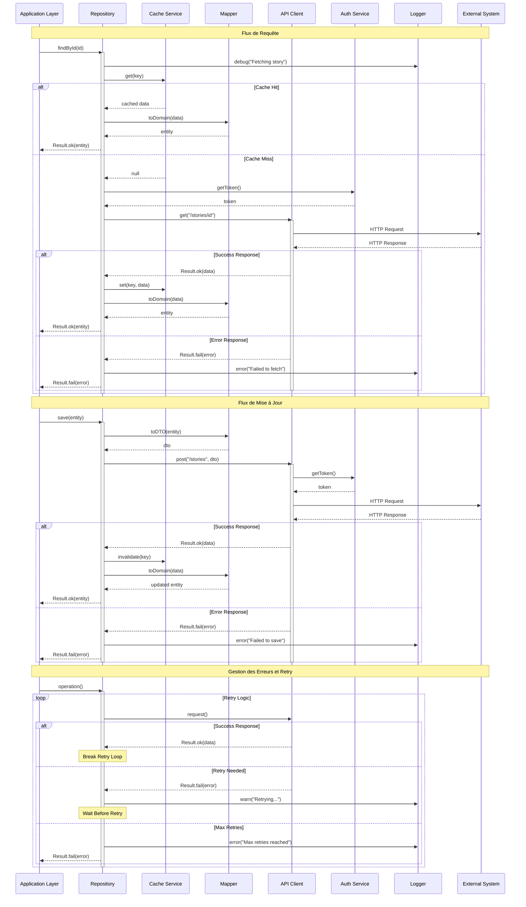

# Couche Infrastructure (Infrastructure Layer) 🔧




## Composants Principaux

### 1. Implémentation des Repositories 📦

```typescript
// src/contexts/story/infrastructure/repositories/story.repository.ts
import type { StoryRepositoryInterface } from "@/contexts/story/domain/repositories/story.repository";
import type { StoryEntityInterface } from "@/contexts/story/domain/entities/story.entity";
import type { StoryCriteriaInterface } from "@/contexts/story/domain/repositories/story.repository";
import type { ApiClientInterface } from "@/shared/interfaces/api-client.interface";
import type { CacheServiceInterface } from "@/shared/interfaces/cache-service.interface";
import type { LoggerInterface } from "@/shared/interfaces/logger.interface";
import type { ResultInterface } from "@/shared/types/result";
import { StoryMapper } from "../mappers/story.mapper";
import { RepositoryError } from "@/shared/errors/repository.error";

export class StoryRepository implements StoryRepositoryInterface {
  constructor(
    private readonly apiClient: ApiClientInterface,
    private readonly cacheService: CacheServiceInterface,
    private readonly logger: LoggerInterface,
    private readonly mapper: StoryMapper
  ) {}

  async findById(id: StoryId): Promise<ResultInterface<StoryEntityInterface>> {
    try {
      this.logger.debug("Fetching story by id", { id: id.value });

      // 1. Vérifier le cache
      const cached = await this.cacheService.get<StoryDTO>(`story:${id.value}`);
      if (cached) {
        this.logger.debug("Cache hit for story", { id: id.value });
        return this.mapper.toDomain(cached);
      }

      // 2. Appel API
      const response = await this.apiClient.get<StoryDTO>(`/stories/${id.value}`);
      if (!response.ok) {
        return Result.fail(new RepositoryError(response.error));
      }

      // 3. Mettre en cache
      await this.cacheService.set(
        `story:${id.value}`,
        response.data,
        { ttl: 3600 }
      );

      // 4. Mapper vers le domaine
      return this.mapper.toDomain(response.data);

    } catch (error) {
      this.logger.error("Failed to fetch story", { id: id.value, error });
      return Result.fail(new RepositoryError("Failed to fetch story", error));
    }
  }

  async findAll(criteria?: StoryCriteriaInterface): Promise<ResultInterface<StoryEntityInterface[]>> {
    try {
      this.logger.debug("Fetching stories with criteria", { criteria });

      // 1. Construction des paramètres de requête
      const queryParams = this.buildQueryParams(criteria);

      // 2. Appel API
      const response = await this.apiClient.get<StoryDTO[]>("/stories", {
        params: queryParams
      });

      if (!response.ok) {
        return Result.fail(new RepositoryError(response.error));
      }

      // 3. Mapper chaque résultat
      const stories = await Promise.all(
        response.data.map(dto => this.mapper.toDomain(dto))
      );

      // 4. Filtrer les résultats en erreur
      const validStories = stories
        .filter(result => result.isSuccess)
        .map(result => result.value);

      return Result.ok(validStories);

    } catch (error) {
      this.logger.error("Failed to fetch stories", { criteria, error });
      return Result.fail(new RepositoryError("Failed to fetch stories", error));
    }
  }

  async save(story: StoryEntityInterface): Promise<ResultInterface<StoryEntityInterface>> {
    try {
      this.logger.debug("Saving story", { id: story.id.value });

      // 1. Mapper vers DTO
      const dto = this.mapper.toDTO(story);

      // 2. Appel API
      const response = await this.apiClient.post<StoryDTO>("/stories", dto);
      if (!response.ok) {
        return Result.fail(new RepositoryError(response.error));
      }

      // 3. Invalider le cache
      await this.cacheService.delete(`story:${story.id.value}`);

      // 4. Mapper la réponse
      return this.mapper.toDomain(response.data);

    } catch (error) {
      this.logger.error("Failed to save story", { id: story.id.value, error });
      return Result.fail(new RepositoryError("Failed to save story", error));
    }
  }

  async update(story: StoryEntityInterface): Promise<ResultInterface<StoryEntityInterface>> {
    try {
      this.logger.debug("Updating story", { id: story.id.value });

      // 1. Mapper vers DTO
      const dto = this.mapper.toDTO(story);

      // 2. Appel API
      const response = await this.apiClient.put<StoryDTO>(
        `/stories/${story.id.value}`,
        dto
      );

      if (!response.ok) {
        return Result.fail(new RepositoryError(response.error));
      }

      // 3. Invalider le cache
      await this.cacheService.delete(`story:${story.id.value}`);

      // 4. Mapper la réponse
      return this.mapper.toDomain(response.data);

    } catch (error) {
      this.logger.error("Failed to update story", { id: story.id.value, error });
      return Result.fail(new RepositoryError("Failed to update story", error));
    }
  }

  async delete(id: StoryId): Promise<ResultInterface<void>> {
    try {
      this.logger.debug("Deleting story", { id: id.value });

      // 1. Appel API
      const response = await this.apiClient.delete(`/stories/${id.value}`);
      if (!response.ok) {
        return Result.fail(new RepositoryError(response.error));
      }

      // 2. Invalider le cache
      await this.cacheService.delete(`story:${id.value}`);

      return Result.ok();

    } catch (error) {
      this.logger.error("Failed to delete story", { id: id.value, error });
      return Result.fail(new RepositoryError("Failed to delete story", error));
    }
  }

  private buildQueryParams(criteria?: StoryCriteriaInterface): Record<string, unknown> {
    if (!criteria) return {};

    return {
      status: criteria.status?.value,
      assigneeId: criteria.assigneeId,
      sprintId: criteria.sprintId,
      tags: criteria.tags,
      fromDate: criteria.fromDate?.toISOString(),
      toDate: criteria.toDate?.toISOString(),
      orderBy: criteria.orderBy,
      page: criteria.pagination?.page,
      limit: criteria.pagination?.limit
    };
  }
}

// Factory pour la création du repository
export function createStoryRepository(): StoryRepositoryInterface {
  return new StoryRepository(
    container.get(ApiClientInterface),
    container.get(CacheServiceInterface),
    container.get(LoggerInterface),
    container.get(StoryMapper)
  );
}
```

Les points clés de cette implémentation :

1. **Injection de Dépendances**
   - API Client pour les appels HTTP
   - Service de cache pour l'optimisation
   - Logger pour le monitoring
   - Mapper pour la conversion des données

2. **Gestion des Erreurs**
   - Utilisation du type Result
   - Erreurs spécifiques au repository
   - Logging détaillé
   - Contexte d'erreur enrichi

3. **Cache**
   - Mise en cache des résultats
   - Invalidation lors des modifications
   - TTL configurable
   - Cache-first strategy

4. **Mapping**
   - Conversion bidirectionnelle DTO ↔ Entity
   - Gestion des erreurs de mapping
   - Validation des données

5. **Critères de Recherche**
   - Support des filtres
   - Pagination
   - Tri
   - Paramètres flexibles

### 2. Services d'Infrastructure 🔧

```typescript
// src/contexts/story/infrastructure/services/api-client.service.ts
export interface ApiClientConfigInterface {
  readonly baseURL: string;
  readonly timeout: number;
  readonly retryAttempts: number;
  readonly headers: Record<string, string>;
}

export interface ApiResponseInterface<T> {
  readonly data: T;
  readonly status: number;
  readonly headers: Record<string, string>;
}

export interface ApiClientInterface {
  get<T>(url: string): Promise<ResultInterface<ApiResponseInterface<T>>>;
  post<T>(url: string, data: unknown): Promise<ResultInterface<ApiResponseInterface<T>>>;
  put<T>(url: string, data: unknown): Promise<ResultInterface<ApiResponseInterface<T>>>;
  delete(url: string): Promise<ResultInterface<void>>;
}

export class ApiClient implements ApiClientInterface {
  private retryCount: number = 0;

  constructor(
    private readonly config: ApiClientConfigInterface,
    private readonly logger: LoggerInterface,
    private readonly errorHandler: ErrorHandlerInterface
  ) {}

  async get<T>(url: string): Promise<ResultInterface<ApiResponseInterface<T>>> {
    try {
      this.logger.debug("API GET Request", { url });

      const response = await fetch(`${this.config.baseURL}${url}`, {
        method: "GET",
        headers: this.config.headers,
        signal: AbortSignal.timeout(this.config.timeout)
      });

      return this.handleResponse<T>(response);
    } catch (error) {
      return this.handleError(error);
    }
  }

  async post<T>(url: string, data: unknown): Promise<ResultInterface<ApiResponseInterface<T>>> {
    try {
      this.logger.debug("API POST Request", { url, data });

      const response = await fetch(`${this.config.baseURL}${url}`, {
        method: "POST",
        headers: {
          ...this.config.headers,
          "Content-Type": "application/json"
        },
        body: JSON.stringify(data),
        signal: AbortSignal.timeout(this.config.timeout)
      });

      return this.handleResponse<T>(response);
    } catch (error) {
      return this.handleError(error);
    }
  }

  private async handleResponse<T>(response: Response): Promise<ResultInterface<ApiResponseInterface<T>>> {
    if (!response.ok) {
      const error = await this.parseError(response);
      return Result.fail(error);
    }

    const data = await response.json();
    return Result.ok({
      data,
      status: response.status,
      headers: Object.fromEntries(response.headers.entries())
    });
  }

  private async parseError(response: Response): Promise<ErrorInterface> {
    try {
      const error = await response.json();
      return this.errorHandler.handleHttpError(response.status, error);
    } catch {
      return this.errorHandler.handleHttpError(response.status);
    }
  }

  private async handleError(error: unknown): Promise<ResultInterface<never>> {
    // Retry logic
    if (this.retryCount < this.config.retryAttempts) {
      this.retryCount++;
      this.logger.warn("Retrying request", { attempt: this.retryCount });
      return this.get(url);
    }

    this.retryCount = 0;
    return Result.fail(this.errorHandler.handle(error));
  }
}
```

```typescript
// src/contexts/story/infrastructure/services/cache.service.ts
export interface CacheOptionsInterface {
  readonly ttl?: number;
  readonly tags?: string[];
}

export interface CacheServiceInterface {
  get<T>(key: string): Promise<T | null>;
  set<T>(key: string, value: T, options?: CacheOptionsInterface): Promise<void>;
  delete(key: string): Promise<void>;
  invalidateByTags(tags: string[]): Promise<void>;
  clear(): Promise<void>;
}

export class CacheService implements CacheServiceInterface {
  constructor(
    private readonly storage: Storage,
    private readonly logger: LoggerInterface
  ) {}

  async get<T>(key: string): Promise<T | null> {
    try {
      const item = await this.storage.getItem(key);
      if (!item) return null;

      const { value, expiry } = JSON.parse(item);

      if (expiry && Date.now() > expiry) {
        await this.delete(key);
        return null;
      }

      return value as T;
    } catch (error) {
      this.logger.error("Cache get error", { key, error });
      return null;
    }
  }

  async set<T>(
    key: string, 
    value: T, 
    options?: CacheOptionsInterface
  ): Promise<void> {
    try {
      const item = {
        value,
        expiry: options?.ttl ? Date.now() + options.ttl * 1000 : null,
        tags: options?.tags ?? []
      };

      await this.storage.setItem(key, JSON.stringify(item));
    } catch (error) {
      this.logger.error("Cache set error", { key, error });
    }
  }

  async delete(key: string): Promise<void> {
    try {
      await this.storage.removeItem(key);
    } catch (error) {
      this.logger.error("Cache delete error", { key, error });
    }
  }

  async invalidateByTags(tags: string[]): Promise<void> {
    try {
      const keys = await this.storage.keys();
      for (const key of keys) {
        const item = await this.storage.getItem(key);
        if (!item) continue;

        const { tags: itemTags } = JSON.parse(item);
        if (tags.some(tag => itemTags.includes(tag))) {
          await this.delete(key);
        }
      }
    } catch (error) {
      this.logger.error("Cache invalidate error", { tags, error });
    }
  }

  async clear(): Promise<void> {
    try {
      await this.storage.clear();
    } catch (error) {
      this.logger.error("Cache clear error", { error });
    }
  }
}
```

### 3. Logger


```typescript
// src/contexts/story/infrastructure/services/logger.service.ts
export interface LogConfigInterface {
  readonly level: LogLevel;
  readonly format: LogFormat;
  readonly metadata?: Record<string, unknown>;
}

export interface LogEntryInterface {
  readonly level: LogLevel;
  readonly message: string;
  readonly timestamp: Date;
  readonly context?: string;
  readonly error?: Error;
  readonly metadata?: Record<string, unknown>;
}

export interface LoggerInterface {
  debug(message: string, context?: unknown): void;
  info(message: string, context?: unknown): void;
  warn(message: string, context?: unknown): void;
  error(message: string, error?: Error, context?: unknown): void;
}

export class Logger implements LoggerInterface {
  constructor(
    private readonly config: LogConfigInterface,
    private readonly formatter: LogFormatterInterface
  ) {}

  debug(message: string, context?: unknown): void {
    if (this.shouldLog("debug")) {
      this.log({
        level: "debug",
        message,
        context,
        timestamp: new Date()
      });
    }
  }

  info(message: string, context?: unknown): void {
    if (this.shouldLog("info")) {
      this.log({
        level: "info",
        message,
        context,
        timestamp: new Date()
      });
    }
  }

  warn(message: string, context?: unknown): void {
    if (this.shouldLog("warn")) {
      this.log({
        level: "warn",
        message,
        context,
        timestamp: new Date()
      });
    }
  }

  error(message: string, error?: Error, context?: unknown): void {
    if (this.shouldLog("error")) {
      this.log({
        level: "error",
        message,
        error,
        context,
        timestamp: new Date()
      });
    }
  }

  private log(entry: LogEntryInterface): void {
    const formattedEntry = this.formatter.format({
      ...entry,
      metadata: {
        ...this.config.metadata,
        ...entry.metadata
      }
    });

    // Output selon la configuration
    console.log(formattedEntry);
  }

  private shouldLog(level: LogLevel): boolean {
    const levels: LogLevel[] = ["error", "warn", "info", "debug"];
    const configIndex = levels.indexOf(this.config.level);
    const messageIndex = levels.indexOf(level);
    return messageIndex <= configIndex;
  }
}
```

### 4. Event Bus

```typescript
// src/contexts/story/infrastructure/services/event-bus.service.ts
export interface EventBusInterface {
  publish<T extends DomainEventInterface>(event: T): Promise<void>;
  subscribe<T extends DomainEventInterface>(
    eventType: string,
    handler: (event: T) => Promise<void>
  ): void;
  unsubscribe(eventType: string, handler: Function): void;
}

export class EventBus implements EventBusInterface {
  private handlers: Map<string, Set<Function>> = new Map();
  
  constructor(
    private readonly logger: LoggerInterface
  ) {}

  async publish<T extends DomainEventInterface>(event: T): Promise<void> {
    try {
      this.logger.debug("Publishing event", { 
        type: event.type,
        payload: event 
      });

      const handlers = this.handlers.get(event.type) ?? new Set();
      
      const promises = Array.from(handlers).map(handler =>
        this.executeHandler(handler, event)
      );

      await Promise.all(promises);

    } catch (error) {
      this.logger.error("Failed to publish event", error as Error, {
        eventType: event.type
      });
      throw error;
    }
  }

  subscribe<T extends DomainEventInterface>(
    eventType: string,
    handler: (event: T) => Promise<void>
  ): void {
    const handlers = this.handlers.get(eventType) ?? new Set();
    handlers.add(handler);
    this.handlers.set(eventType, handlers);

    this.logger.debug("Subscribed to event", { eventType });
  }

  unsubscribe(eventType: string, handler: Function): void {
    const handlers = this.handlers.get(eventType);
    if (handlers) {
      handlers.delete(handler);
      if (handlers.size === 0) {
        this.handlers.delete(eventType);
      }
    }

    this.logger.debug("Unsubscribed from event", { eventType });
  }

  private async executeHandler(
    handler: Function,
    event: DomainEventInterface
  ): Promise<void> {
    try {
      await handler(event);
    } catch (error) {
      this.logger.error(
        "Event handler failed",
        error as Error,
        { eventType: event.type }
      );
      throw error;
    }
  }
}
```

Les points clés de ces implémentations :

1. **Logger Service**
   - Configuration flexible
   - Niveaux de log
   - Formatage personnalisable
   - Contexte et métadonnées

2. **Event Bus**
   - Publication/Souscription asynchrone
   - Gestion des erreurs
   - Logging des événements
   - Handlers multiples par événement


### 5. Clients API 🌐

```typescript
//src/contexts/story/infrastructure/api/api-client.service.ts
export interface ApiConfigInterface {
  readonly baseURL: string;
  readonly timeout: number;
  readonly retryAttempts: number;
  readonly headers: Record<string, string>;
}

export interface ApiResponseInterface<T> {
  readonly data: T;
  readonly status: number;
  readonly headers: Record<string, string>;
  readonly ok: boolean;
}

export interface ApiClientInterface {
  get<T>(url: string, config?: RequestConfigInterface): Promise<ResultInterface<ApiResponseInterface<T>>>;
  post<T>(url: string, data?: unknown, config?: RequestConfigInterface): Promise<ResultInterface<ApiResponseInterface<T>>>;
  put<T>(url: string, data?: unknown, config?: RequestConfigInterface): Promise<ResultInterface<ApiResponseInterface<T>>>;
  delete(url: string, config?: RequestConfigInterface): Promise<ResultInterface<void>>;
}

export class ApiClient implements ApiClientInterface {
  private retryCount: number = 0;

  constructor(
    private readonly config: ApiConfigInterface,
    private readonly logger: LoggerInterface,
    private readonly errorHandler: ErrorHandlerInterface,
    private readonly authService: AuthServiceInterface
  ) {}

  async get<T>(url: string, config?: RequestConfigInterface): Promise<ResultInterface<ApiResponseInterface<T>>> {
    try {
      this.logger.debug("API GET Request", { url, config });

      const requestConfig = await this.prepareRequest({
        ...config,
        method: "GET"
      });

      const response = await this.executeRequest<T>(url, requestConfig);
      return this.handleResponse<T>(response);

    } catch (error) {
      return this.handleError(error, url);
    }
  }

  async post<T>(
    url: string, 
    data?: unknown, 
    config?: RequestConfigInterface
  ): Promise<ResultInterface<ApiResponseInterface<T>>> {
    try {
      this.logger.debug("API POST Request", { url, data, config });

      const requestConfig = await this.prepareRequest({
        ...config,
        method: "POST",
        body: JSON.stringify(data)
      });

      const response = await this.executeRequest<T>(url, requestConfig);
      return this.handleResponse<T>(response);

    } catch (error) {
      return this.handleError(error, url);
    }
  }

  private async prepareRequest(config: RequestConfigInterface): Promise<RequestInit> {
    const token = await this.authService.getToken();
    
    return {
      ...config,
      headers: {
        ...this.config.headers,
        ...config.headers,
        ...(token ? { Authorization: `Bearer ${token}` } : {}),
        "Content-Type": "application/json"
      },
      signal: AbortSignal.timeout(this.config.timeout)
    };
  }

  private async executeRequest<T>(url: string, config: RequestInit): Promise<Response> {
    const response = await fetch(`${this.config.baseURL}${url}`, config);

    if (response.status === 401) {
      await this.authService.refreshToken();
      config.headers = {
        ...config.headers,
        Authorization: `Bearer ${await this.authService.getToken()}`
      };
      return fetch(`${this.config.baseURL}${url}`, config);
    }

    return response;
  }

  private async handleResponse<T>(response: Response): Promise<ResultInterface<ApiResponseInterface<T>>> {
    if (!response.ok) {
      const error = await this.parseError(response);
      return Result.fail(error);
    }

    const data = await response.json();
    return Result.ok({
      data,
      status: response.status,
      headers: Object.fromEntries(response.headers.entries()),
      ok: true
    });
  }

  private async parseError(response: Response): Promise<ErrorInterface> {
    try {
      const error = await response.json();
      return this.errorHandler.handleHttpError(response.status, error);
    } catch {
      return this.errorHandler.handleHttpError(response.status);
    }
  }

  private async handleError(error: unknown, url: string): Promise<ResultInterface<never>> {
    // Retry logic
    if (this.retryCount < this.config.retryAttempts) {
      this.retryCount++;
      this.logger.warn("Retrying request", { 
        url,
        attempt: this.retryCount,
        maxAttempts: this.config.retryAttempts
      });
      return this.get(url);
    }

    this.retryCount = 0;
    return Result.fail(this.errorHandler.handle(error));
  }
}

// Factory pour la création du client API
export function createApiClient(): ApiClientInterface {
  return new ApiClient(
    container.get(ApiConfigInterface),
    container.get(LoggerInterface),
    container.get(ErrorHandlerInterface),
    container.get(AuthServiceInterface)
  );
}
```

Les points clés de cette implémentation :

1. **Gestion des Requêtes**
   - Configuration flexible
   - Timeout automatique
   - Headers personnalisables
   - Méthodes HTTP standards

2. **Authentification**
   - Gestion des tokens
   - Refresh automatique
   - Headers d'authentification
   - Retry sur 401

3. **Gestion des Erreurs**
   - Parsing des erreurs HTTP
   - Transformation en erreurs domaine
   - Logging détaillé
   - Retry configurable

4. **Sécurité**
   - HTTPS par défaut
   - Validation des réponses
   - Protection contre les timeouts
   - Sanitization des données

5. **Monitoring**
   - Logging des requêtes
   - Tracking des erreurs
   - Métriques de performance
   - Traçabilité complète

### 6. Mappers

Conversion entre les formats de données.

```typescript
export interface MapperInterface<TDomain, TDTO> {
  toDomain(dto: TDTO): ResultInterface<TDomain>;
  toDTO(domain: TDomain): TDTO;
}

export class StoryMapper implements MapperInterface<StoryEntityInterface, StoryDTO> {
  toDomain(dto: StoryDTO): ResultInterface<StoryEntityInterface> {
    return StoryEntity.create({
      id: dto.id,
      title: dto.title,
      description: dto.description,
      points: dto.points,
      status: dto.status
    });
  }

  toDTO(domain: StoryEntityInterface): StoryDTO {
    return {
      id: domain.id.value,
      title: domain.title,
      description: domain.description,
      points: domain.points.value,
      status: domain.status.value,
      createdAt: domain.createdAt.toISOString(),
      updatedAt: domain.updatedAt.toISOString()
    };
  }
}
```

## Responsabilités 📋

La couche infrastructure est responsable de l'implémentation des détails techniques et des interactions avec les systèmes externes. Ses responsabilités principales sont :



### 1. Persistance des Données 💾
- Implémentation des repositories
- Gestion du cache
- Optimisation des requêtes
- Transactions et cohérence

### 2. Communication Externe 🌐
- Intégration avec les APIs
- Gestion des protocoles
- Sérialisation des données
- Gestion des timeouts et retries

### 3. Sécurité Technique 🔒
- Authentification
- Autorisation
- Encryption des données
- Protection contre les attaques

### 4. Monitoring et Logging 📊
- Traces d'exécution
- Métriques de performance
- Alertes et notifications
- Diagnostics techniques

### 5. Configuration Système 🔧
- Paramètres d'environnement
- Variables de configuration
- Feature flags
- Profils d'exécution

### 6. Services Techniques 🛠️
- Gestion des fichiers
- Services de messagerie
- Tâches planifiées
- Services d'infrastructure cloud



### 7. Performance et Optimisation ⚡
- Mise en cache
- Optimisation des requêtes
- Gestion des ressources
- Scalabilité technique

La couche infrastructure doit :
- Implémenter les interfaces définies par le domaine
- Gérer les détails techniques sans exposer leur complexité
- Assurer la fiabilité et la performance des opérations techniques
- Fournir une abstraction stable pour les couches supérieures


## Règles et Principes 📜



### 1. Principe d'Isolation 🔒
- La couche infrastructure ne doit pas exposer ses détails techniques aux autres couches
- Les implémentations concrètes doivent respecter les interfaces du domaine
- Les dépendances externes doivent être encapsulées et abstraites
- Les détails d'implémentation doivent rester invisibles pour les couches supérieures

### 2. Principe de Réversibilité 🔄
- Les choix technologiques doivent pouvoir être modifiés sans impacter les autres couches
- Les implémentations doivent être interchangeables
- Les migrations technologiques doivent être possibles sans refonte majeure
- La flexibilité technique doit être préservée

### 3. Principe de Robustesse 🛡️
- Gestion complète des erreurs et des cas limites
- Résilience face aux pannes et aux timeouts
- Stratégies de retry et de fallback
- Monitoring et alerting proactifs

### 4. Principe de Performance ⚡
- Optimisation des ressources et des requêtes
- Stratégies de cache appropriées
- Gestion efficace des connexions
- Monitoring des performances

### 5. Principe de Sécurité 🔐
- Protection contre les vulnérabilités courantes
- Gestion sécurisée des données sensibles
- Authentification et autorisation robustes
- Audit et traçabilité des opérations

### 6. Principe de Maintenance 🔧
- Code documenté et maintenable
- Logs et métriques exploitables
- Configuration externalisée et flexible
- Processus de déploiement automatisés

### 7. Principe de Testabilité 🧪
- Tests d'intégration complets
- Mocks et stubs pour les dépendances externes
- Environnements de test isolés
- Couverture de code optimale

### 8. Principe de Scalabilité 📈
- Architecture permettant la montée en charge
- Gestion efficace des ressources
- Capacité d'évolution horizontale et verticale
- Monitoring de la charge et des performances

Ces principes garantissent que la couche infrastructure :
- Reste un détail technique remplaçable
- Fournit une base solide et fiable
- Facilite la maintenance et l'évolution
- Protège l'intégrité du système



## Bonnes Pratiques 🌟



### 1. Isolation des Dépendances 🔒
- Utilisation de l'injection de dépendances
- Configuration centralisée
- Abstraction des services externes
- Interfaces clairement définies

### 2. Gestion des Erreurs 🚨
- Transformation des erreurs techniques en erreurs domaine
- Logging détaillé des erreurs
- Gestion des timeouts et retries
- Traçabilité des erreurs

### 3. Performance et Optimisation ⚡
- Mise en cache intelligente
- Gestion des connexions
- Optimisation des requêtes
- Monitoring des performances

### 4. Sécurité 🛡️
- Validation des entrées
- Gestion sécurisée des tokens
- Protection contre les attaques
- Encryption des données sensibles

### 5. Testabilité 🧪
- Mocks pour les services externes
- Tests d'intégration
- Simulation des erreurs
- Couverture des cas limites

### 6. Configuration 🔧
- Gestion des environnements
- Variables de configuration
- Feature flags
- Profils de déploiement

### 7. Monitoring 📊
- Logging structuré
- Métriques de performance
- Alertes et notifications
- Diagnostics techniques

### 8. Maintenance 🔨
- Documentation technique
- Gestion des versions
- Migration des données
- Plans de reprise



Ces bonnes pratiques permettent de :
- Assurer la fiabilité du système
- Faciliter la maintenance
- Optimiser les performances
- Garantir la sécurité
- Améliorer la testabilité


## Anti-Patterns à Éviter ⚠️



### 1. Dépendances Directes du Domaine 🚫

```typescript
// ❌ Mauvais : Infrastructure dépendant directement du domaine
export class StoryRepository {
  private readonly storyEntity = new StoryEntity(); // ❌ Instanciation directe

  async save(data: unknown): Promise<void> {
    // Utilisation directe des entités du domaine
    const story = new StoryEntity(data); // ❌ Couplage fort
    await this.database.save(story);
  }
}

// ✅ Bon : Utilisation des interfaces et mappers
export class StoryRepository implements StoryRepositoryInterface {
  constructor(
    private readonly mapper: StoryMapperInterface,
    private readonly database: DatabaseInterface
  ) {}

  async save(story: StoryEntityInterface): Promise<ResultInterface<void>> {
    const dto = this.mapper.toDTO(story);
    return this.database.save(dto);
  }
}
```

### 2. Gestion Incohérente des Erreurs 🔥

```typescript
// ❌ Mauvais : Erreurs non transformées
export class ApiClient {
  async get(url: string) {
    try {
      return await fetch(url); // ❌ Erreurs HTTP brutes
    } catch (error) {
      throw error; // ❌ Pas de transformation
    }
  }
}

// ✅ Bon : Erreurs cohérentes et typées
export class ApiClient implements ApiClientInterface {
  async get<T>(url: string): Promise<ResultInterface<T>> {
    try {
      const response = await fetch(url);
      
      if (!response.ok) {
        return Result.fail(
          new InfrastructureError(`HTTP ${response.status}`)
        );
      }

      return Result.ok(await response.json());
    } catch (error) {
      return Result.fail(
        new InfrastructureError("Network error", error)
      );
    }
  }
}
```

### 3. État Global et Mutable 🌍

```typescript
// ❌ Mauvais : État global et mutable
export class CacheService {
  private static instance: CacheService;
  public cache: Map<string, any> = new Map(); // ❌ État mutable public

  static getInstance() {
    if (!this.instance) {
      this.instance = new CacheService();
    }
    return this.instance;
  }
}

// ✅ Bon : Services immutables et injectables
export class CacheService implements CacheServiceInterface {
  constructor(
    private readonly storage: StorageInterface,
    private readonly logger: LoggerInterface
  ) {}

  async get<T>(key: string): Promise<ResultInterface<T>> {
    // Implémentation...
  }
}
```

### 4. Couplage avec les Détails Techniques 🔌

```typescript
// ❌ Mauvais : Couplage fort avec la technologie
export class StoryRepository {
  private readonly mongoClient = new MongoClient(); // ❌ Dépendance directe
  private readonly redisClient = new RedisClient(); // ❌ Dépendance directe

  async findById(id: string) {
    const cached = await this.redisClient.get(id);
    if (!cached) {
      return this.mongoClient.findOne({ _id: id });
    }
  }
}

// ✅ Bon : Abstraction des détails techniques
export class StoryRepository implements StoryRepositoryInterface {
  constructor(
    private readonly database: DatabaseInterface,
    private readonly cache: CacheInterface
  ) {}

  async findById(id: StoryId): Promise<ResultInterface<StoryEntity>> {
    const cached = await this.cache.get(id.value);
    if (cached) return this.mapper.toDomain(cached);
    
    return this.database.findById(id.value);
  }
}
```

### 5. Validation dans l'Infrastructure 🚦

```typescript
// ❌ Mauvais : Validation dans l'infrastructure
export class StoryRepository {
  async save(story: unknown) {
    // ❌ Validation au mauvais niveau
    if (!story.title || story.points > 21) {
      throw new Error("Invalid story");
    }
  }
}

// ✅ Bon : Validation déléguée au domaine
export class StoryRepository implements StoryRepositoryInterface {
  async save(story: StoryEntityInterface): Promise<ResultInterface<void>> {
    // La validation est déjà faite dans l'entité
    return this.database.save(this.mapper.toDTO(story));
  }
}
```

Ces anti-patterns doivent être évités car ils :
- Violent les principes de Clean Architecture
- Créent des couplages forts
- Rendent le code difficile à tester
- Compliquent la maintenance
- Réduisent la portabilité
- Augmentent la dette technique


## Diagramme de séquence illustrant les flux des exemples


