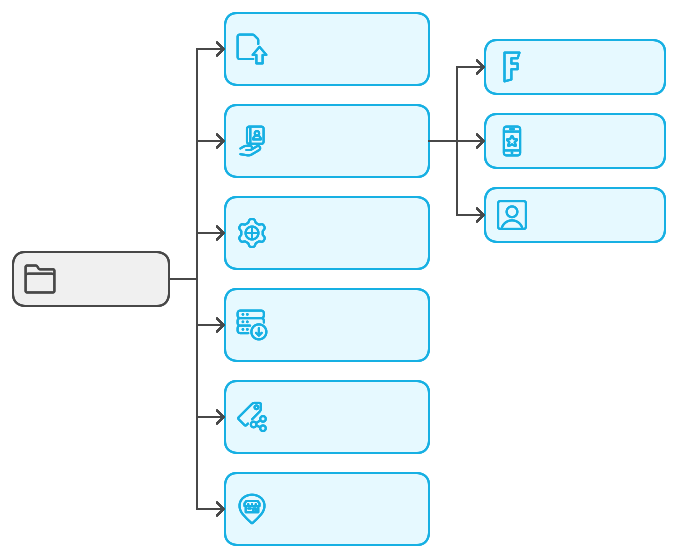
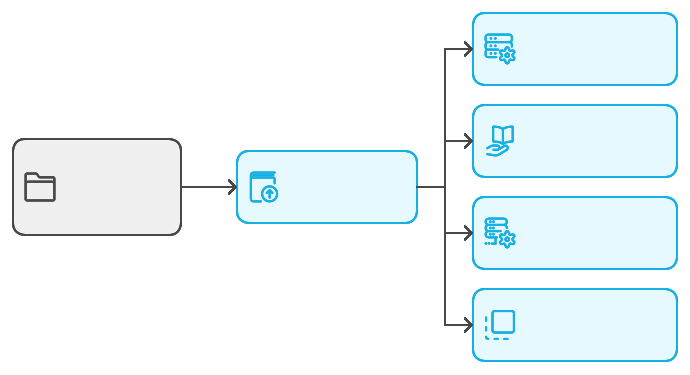
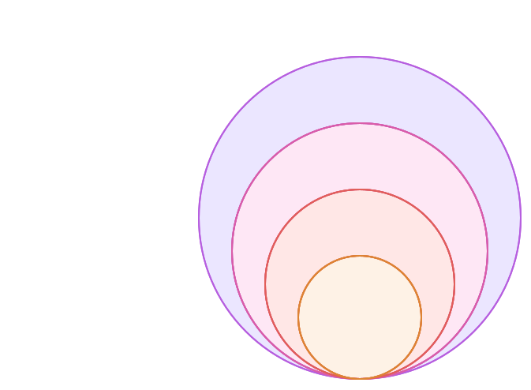
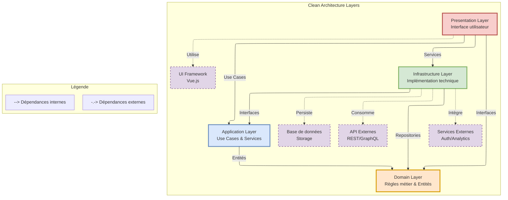

# Organisation Globale du Projet

## Structure Racine

```
/src
├── /assets                    # Ressources statiques
├── /contexts                  # Contextes métiers (DDD)
│   ├── /epic                  # Contexte "Epic"
│   ├── /story                 # Contexte "Story"
│   └── /user                  # Contexte "Utilisateur"
├── /infrastructure            # Infrastructure globale
├── /router                    # Configuration du routeur
├── /shared                    # Code partagé
└── /store                     # Stores Pinia globaux
```



## Description des Dossiers Principaux

### 1. Contexts (`/contexts`)

Le dossier `contexts` contient les différents domaines métier de l'application, organisés selon les principes du **Domain-Driven Design** (DDD).

Chaque contexte est isolé et contient sa propre implémentation des couches :
- Domain
- Application
- Infrastructure
- Presentation

Exemple de contexte :
```
/contexts
├── /story
│   ├── /application        # Use cases et services
│   ├── /domain             # Logique métier
│   ├── /infrastructure     # Implémentation technique
│   └── /presentation       # Interface utilisateur
```



### 2. Shared (`/shared`)

Code réutilisable partagé entre les différents contextes :

```
/shared
├── /components          # Composants UI partagés
│   ├── BaseButton.vue
│   └── BaseInput.vue
├── /composables         # Composables Vue partagés
│   ├── useError.ts
│   └── useLoading.ts
├── /constants           # Constantes globales
│   ├── api.ts
│   └── errors.ts
├── /types               # Types et interfaces communs
│   ├── Entity.ts
│   └── Result.ts
└── /utils               # Fonctions utilitaires
    ├── date.ts
    └── validation.ts
```

### 3. Infrastructure (`/infrastructure`)

Services et configurations globales :

```
/infrastructure
├── /api               # Configuration API
│   ├── client.ts
│   └── interceptors.ts
├── /error             # Gestion des erreurs
│   └── handler.ts
├── /events            # Bus d'événements
│   └── eventBus.ts
├── /logger            # Service de logging
│   └── logger.ts
└── /storage           # Stockage local
    └── storage.ts
```

### 4. Store (`/store`)

Stores Pinia :

```
/store
├── /modules                # Stores modulaires
│   ├── /app               # Store application global
│   │   ├── index.ts
│   │   └── types.ts
│   └── /auth              # Store authentification
│       ├── index.ts
│       └── types.ts
├── /types                 # Types partagés des stores
│   └── index.ts
└── index.ts              # Configuration et exports des stores
```

### 5. Router (`/router`)

Configuration et guards du routeur Vue :

```
/router
├── /guards                # Guards de navigation
│   ├── auth.guard.ts      # Guard d'authentification
│   └── role.guard.ts      # Guard de rôles
├── /middleware           # Middleware de routes
│   └── analytics.ts      # Tracking analytics
├── /types               # Types du routeur
│   └── index.ts
└── index.ts            # Configuration principale
```

### 6. Gestion des Assets

Organisation des ressources statiques :

```
/assets
├── /fonts                      # Polices personnalisées
│   ├── /roboto
│   │   ├── Roboto-Bold.woff2
│   │   └── Roboto-Regular.woff2
│   └── /inter
│       ├── Inter-Bold.woff2
│       └── Inter-Regular.woff2
├── /images                     # Images et graphiques
│   ├── /backgrounds            # Arrière-plans
│   │   ├── hero-bg.webp
│   │   └── pattern.svg
│   ├── /icons                  # Icônes SVG
│   │   ├── arrow-right.svg
│   │   └── check.svg
│   └── /logos                  # Logos
│       ├── logo-dark.svg
│       └── logo-light.svg
└── /styles                     # Styles globaux
    ├── /base                   # Styles de base
    │   ├── _reset.scss
    │   └── _typography.scss
    └── /themes             # Thèmes
        ├── _dark.scss
        └── _light.scss
```

## Bonnes Pratiques

### 1. Organisation des Dossiers

#### Principes Généraux
- Suivre une structure cohérente et prévisible
- Limiter la profondeur des dossiers (max 5-6 niveaux)
- Regrouper les fichiers par responsabilité
- Éviter la duplication de code entre contextes

#### Clean Architecture
- Séparer clairement les couches (domain, application, infrastructure, presentation)
- Respecter les dépendances entre couches
- Isoler le code métier dans la couche domain
- Centraliser les interfaces dans chaque couche

```
/contexts/story
├── /domain             # ⚡ Cœur métier, indépendant des autres couches
├── /application        # 🔄 Orchestration des use cases
├── /infrastructure     # 🔌 Implémentation technique
└── /presentation       # 🖼️ Interface utilisateur
```

### 2. Conventions de Nommage

#### Dossiers
- Utiliser le kebab-case : `user-profile`, `auth-service`
- Noms au singulier pour les contextes : `story` et non `stories`
- Noms descriptifs et explicites : `infrastructure` plutôt que `infra`

```
✅ /user-management
✅ /auth-service
❌ /userManagement
❌ /auth_service
```

#### Fichiers
- Components Vue : PascalCase avec `.vue`
  ```
  StoryCard.vue
  UserProfile.vue
  ```
- Services/Classes : PascalCase avec suffixe descriptif
  ```
  StoryRepository.ts
  AuthenticationService.ts
  ```
- Interfaces : suffixe 'Interface'
  ```
  StoryRepositoryInterface.ts
  ```
- Types : Suffixe 'Type'
  ```
  StoryStatusType.ts
  UserRoleType.ts
  ```
- Utils/Helpers : camelCase
  ```
  dateFormatter.ts
  stringUtils.ts
  ```

### 3. Organisation des Tests

```
/contexts/story
├── /__tests__
│   ├── /unit              # Tests unitaires
│   │   ├── /domain
│   │   └── /application
│   ├── /integration       # Tests d'intégration
│   └── /e2e              # Tests end-to-end
```

### 4. Documentation

- README.md dans chaque dossier principal
- Documentation des interfaces et types
- Commentaires JSDoc pour les fonctions complexes

```
/contexts/story
├── README.md             # Documentation du contexte
├── /domain
│   └── README.md        # Documentation du domaine
└── /application
    └── README.md        # Documentation de la couche application
```

### 5. Anti-patterns à Éviter

❌ **À Éviter**
- Mélanger les responsabilités des couches
- Créer des dépendances circulaires entre contextes
- Dupliquer la logique métier
- Utiliser des noms ambigus ou trop génériques

✅ **Bonnes Pratiques**
- Respecter les principes SOLID
- Maintenir une séparation claire des préoccupations
- Utiliser des noms explicites et cohérents
- Documenter les choix d'architecture

### 6. Gestion des Dépendances



Les dépendances suivent deux règles principales : les dépendances internes (vers le domaine) et les dépendances externes (vers les services externes).




#### Principes des dépendances :

1. **Dépendances Internes** (flèches pleines)
   - Pointent toujours vers le Domain Layer
   - Suivent les principes Clean Architecture
   - Garantissent l'isolation du domaine

2. **Dépendances Externes** (flèches pointillées)
   - Gérées par l'Infrastructure Layer
   - Isolées par des interfaces
   - Facilement remplaçables

3. **Règles de Protection**
   - Domain Layer protégé des dépendances externes
   - Infrastructure Layer encapsule les services externes
   - Presentation Layer isolée des détails d'implémentation

### 7. Scalabilité

- Prévoir la croissance du projet
- Faciliter l'ajout de nouveaux contextes
- Permettre la réorganisation sans casser la structure
- Maintenir la cohérence à l'échelle du projet
