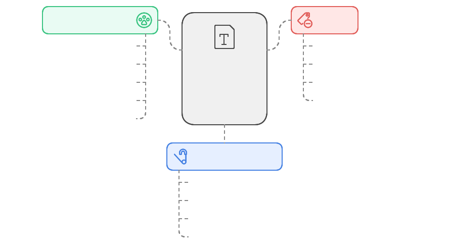
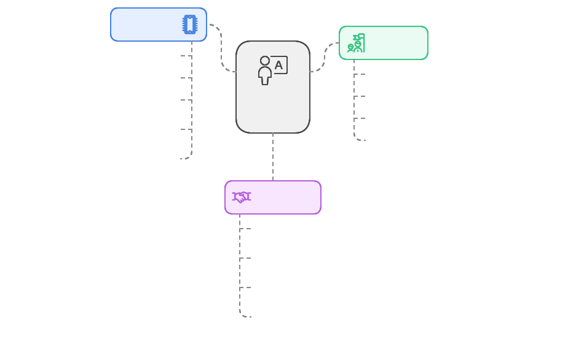
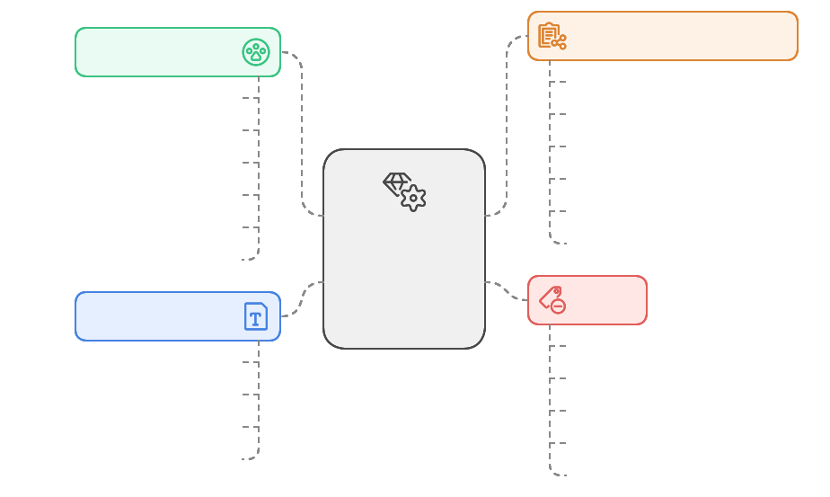
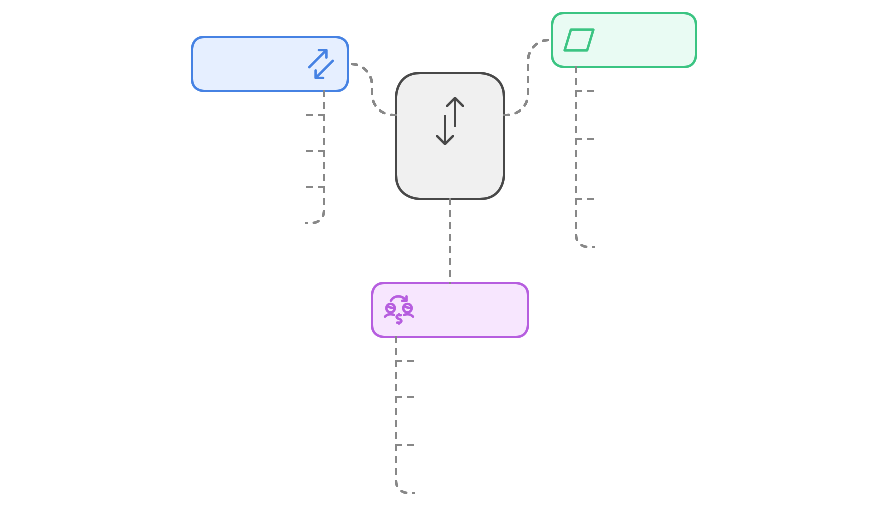
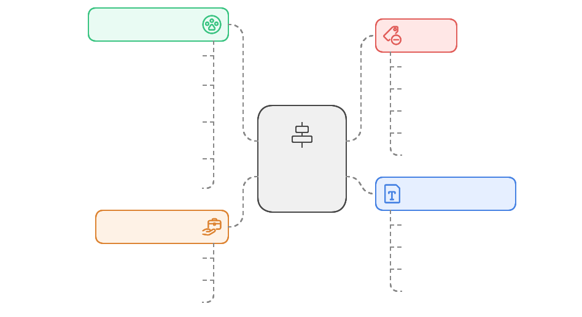
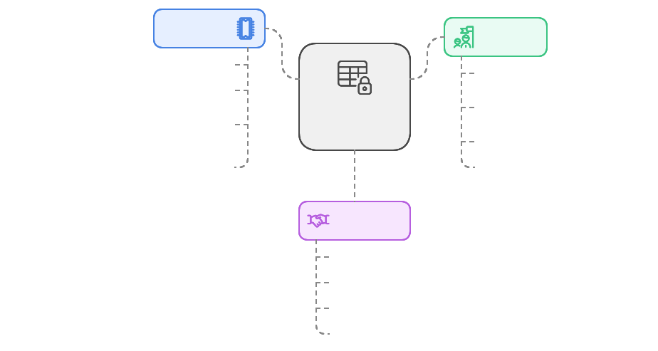
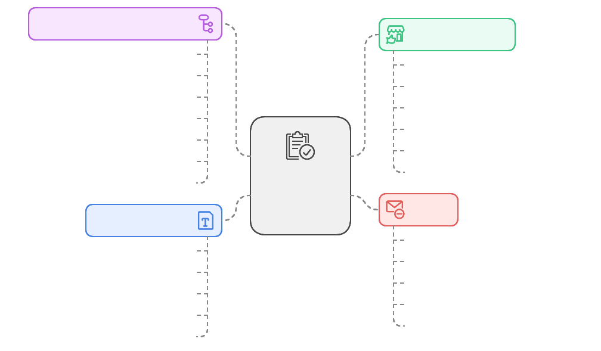
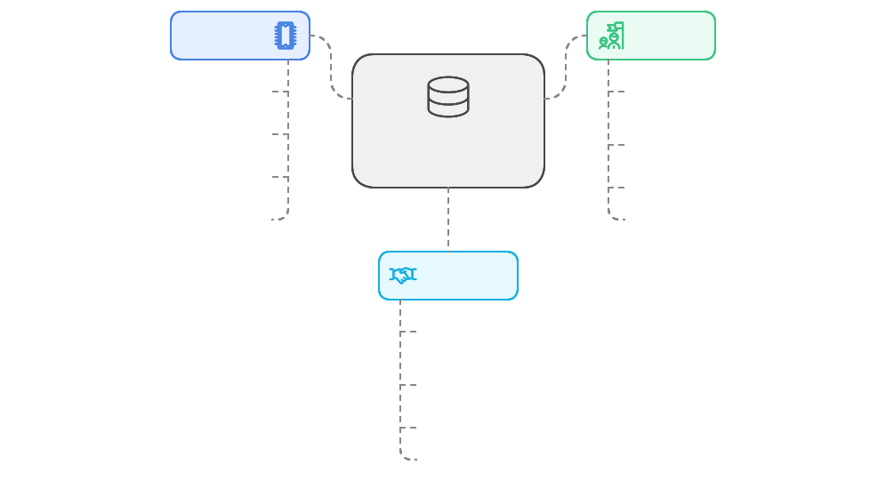
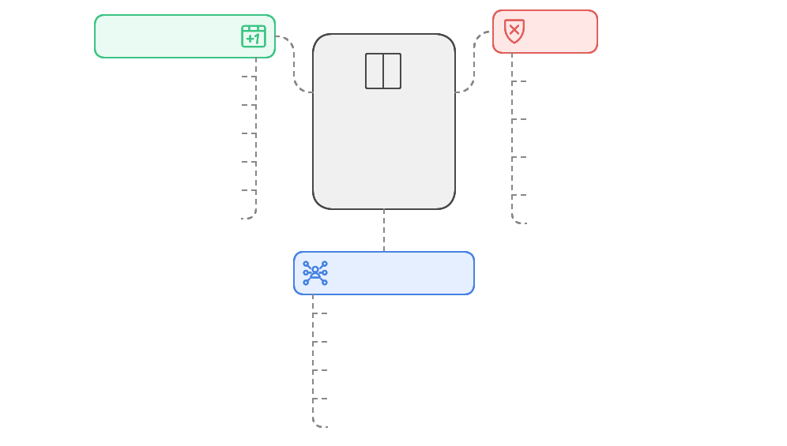

# Structure d'un Contexte 🏗️

## Vue d'ensemble

Chaque contexte métier (`/contexts/*`) suit une structure standardisée qui reflète l'architecture en couches. Cette organisation assure une séparation claire des responsabilités et facilite la maintenance.

## Structure Détaillée

```mermaid
graph TD
    %% Styles
    classDef domain fill:#FFE6CC,stroke:#D79B00,stroke-width:2px
    classDef application fill:#DAE8FC,stroke:#6C8EBF,stroke-width:2px
    classDef infrastructure fill:#D5E8D4,stroke:#82B366,stroke-width:2px
    classDef presentation fill:#F8CECC,stroke:#B85450,stroke-width:2px

    %% Root
    Story[contexts/story]

    %% Domain Layer
    Domain[domain]
    D_Entities[entities]
    D_ValueObjects[value-objects]
    D_Services[services]
    D_Repos[repositories]
    D_Specs[specifications]
    D_Events[events]

    %% Application Layer
    Application[application]
    A_DTOs[dtos]
    A_Services[services]
    A_UseCases[use-cases]
    A_Ports[ports]

    %% Infrastructure Layer
    Infrastructure[infrastructure]
    I_Repos[repositories]
    I_Mappers[mappers]
    I_API[api]
    I_Persistence[persistence]

    %% Presentation Layer
    Presentation[presentation]
    P_Components[components]
    P_Views[views]
    P_Composables[composables]
    P_Store[store]

    %% Relations
    Story --> Domain
    Story --> Application
    Story --> Infrastructure
    Story --> Presentation

    %% Domain Relations
    Domain --> D_Entities
    Domain --> D_ValueObjects
    Domain --> D_Services
    Domain --> D_Repos
    Domain --> D_Specs
    Domain --> D_Events

    %% Application Relations
    Application --> A_DTOs
    Application --> A_Services
    Application --> A_UseCases
    Application --> A_Ports

    %% Infrastructure Relations
    Infrastructure --> I_Repos
    Infrastructure --> I_Mappers
    Infrastructure --> I_API
    Infrastructure --> I_Persistence

    %% Presentation Relations
    Presentation --> P_Components
    Presentation --> P_Views
    Presentation --> P_Composables
    Presentation --> P_Store

    %% Apply styles
    class Domain,D_Entities,D_ValueObjects,D_Services,D_Repos,D_Specs,D_Events domain
    class Application,A_DTOs,A_Services,A_UseCases,A_Ports application
    class Infrastructure,I_Repos,I_Mappers,I_API,I_Persistence infrastructure
    class Presentation,P_Components,P_Views,P_Composables,P_Store presentation
```



```
/contexts/story
├── /domain                    # Couche domaine
│   ├── /entities             # Entités métier
│   │   ├── Story.ts
│   │   └── StoryId.ts
│   ├── /value-objects        # Objets valeur
│   │   ├── StoryStatus.ts
│   │   └── StoryPoints.ts
│   ├── /services             # Services métier
│   │   └── StoryService.ts
│   ├── /repositories         # Interfaces repositories
│   │   └── StoryRepository.ts
│   ├── /specifications       # Spécifications
│   │   └── StoryEligibility.ts
│   └── /events              # Événements domaine
│       └── StoryCreated.ts
│
├── /application              # Couche application
│   ├── /dtos                # Data Transfer Objects
│   │   └── StoryDTO.ts
│   ├── /services            # Services d'application
│   │   └── StoryApplicationService.ts
│   ├── /use-cases          # Cas d'utilisation
│   │   ├── CreateStory.ts
│   │   └── UpdateStory.ts
│   └── /ports              # Ports pour l'infrastructure
│       └── StoryStorage.ts
│
├── /infrastructure          # Couche infrastructure
│   ├── /repositories       # Implémentation repositories
│   │   └── StoryRepositoryImpl.ts
│   ├── /mappers           # Mappers DTO <-> Entity
│   │   └── StoryMapper.ts
│   ├── /api               # Clients API
│   │   └── StoryApi.ts
│   └── /persistence       # Persistence locale
│       └── StoryCache.ts
│
└── /presentation           # Couche présentation
    ├── /components        # Composants Vue
    │   ├── StoryCard.vue
    │   └── StoryForm.vue
    ├── /views            # Pages Vue
    │   ├── StoryList.vue
    │   └── StoryDetail.vue
    ├── /composables      # Composables Vue
    │   ├── useStory.ts
    │   └── useStoryDrag.ts
    └── /store            # Store Pinia contextuel
        └── storyStore.ts
```

## Description des Dossiers

### 1. Domain Layer (`/domain`)

#### Entities (`/domain/entities`)

Les entités représentent les objets métier principaux du domaine, avec leur identité et leur cycle de vie.

**Définition**
- Objets avec une identité unique et continue
- Contiennent les règles métier et les invariants
- Immutables et encapsulés
- Indépendants des détails techniques

**Objectifs**
- Garantir l'intégrité des données
- Centraliser les règles métier
- Protéger les invariants du domaine
- Fournir une API claire et cohérente

**Relations**
- Utilisées par les Use Cases (Application)
- Persistées via les Repositories (Infrastructure)
- Peuvent contenir des Value Objects
- Peuvent émettre des Domain Events



**Implémentation**

```typescript
// Story.ts
export class Story extends AggregateRoot {
  private constructor(
    private readonly props: StoryProps,
    private readonly id: StoryId
  ) {
    super();
    Object.freeze(this);
  }

  // Factory method pour garantir la validité
  public static create(props: StoryProps): Result<Story> {
    // Validation des règles métier
    if (!this.validateTitle(props.title)) {
      return Result.fail("Titre invalide");
    }

    // Création sécurisée
    const id = StoryId.generate();
    const story = new Story(props, id);

    // Événement de création
    story.addDomainEvent(new StoryCreatedEvent(story));

    return Result.ok(story);
  }

  // Méthodes métier
  public updateStatus(status: StoryStatus): Result<void> {
    if (!this.canChangeStatus(status)) {
      return Result.fail("Changement de statut non autorisé");
    }

    this.props.status = status;
    return Result.ok();
  }

  // Encapsulation des règles métier
  private canChangeStatus(newStatus: StoryStatus): boolean {
    // Logique de validation du changement de statut
    return true;
  }

  // Getters immutables
  public get title(): string {
    return this.props.title;
  }
}
```

**Bonnes Pratiques**
- Constructeur privé pour forcer l'utilisation des factory methods
- Validation complète dans les factory methods
- Getters immutables uniquement
- Méthodes métier explicites pour les modifications
- Émission d'événements pour les changements importants

**À Éviter**
- Dépendances externes (frameworks, BDD...)
- Logique d'infrastructure ou de présentation
- Setters publics
- Violation de l'encapsulation

**Patterns Associés**
- Factory Pattern pour la création
- Value Objects pour les attributs complexes
- Aggregate Pattern pour les groupes d'entités
- Domain Events pour la communication


#### Value Objects (`/domain/value-objects`)

Les Value Objects sont des objets immutables qui décrivent des caractéristiques du domaine sans identité propre.

**Définition**
- Objets sans identité
- Immutables par nature
- Égalité basée sur les attributs
- Encapsulent des règles de validation
- Auto-validants à la création

**Objectifs**
- Encapsuler la logique de validation
- Garantir l'intégrité des données
- Éviter les primitives obsessives
- Créer un vocabulaire métier riche

**Relations**
- Utilisés par les Entities
- Peuvent être composés d'autres Value Objects
- Partagés entre différentes Entities
- Facilement sérialisables/désérialisables
-


**Implémentation**

```typescript
// StoryPoints.ts
export class StoryPoints extends ValueObject<number> {
  // Points valides selon la suite de Fibonacci
  private static readonly VALID_POINTS = [1, 2, 3, 5, 8, 13, 21];

  private constructor(props: { value: number }) {
    super(props);
    this.validate();
    Object.freeze(this);
  }

  // Factory method pour garantir la validité
  public static create(points: number): Result<StoryPoints> {
    if (!this.isValid(points)) {
      return Result.fail<StoryPoints>(
        `Points invalides: ${points}. Valeurs autorisées: ${this.VALID_POINTS.join(", ")}`
      );
    }

    return Result.ok<StoryPoints>(new StoryPoints({ value: points }));
  }

  // Validation métier
  private validate(): void {
    if (!StoryPoints.isValid(this.props.value)) {
      throw new InvalidPointsError(this.props.value);
    }
  }

  // Méthodes utilitaires
  private static isValid(points: number): boolean {
    return this.VALID_POINTS.includes(points);
  }

  // Opérations métier
  public isHighPriority(): boolean {
    return this.props.value >= 8;
  }

  // Comparaisons
  public equals(other: StoryPoints): boolean {
    return this.props.value === other.props.value;
  }

  // Conversion
  public toNumber(): number {
    return this.props.value;
  }
}

// Exemple d'utilisation
const pointsResult = StoryPoints.create(5);
if (pointsResult.isSuccess) {
  const points = pointsResult.getValue();
  console.log(points.isHighPriority()); // false
}
```

**Bonnes Pratiques**
- Toujours immutable (Object.freeze)
- Validation à la création
- Factory methods pour la construction
- Méthodes de comparaison explicites
- Encapsulation des règles métier
- Nommage expressif du domaine

**À Éviter**
- Setters ou mutations
- Identité ou ID
- État interne modifiable
- Dépendances externes
- Logique non liée au domaine

**Patterns Associés**
- Factory Pattern pour la création
- Null Object Pattern pour les valeurs par défaut
- Specification Pattern pour les règles complexes
- Builder Pattern pour la construction complexe

**Cas d'Utilisation Typiques**
- Montants monétaires
- Dates et périodes
- Statuts et états
- Mesures et unités
- Coordonnées et positions
- Identifiants formatés (email, téléphone)



### 2. Application Layer (`/application`)

#### DTOs (`/application/dtos`)

Les DTOs (Data Transfer Objects) sont des objets simples utilisés pour transférer des données entre les couches de l'application.

**Définition**
- Objets de transport de données sans logique métier
- Structures de données plates et simples
- Adaptés aux besoins spécifiques des clients
- Indépendants des entités du domaine

**Objectifs**
- Découpler la présentation du domaine
- Optimiser les transferts de données
- Protéger les invariants du domaine
- Versionner les contrats d'API

**Relations**
- Créés par les Use Cases
- Mappés depuis/vers les Entities
- Utilisés par la couche Presentation
- Sérialisés pour les API



**Implémentation**

```typescript
// StoryDTO.ts

// DTO pour la création
export interface CreateStoryDTOInterface {
  title: string;
  description: string;
  points: number;
  assigneeId?: string;
  tags: string[];
}

// DTO pour la réponse
export interface StoryDTOInterface {
  id: string;
  title: string;
  description: string;
  points: number;
  status: string;
  assignee?: {
    id: string;
    name: string;
  };
  tags: string[];
  createdAt: string;
  updatedAt: string;
}

// DTO pour la mise à jour
export interface UpdateStoryDTOInterface {
  title?: string;
  description?: string;
  points?: number;
  status?: string;
  assigneeId?: string;
  tags?: string[];
}

// DTO pour la liste
export interface StoryListItemDTOInterface {
  id: string;
  title: string;
  points: number;
  status: string;
  assigneeName?: string;
}
```

**Bonnes Pratiques**
- Interfaces plutôt que classes
- Nommage explicite avec suffixe DTO
- Versions différentes pour différents usages
- Validation via schemas/decorators
- Documentation claire des champs

**À Éviter**
- Logique métier dans les DTOs
- Dépendances vers le domaine
- Héritage complexe
- Mutabilité non nécessaire
- Couplage avec les frameworks

**Patterns Associés**
- Mapper Pattern pour la conversion
- Builder Pattern pour la construction
- Facade Pattern pour l'agrégation
- Adapter Pattern pour la compatibilité



**Cas d'Utilisation**
1. **API Contracts**
   ```typescript
   // API V1
   interface StoryV1DTO {
     id: string;
     title: string;
   }

   // API V2
   interface StoryV2DTO extends StoryV1DTO {
     description: string;
     version: 2;
   }
   ```

2. **Agrégation de Données**
   ```typescript
   interface StoryDetailsDTO {
     story: StoryDTOInterface;
     comments: CommentDTOInterface[];
     activities: ActivityDTOInterface[];
     assigneeDetails: UserDTOInterface;
   }
   ```

3. **Projections Spécifiques**
   ```typescript
   interface StoryKanbanDTO {
     id: string;
     title: string;
     points: number;
     color: string;
     position: number;
   }
   ```

**Sécurité**
- Filtrage des données sensibles
- Validation des entrées
- Contrôle des accès
- Versionnage des contrats

#### Use Cases (`/application/use-cases`)

Les Use Cases encapsulent la logique métier spécifique à une action ou un cas d'utilisation particulier.

**Définition**
- Orchestrent les interactions entre les entités et services
- Implémentent une seule action métier
- Indépendants du framework et de l'UI
- Point d'entrée pour les fonctionnalités métier

**Objectifs**
- Isoler la logique métier
- Garantir la cohérence des opérations
- Faciliter les tests unitaires
- Assurer la réutilisabilité

**Relations**
- Utilisent les Entities et Value Objects
- Interagissent avec les Repositories
- Retournent des DTOs
- Peuvent émettre des Events



**Implémentation**

```typescript
// CreateStoryUseCase.ts
export class CreateStoryUseCase implements UseCase<CreateStoryDTO, StoryDTO> {
  constructor(
    private readonly storyRepository: StoryRepository,
    private readonly userRepository: UserRepository,
    private readonly storyMapper: StoryMapper,
    private readonly eventEmitter: EventEmitter
  ) {}

  async execute(params: CreateStoryDTO): Promise<Result<StoryDTO>> {
    // 1. Validation des données d'entrée
    const validationResult = await this.validateInput(params);
    if (validationResult.isFailure) {
      return Result.fail(validationResult.error);
    }

    // 2. Création de l'entité
    const storyResult = Story.create({
      title: params.title,
      description: params.description,
      points: params.points,
      assigneeId: params.assigneeId
    });

    if (storyResult.isFailure) {
      return Result.fail(storyResult.error);
    }

    const story = storyResult.getValue();

    // 3. Logique métier spécifique
    if (params.assigneeId) {
      const assigneeResult = await this.userRepository.findById(params.assigneeId);
      if (assigneeResult.isFailure) {
        return Result.fail("Assignee not found");
      }
      story.assign(assigneeResult.getValue());
    }

    // 4. Persistance
    const savedStoryResult = await this.storyRepository.save(story);
    if (savedStoryResult.isFailure) {
      return Result.fail(savedStoryResult.error);
    }

    // 5. Événements du domaine
    this.eventEmitter.emit(new StoryCreatedEvent(story));

    // 6. Transformation en DTO
    const dto = this.storyMapper.toDTO(savedStoryResult.getValue());
    return Result.ok(dto);
  }

  private async validateInput(params: CreateStoryDTO): Promise<Result<void>> {
    // Validation spcifique au use case
    return Result.ok();
  }
}

// Utilisation
const useCase = new CreateStoryUseCase(
  storyRepository,
  userRepository,
  storyMapper,
  eventEmitter
);

const result = await useCase.execute({
  title: "Nouvelle story",
  description: "Description",
  points: 5,
  assigneeId: "user-123"
});

if (result.isSuccess) {
  console.log("Story créée:", result.getValue());
} else {
  console.error("Erreur:", result.error);
}
```

**Bonnes Pratiques**
- Un use case = une action métier
- Validation des entrées
- Gestion des erreurs explicite
- Retour de Result<T>
- Injection des dépendances
- Tests unitaires complets

**À Éviter**
- Logique de présentation
- Accès direct aux services externes
- État mutable
- Dépendances au framework
- Use cases génériques

**Patterns Associés**
- Command Pattern
- Result Pattern
- Repository Pattern
- Event-Driven Pattern
- Mapper Pattern

**Structure Type d'un Use Case**
1. Validation des entrées
2. Création/Récupération des entités
3. Exécution de la logique métier
4. Persistance des changements
5. Émission des événements
6. Transformation en DTO
7. Retour du résultat



**Cas d'Utilisation Spéciaux**

1. **Use Case Composé**
```typescript
class CompleteSprintUseCase {
  constructor(
    private readonly closeStoriesUseCase: CloseStoriesUseCase,
    private readonly generateReportUseCase: GenerateReportUseCase
  ) {}

  async execute(sprintId: string): Promise<Result<void>> {
    // Utilise d'autres use cases
    await this.closeStoriesUseCase.execute(sprintId);
    await this.generateReportUseCase.execute(sprintId);
  }
}
```

2. **Use Case avec Saga**
```typescript
class CreateProjectUseCase {
  async execute(params: CreateProjectDTO): Promise<Result<void>> {
    try {
      await this.beginTransaction();

      // Séquence d'opérations
      await this.createProject();
      await this.setupTeam();
      await this.initializeBoards();

      await this.commitTransaction();
    } catch (error) {
      await this.rollbackTransaction();
      return Result.fail(error);
    }
  }
}
```

3. **Use Case Query**
```typescript
class GetStoriesForKanbanUseCase {
  async execute(filters: StoryFilters): Promise<Result<StoryKanbanDTO[]>> {
    // Optimisé pour un usage spécifique
    const stories = await this.storyRepository.findForKanban(filters);
    return Result.ok(stories.map(this.toKanbanDTO));
  }
}
```

### 3. Infrastructure Layer (`/infrastructure`)

#### Repositories (`/infrastructure/repositories`)

Les implémentations des repositories fournissent l'accès concret aux données et implémentent les interfaces définies dans la couche domaine.

**Définition**
- Implémentent les interfaces de repository du domaine
- Gèrent l'accès aux données persistantes
- Encapsulent la logique de persistance
- Effectuent les conversions de données

**Objectifs**
- Isoler la logique d'accès aux données
- Implémenter les patterns de persistance
- Gérer les transactions
- Optimiser les performances

**Relations**
- Implémentent les interfaces du domaine
- Utilisent les services d'infrastructure
- Convertissent les modèles de données
- Gèrent le cache et la cohérence




**Implémentation**

```typescript
// StoryRepositoryImpl.ts
export class StoryRepositoryImpl implements StoryRepository {
  constructor(
    private readonly database: Database,
    private readonly mapper: StoryMapper,
    private readonly cache: CacheService,
    private readonly logger: LoggerService
  ) {}

  async findById(id: StoryId): Promise<Result<Story>> {
    try {
      // 1. Vérifier le cache
      const cached = await this.cache.get<StoryData>(`story:${id}`);
      if (cached) {
        return Result.ok(this.mapper.toDomain(cached));
      }

      // 2. Accéder à la base de données
      const data = await this.database.stories.findUnique({
        where: { id: id.toString() },
        include: {
          assignee: true,
          comments: true
        }
      });

      if (!data) {
        return Result.fail(new StoryNotFoundError(id));
      }

      // 3. Mapper vers le domaine
      const story = this.mapper.toDomain(data);

      // 4. Mettre en cache
      await this.cache.set(`story:${id}`, data, CACHE_TTL);

      return Result.ok(story);

    } catch (error) {
      // 5. Logging et gestion des erreurs
      this.logger.error('Error in StoryRepository.findById', { id, error });
      return Result.fail(new RepositoryError(error.message));
    }
  }

  async save(story: Story): Promise<Result<Story>> {
    try {
      // 1. Démarrer une transaction
      return await this.database.transaction(async (tx) => {
        // 2. Mapper vers le modèle de données
        const data = this.mapper.toPersistence(story);

        // 3. Sauvegarder
        const saved = await tx.stories.upsert({
          where: { id: data.id },
          create: data,
          update: data,
          include: { assignee: true }
        });

        // 4. Invalider le cache
        await this.cache.delete(`story:${data.id}`);

        // 5. Mapper le résultat
        return Result.ok(this.mapper.toDomain(saved));
      });

    } catch (error) {
      this.logger.error('Error in StoryRepository.save', { story, error });
      return Result.fail(new RepositoryError(error.message));
    }
  }

  async findByFilters(filters: StoryFilters): Promise<Result<Story[]>> {
    // Implémentation de requête complexe avec optimisations
    const query = this.buildOptimizedQuery(filters);
    // ...
  }

  private buildOptimizedQuery(filters: StoryFilters) {
    // Logique de construction de requête optimisée
  }
}
```

**Bonnes Pratiques**
- Gestion des transactions
- Mise en cache intelligente
- Logging des erreurs
- Optimisation des requêtes
- Mapping explicite des données
- Gestion des erreurs robuste

**À Éviter**
- Logique métier dans les repositories
- Dépendances vers la présentation
- Couplage avec des frameworks spécifiques
- Requêtes non optimisées
- Transactions mal gérées

**Patterns Associés**
- Unit of Work Pattern
- Identity Map Pattern
- Query Object Pattern
- Specification Pattern
- Cache Patterns



**Cas d'Utilisation Spéciaux**

1. **Requêtes Optimisées**
```typescript
class OptimizedStoryRepository extends StoryRepositoryImpl {
  async findForKanban(filters: KanbanFilters): Promise<Result<Story[]>> {
    // Requête optimisée pour le kanban
    const query = `
      SELECT s.*, COUNT(c.id) as comments_count
      FROM stories s
      LEFT JOIN comments c ON c.story_id = s.id
      WHERE s.status IN (?)
      GROUP BY s.id
      ORDER BY s.position
    `;
    // ...
  }
}
```

1. **Cache Multi-niveaux**
```typescript
class CachedStoryRepository implements StoryRepository {
  constructor(
    private readonly repository: StoryRepository,
    private readonly memoryCache: Cache,
    private readonly redisCache: Cache
  ) {}

  async findById(id: StoryId): Promise<Result<Story>> {
    // Vérifier les différents niveaux de cache
    const cached = await this.checkCaches(id);
    if (cached) return cached;

    // Récupérer et mettre en cache
    const result = await this.repository.findById(id);
    if (result.isSuccess) {
      await this.updateCaches(id, result.getValue());
    }
    return result;
  }
}
```

3. **Agrégation de Données**
```typescript
class StoryRepositoryWithAggregates extends StoryRepositoryImpl {
  async getStoryWithFullDetails(id: StoryId): Promise<Result<StoryAggregate>> {
    return await this.database.transaction(async (tx) => {
      const [story, comments, history] = await Promise.all([
        this.findById(id),
        this.getComments(id),
        this.getHistory(id)
      ]);

      return new StoryAggregate(story, comments, history);
    });
  }
}
```

**Considérations de Performance**
- Utilisation judicieuse des index
- Pagination des résultats
- Chargement différé (lazy loading)

```vue
// StoryCard.vue
<script setup lang="ts">
import { computed } from "vue";
import type { StoryDTO } from "@/application/dtos/StoryDTO";

const props = defineProps<{
  story: StoryDTO;
}>();

const statusColor = computed(() => {
  // Logique de couleur selon le statut
});
</script>

<template>
  <div class="story-card" :class="statusColor">
    <h3>{{ story.title }}</h3>
    <p>{{ story.description }}</p>
  </div>
</template>
```

## Règles de Nommage

1. **Fichiers**
   - Entités: `{Name}.ts`
   - Value Objects: `{Name}ValueObject.ts`
   - DTOs: `{Name}DTO.ts`
   - Composants Vue: `{Name}.vue`
   - Stores: `{name}Store.ts`
   - Composables: `use{Name}.ts`
   - Interfaces: `{Name}Interface.ts`
   - Tests: `{Name}.spec.ts`
   - Services: `{Name}Service.ts`


2. **Interfaces**

```typescript
   export interface StoryRepositoryInterface {
     findById(id: StoryId): Promise<Result<Story>>;
   }

   export interface CreateStoryUseCaseInterface {
     execute(dto: CreateStoryDTOInterface): Promise<Result<StoryDTOInterface>>;
   }
```

## Organisation des Tests

```
/contexts/story
  /__tests__           			# Tests du contexte
    /domain
      /entities
        Story.spec.ts
    /application
      /use-cases
        CreateStory.spec.ts
    /infrastructure
      /repositories
        StoryRepository.spec.ts
    /presentation
      /components
        StoryCard.spec.ts
```

## Bonnes Pratiques

### 1. Isolation du Contexte
- **Principe de Séparation**
  ```typescript
  // ❌ Mauvais : Dépendance directe entre contextes
  import { User } from "@/contexts/user/domain/entities/User";

  // ✅ Bon : Interface pour la communication
  interface StoryAssigneeInterface {
    id: string;
    name: string;
  }
  ```

- **Communication Inter-Contextes**
  ```typescript
  // ❌ Mauvais : Couplage fort entre contextes
  class Story {
    assignTo(user: User) { ... }
  }

  // ✅ Bon : Communication via interfaces
  class Story {
    assignTo(assignee: AssigneeInterface) { ... }
  }
  ```

### 2. Organisation des Imports
```typescript
// 1. Imports externes (frameworks, librairies)
import { ref, computed } from "vue";
import { inject } from "vue-di";

// 2. Imports du même contexte
import { Story } from "../../domain/entities/Story";
import { StoryStatus } from "../../domain/value-objects/StoryStatus";

// 3. Imports d'autres contextes (via interfaces)
import type { UserReference } from "@/contexts/user/application/dtos/UserDTO";

// 4. Imports partagés
import { Result } from "@/shared/types/Result";
import { dateFormatter } from "@/shared/utils/dateFormatter";
```

### 3. Structure des Fichiers
- **Un fichier = Une responsabilité**
  ```typescript
  // ❌ Mauvais : Multiples responsabilités
  // story-utils.ts
  export function createStory() { ... }
  export function validateStory() { ... }
  export function formatStoryDate() { ... }

  // ✅ Bon : Responsabilité unique
  // StoryFactory.ts
  export class StoryFactory {
    static create(): Story { ... }
  }
  ```

### 4. Nommage et Conventions
- **Entités et Value Objects**
  ```typescript
  // Entités : PascalCase, nom significatif
  Story.ts, StoryId.ts

  // Value Objects : PascalCase + ValueObject
  StoryStatusValueObject.ts, PriorityValueObject.ts
  ```

- **Use Cases et Services**
  ```typescript
  // Use Cases : Verbe + Nom + UseCase
  CreateStoryUseCase.ts, AssignStoryUseCase.ts

  // Services : Nom + Service
  StoryDomainService.ts, NotificationService.ts
  ```

### 5. Tests et Documentation
```typescript
// Documentation claire des interfaces
/**
 * Représente un repository pour la gestion des stories
 * @interface StoryRepositoryInterface
 */
export interface StoryRepositoryInterface {
  /**
   * Recherche une story par son ID
   * @param {StoryId} id - L'identifiant unique de la story
   * @returns {Promise<Result<Story>>} La story trouvée ou une erreur
   */
  findById(id: StoryId): Promise<Result<Story>>;
}

// Tests organisés par fonctionnalité
describe('CreateStoryUseCase', () => {
  describe('validation rules', () => {
    it('should validate title length', () => { ... });
    it('should validate status', () => { ... });
  });
});
```

### 6. Gestion des Erreurs
```typescript
// ❌ Mauvais : Erreurs génériques
throw new Error("Something went wrong");

// ✅ Bon : Erreurs métier spécifiques
export class InvalidStoryTitleError extends DomainError {
  constructor(title: string) {
    super(`Invalid story title: ${title}`);
  }
}
```

### 7. Patterns à Suivre
- **Factory Pattern pour la création**
  ```typescript
  export class StoryFactory {
    static create(props: StoryProps): Result<Story> {
      // Validation et création sécurisée
      return Story.create(props);
    }
  }
  ```

- **Repository Pattern pour la persistance**
  ```typescript
  export class StoryRepository implements StoryRepositoryInterface {
    async findById(id: StoryId): Promise<Result<Story>> {
      // Implémentation avec gestion des erreurs
    }
  }
  ```

### 8. Anti-Patterns à Éviter
```typescript
// ❌ Mauvais : Logique métier dans la présentation
class StoryComponent {
  validateStoryTitle(title: string) {
    return title.length >= 3;
  }
}

// ✅ Bon : Logique métier dans le domaine
class Story {
  private validateTitle(title: string): Result<void> {
    if (title.length < 3) {
      return Result.fail(new InvalidTitleError(title));
    }
    return Result.ok();
  }
}
```

### 9. Sécurité et Performance
```typescript
// Validation des entrées
class CreateStoryUseCase {
  execute(input: unknown): Result<Story> {
    // Validation du schéma d'entrée
    const validationResult = this.validateInput(input);
    if (validationResult.isFailure) {
      return Result.fail(validationResult.error);
    }

    // Suite du traitement
  }
}

// Gestion des transactions
class StoryRepository {
  async save(story: Story): Promise<Result<void>> {
    return await this.unitOfWork.transaction(async () => {
      // Opérations dans la transaction
    });
  }
}
```

## Structure des Composants

### Organisation des Composants dans un Contexte

Les composants d'un contexte sont organisés dans `/presentation/components` selon les principes suivants :

1. **Hiérarchie des Composants**
   ```
   /components
   ├── /data-display        # Composants d'affichage de données
   │   ├── StoryCard.vue    # Carte d'affichage d'une story
   │   └── StoryList.vue    # Liste de stories
   ├── /forms              # Composants de formulaires
   │   ├── StoryForm.vue   # Formulaire de story
   │   └── StatusSelect.vue # Sélecteur de statut
   └── /layout             # Composants de mise en page
       ├── StoryHeader.vue # En-tête de story
       └── StoryGrid.vue   # Grille de stories
   ```

2. **Composition des Composants**
   ```vue
   <!-- StoryCard.vue -->
   <template>
     <div class="story-card">
       <story-header :title="story.title" />
       <story-status :status="story.status" />
       <story-actions :storyId="story.id" />
     </div>
   </template>
   ```

### Bonnes Pratiques des Composants

#### Architecture des Composants
- Un composant = une responsabilité unique
- Composition plutôt qu'héritage
- Props pour la configuration
- Events pour la communication

#### Exemple d'Implémentation
```vue
<!-- StoryForm.vue -->
<template>
  <form @submit.prevent="handleSubmit">
    <base-input
      v-model="form.title"
      :validation="validations.title"
    />
    <status-select
      v-model="form.status"
      :options="statusOptions"
    />
    <base-button type="submit">
      {{ isEdit ? 'Update' : 'Create' }} Story
    </base-button>
  </form>
</template>

<script setup lang="ts">
import { ref, computed } from 'vue';
import { useStoryValidation } from '../composables/useStoryValidation';
import type { StoryFormData } from '../types';

const props = defineProps<{
  initialData?: StoryFormData;
  isEdit?: boolean;
}>();

const emit = defineEmits<{
  (event: 'submit', data: StoryFormData): void;
}>();

const form = ref<StoryFormData>(props.initialData ?? {
  title: '',
  status: 'TODO'
});

const { validations } = useStoryValidation(form);

const handleSubmit = () => {
  if (validations.value.isValid) {
    emit('submit', form.value);
  }
};
</script>
```

### Anti-patterns à Éviter dans les Composants

❌ **Ne pas faire**
- Logique métier dans les composants
- Props en mutation directe
- État global dans les composants
- Composants monolithiques

✅ **Bonnes pratiques**
- Utiliser les composables pour la logique
- Props immutables
- État local minimal
- Composants petits et focalisés
