# Code Partagé (Shared Code)

## Vue d'ensemble

Le dossier `/shared` contient tout le code réutilisable qui peut être partagé entre les différents contextes de l'application. Ce code doit être générique et ne pas contenir de logique métier spécifique.

## Structure


```mermaid
graph TD
    %% Styles
    classDef folder fill:#f9f,stroke:#333,stroke-width:2px
    classDef file fill:#fff,stroke:#333,stroke-width:1px

    %% Root
    Shared[shared]

    %% Components
    Components[components]
    Atoms[atoms]
    Molecules[molecules]
    Organisms[organisms]

    %% Components Files
    Button[Button.vue]
    Input[Input.vue]
    Icon[Icon.vue]
    SearchBar[SearchBar.vue]
    FormField[FormField.vue]
    DataTable[DataTable.vue]
    Modal[Modal.vue]

    %% Composables
    Composables[composables]
    FormHooks[form]
    UIHooks[ui]

    %% Composables Files
    UseForm[useForm.ts]
    UseValidation[useValidation.ts]
    UseBreakpoints[useBreakpoints.ts]
    UseTheme[useTheme.ts]

    %% Constants
    Constants[constants]
    ApiConst[api.ts]
    RoutesConst[routes.ts]
    ValidationConst[validation.ts]

    %% Types
    Types[types]
    ApiTypes[api.ts]
    ModelsTypes[models.ts]
    UtilsTypes[utils.ts]

    %% Utils
    Utils[utils]
    DateUtils[date]
    StringUtils[string]
    NumberUtils[number]

    %% Utils Files
    DateFormat[format.ts]
    DateParse[parse.ts]
    StringFormat[format.ts]
    StringValidate[validate.ts]
    NumberFormat[format.ts]
    NumberCalculate[calculate.ts]

    %% Relations
    Shared --> Components
    Shared --> Composables
    Shared --> Constants
    Shared --> Types
    Shared --> Utils

    %% Components Relations
    Components --> Atoms
    Components --> Molecules
    Components --> Organisms

    Atoms --> Button
    Atoms --> Input
    Atoms --> Icon
    Molecules --> SearchBar
    Molecules --> FormField
    Organisms --> DataTable
    Organisms --> Modal

    %% Composables Relations
    Composables --> FormHooks
    Composables --> UIHooks

    FormHooks --> UseForm
    FormHooks --> UseValidation
    UIHooks --> UseBreakpoints
    UIHooks --> UseTheme

    %% Constants Relations
    Constants --> ApiConst
    Constants --> RoutesConst
    Constants --> ValidationConst

    %% Types Relations
    Types --> ApiTypes
    Types --> ModelsTypes
    Types --> UtilsTypes

    %% Utils Relations
    Utils --> DateUtils
    Utils --> StringUtils
    Utils --> NumberUtils

    DateUtils --> DateFormat
    DateUtils --> DateParse
    StringUtils --> StringFormat
    StringUtils --> StringValidate
    NumberUtils --> NumberFormat
    NumberUtils --> NumberCalculate

    %% Apply styles
    class Shared,Components,Atoms,Molecules,Organisms,Composables,FormHooks,UIHooks,Constants,Types,Utils,DateUtils,StringUtils,NumberUtils folder
    class Button,Input,Icon,SearchBar,FormField,DataTable,Modal,UseForm,UseValidation,UseBreakpoints,UseTheme,ApiConst,RoutesConst,ValidationConst,ApiTypes,ModelsTypes,UtilsTypes,DateFormat,DateParse,StringFormat,StringValidate,NumberFormat,NumberCalculate file
```


```
/shared
├── /components              # Composants UI réutilisables
│   ├── /atoms              # Composants de base
│   │   ├── Button.vue
│   │   ├── Input.vue
│   │   └── Icon.vue
│   ├── /molecules          # Composants composés
│   │   ├── SearchBar.vue
│   │   └── FormField.vue
│   └── /organisms          # Composants complexes
│       ├── DataTable.vue
│       └── Modal.vue
│
├── /composables            # Hooks Vue réutilisables
│   ├── /form              # Hooks de formulaire
│   │   ├── useForm.ts
│   │   └── useValidation.ts
│   └── /ui                # Hooks UI
│       ├── useBreakpoints.ts
│       └── useTheme.ts
│
├── /constants             # Constantes partagées
│   ├── api.ts            # Configuration API
│   ├── routes.ts         # Routes de l'application
│   └── validation.ts     # Règles de validation
│
├── /types                # Types et interfaces partagés
│   ├── api.ts           # Types pour l'API
│   ├── models.ts        # Interfaces de modèles
│   └── utils.ts         # Types utilitaires
│
├── /utils                # Fonctions utilitaires
│   ├── /date            # Utilitaires de date
│   │   ├── format.ts
│   │   └── parse.ts
│   ├── /string          # Utilitaires de chaînes
│   │   ├── format.ts
│   │   └── validate.ts
│   └── /number          # Utilitaires de nombres
│       ├── format.ts
│       └── calculate.ts

```

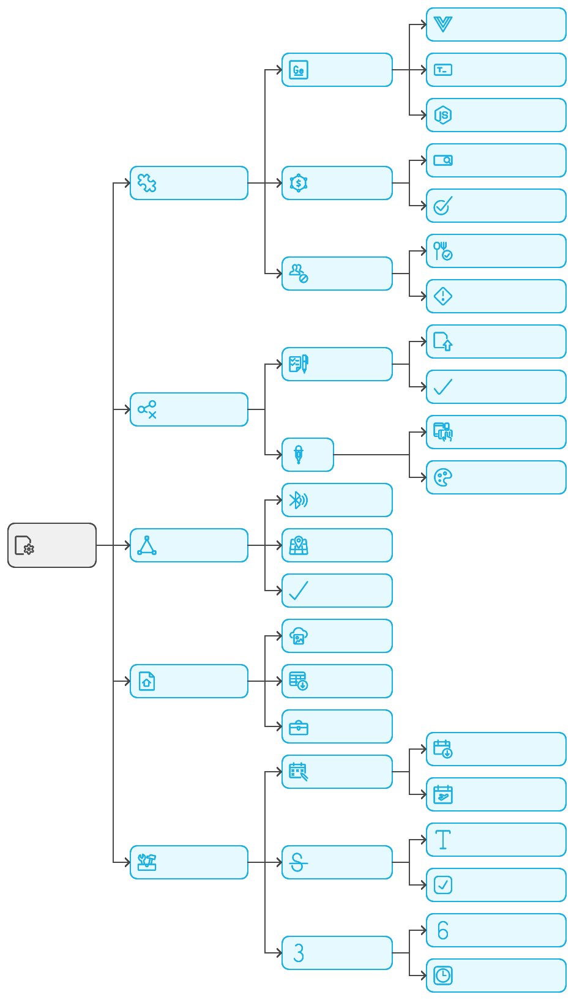


## Composants Principaux

### 1. Types Partagés (`/types`)

Les types partagés représentent les structures de données et les contrats communs utilisés dans toute l'application.

**Définition**
- Types et interfaces réutilisables
- Structures de données communes
- Utilitaires de typage génériques
- Contrats techniques partagés

**Objectifs**
- Assurer la cohérence des types
- Éviter la duplication de code
- Faciliter la maintenance
- Standardiser les structures communes

**Pourquoi ?**
- Réduction de la duplication de types
- Meilleure maintenabilité
- Source unique de vérité pour les types communs
- Facilite les refactoring globaux

**Relations**
- Utilisés par tous les contextes
- Indépendants des implémentations
- Base pour les types spécifiques
- Support pour les utilitaires

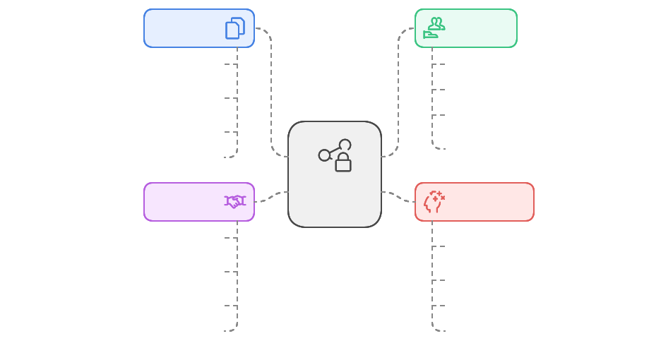

**Structure Type**
```
/shared/types
├── /core                 # Types fondamentaux
│   ├── Entity.ts        # Base pour les entités
│   ├── ValueObject.ts   # Base pour les value objects
│   └── Result.ts        # Gestion des résultats
│
├── /api                 # Types liés à l'API
│   ├── Request.ts      # Types de requêtes
│   ├── Response.ts     # Types de réponses
│   └── Error.ts        # Types d'erreurs
│
├── /utils              # Types utilitaires
│   ├── Nullable.ts    # Types avec null/undefined
│   └── DeepPartial.ts # Types partiels profonds
│
└── /models             # Modèles partagés
    ├── User.ts        # Types utilisateur communs
    └── Status.ts      # États et statuts communs
```

**Implémentation**

```typescript
// Result.ts - Type générique pour la gestion des résultats
export interface ResultInterface<T> {
  isSuccess: boolean;
  isFailure: boolean;
  error?: ErrorInterface;
  value?: T;
}

// Entity.ts - Type de base pour les entités
export interface EntityInterface<T> {
  id: T;
  equals(other: EntityInterface<T>): boolean;
}

// Utility Types
export type Nullable<T> = T | null;
export type Optional<T> = T | undefined;
export type DeepPartial<T> = {
  [P in keyof T]?: T[P] extends object ? DeepPartial<T[P]> : T[P];
};

// API Types
export interface ApiResponse<T> {
  data: T;
  meta?: Record<string, unknown>;
  errors?: ApiError[];
}

export interface ApiError {
  code: string;
  message: string;
  details?: Record<string, unknown>;
}
```

**Bonnes Pratiques**
- Types génériques et réutilisables
- Documentation claire
- Pas de logique d'implémentation
- Nommage explicite
- Versionnage soigneux

**À Éviter**
- Types spécifiques à un contexte
- Logique métier
- Types trop complexes
- Dépendances circulaires
- Types mutables

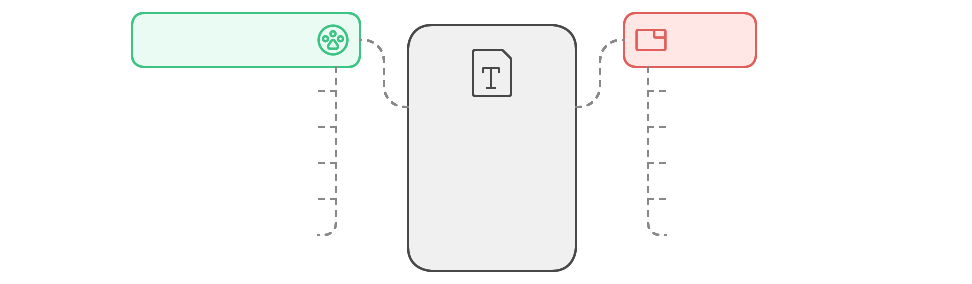

**Patterns Courants**

1. **Type Guards**
```typescript
export function isApiError(error: unknown): error is ApiError {
  return (
    typeof error === 'object' &&
    error !== null &&
    'code' in error &&
    'message' in error
  );
}
```

1. **Type Builders**
```typescript
export type BuildPaginatedResponse<T> = {
  items: T[];
  total: number;
  page: number;
  pageSize: number;
};
```

1. **Type Mappers**
```typescript
export type MapToDTO<T> = {
  [K in keyof T]: T[K] extends Date ? string : T[K];
};
```

**Exemples d'Utilisation**

1. **Dans les Contextes**
```typescript
import { EntityInterface, Result } from '@/shared/types';

export class Story implements EntityInterface<string> {
  constructor(public readonly id: string) {}
  
  equals(other: EntityInterface<string>): boolean {
    return this.id === other.id;
  }
}
```

2. **Dans l'Infrastructure**
```typescript
import { ApiResponse, ApiError } from '@/shared/types';

export async function fetchData<T>(): Promise<Result<T>> {
  try {
    const response: ApiResponse<T> = await api.get('/data');
    return Result.ok(response.data);
  } catch (error) {
    return Result.fail(error as ApiError);
  }
}
```

3. **Dans la Présentation**
```typescript
import { Nullable, Optional } from '@/shared/types';

interface UserState {
  currentUser: Nullable<User>;
  lastLogin: Optional<Date>;
}
```

### 2. Utilitaires (`/utils`)

Les utilitaires sont des fonctions pures et réutilisables qui fournissent des fonctionnalités communes à travers l'application.

**Définition**
- Fonctions pures sans état
- Utilitaires génériques réutilisables
- Helpers techniques communs
- Transformations de données

**Objectifs**
- Éviter la duplication de code
- Standardiser les opérations communes
- Faciliter les tests
- Améliorer la maintenabilité

**Pourquoi ?**
- Code DRY (Don't Repeat Yourself)
- Cohérence des opérations
- Facilité de maintenance
- Performance optimisée

**Relations**
- Utilisés par toutes les couches
- Indépendants du domaine
- Support pour les composants
- Base pour les transformations

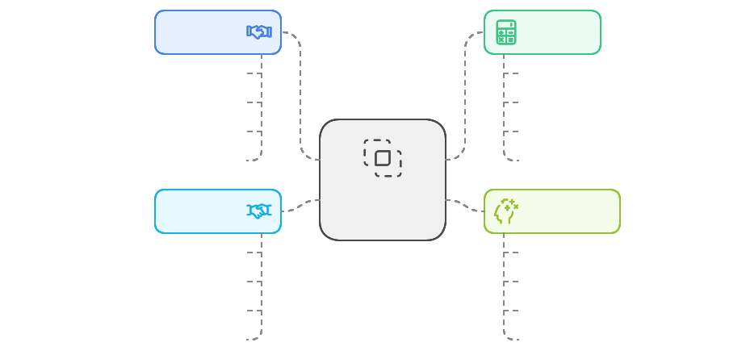

**Structure Type**
```
/shared/utils
├── /date                  # Utilitaires de date
│   ├── format.ts         # Formatage de dates
│   └── parse.ts          # Parsing de dates
│
├── /string               # Utilitaires de chaînes
│   ├── format.ts        # Formatage de texte
│   └── validate.ts      # Validation de texte
│
├── /number              # Utilitaires de nombres
│   ├── format.ts        # Formatage de nombres
│   └── calculate.ts     # Calculs mathématiques
│
└── /validation         # Utilitaires de validation
    ├── schemas.ts      # Schémas de validation
    └── rules.ts        # Règles de validation
```

**Implémentation**

```typescript
// date/format.ts
export const dateUtils = {
  /**
   * Formate une date selon le format spécifié
   * @param date - La date à formater
   * @param format - Le format souhaité (défaut: 'yyyy-MM-dd')
   */
  format(date: Date, format: string = "yyyy-MM-dd"): string {
    return new Intl.DateTimeFormat("fr-FR", {
      dateStyle: format.includes("HH") ? "full" : "short",
      timeStyle: format.includes("HH") ? "medium" : undefined
    }).format(date);
  },

  /**
   * Convertit une date en chaîne relative
   * @param date - La date à convertir
   */
  toRelative(date: Date): string {
    const rtf = new Intl.RelativeTimeFormat("fr", { numeric: "auto" });
    const diff = (date.getTime() - Date.now()) / (1000 * 60 * 60 * 24);
    return rtf.format(Math.round(diff), "day");
  },

  /**
   * Vérifie si une date est valide
   * @param date - La date à vérifier
   */
  isValid(date: unknown): date is Date {
    return date instanceof Date && !isNaN(date.getTime());
  }
};

// string/validate.ts
export const stringUtils = {
  /**
   * Valide un email
   * @param email - L'email à valider
   */
  isValidEmail(email: string): boolean {
    const emailRegex = /^[^\s@]+@[^\s@]+\.[^\s@]+$/;
    return emailRegex.test(email);
  },

  /**
   * Valide un mot de passe selon les règles spécifiées
   * @param password - Le mot de passe à valider
   */
  isValidPassword(password: string): boolean {
    return (
      password.length >= 8 && 
      /[A-Z]/.test(password) && 
      /[0-9]/.test(password) &&
      /[!@#$%^&*]/.test(password)
    );
  },

  /**
   * Nettoie une chaîne de caractères
   * @param text - Le texte à nettoyer
   */
  sanitize(text: string): string {
    return text
      .trim()
      .replace(/[<>]/g, '')
      .slice(0, 255);
  }
};

// number/calculate.ts
export const numberUtils = {
  /**
   * Calcule un pourcentage
   * @param value - La valeur
   * @param total - Le total
   */
  calculatePercentage(value: number, total: number): number {
    if (total === 0) return 0;
    return Math.round((value / total) * 100);
  },

  /**
   * Formate un nombre avec séparateurs
   * @param num - Le nombre à formater
   */
  format(num: number): string {
    return new Intl.NumberFormat("fr-FR").format(num);
  }
};
```

**Bonnes Pratiques**
- Fonctions pures uniquement
- Documentation claire
- Tests unitaires complets
- Performance optimisée
- Nommage explicite

**À Éviter**
- État interne
- Effets de bord
- Dépendances externes
- Logique métier
- Couplage avec le domaine

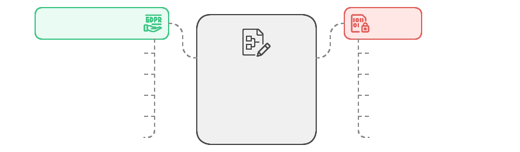

**Patterns Courants**

1. **Memoization**
```typescript
export const memoize = <T extends (...args: any[]) => any>(
  fn: T
): T => {
  const cache = new Map();

  return ((...args: Parameters<T>): ReturnType<T> => {
    const key = JSON.stringify(args);
    if (cache.has(key)) {
      return cache.get(key);
    }
    const result = fn(...args);
    cache.set(key, result);
    return result;
  }) as T;
};
```

2. **Composition**
```typescript
export const pipe = <T>(...fns: Array<(arg: T) => T>) => 
  (value: T): T => fns.reduce((acc, fn) => fn(acc), value);

export const compose = <T>(...fns: Array<(arg: T) => T>) => 
  (value: T): T => fns.reduceRight((acc, fn) => fn(acc), value);
```

3. **Currying**
```typescript
export const curry = <T extends (...args: any[]) => any>(
  fn: T
) => {
  return function curried(...args: any[]) {
    if (args.length >= fn.length) {
      return fn(...args);
    }
    return (...moreArgs: any[]) => curried(...args, ...moreArgs);
  };
};
```

**Exemples d'Utilisation**

1. **Dans les Composants**
```typescript
import { dateUtils, stringUtils } from '@/shared/utils';

const formatCreatedAt = (date: Date) => dateUtils.toRelative(date);
const validateInput = (text: string) => stringUtils.sanitize(text);
```

2. **Dans les Services**
```typescript
import { numberUtils } from '@/shared/utils';

const calculateProgress = (completed: number, total: number) => 
  numberUtils.calculatePercentage(completed, total);
```

3. **Dans les Tests**
```typescript
import { stringUtils } from '@/shared/utils';

describe('stringUtils', () => {
  describe('isValidEmail', () => {
    it('should validate correct email', () => {
      expect(stringUtils.isValidEmail('test@example.com')).toBe(true);
    });
  });
});
```

### 3. Constantes (`/constants`)

Les constantes partagées représentent les valeurs fixes et configurations utilisées à travers l'application.

**Définition**
- Valeurs immuables de l'application
- Configurations partagées
- Énumérations et mappings
- Messages et textes statiques

**Objectifs**
- Centraliser les valeurs constantes
- Éviter la duplication de valeurs
- Faciliter la maintenance
- Standardiser les configurations

**Pourquoi ?**
- Source unique de vérité
- Facilité de modification
- Meilleure maintenabilité
- Cohérence des valeurs

**Relations**
- Utilisées par toutes les couches
- Importées dans les configurations
- Support pour les validations
- Base pour les types énumérés

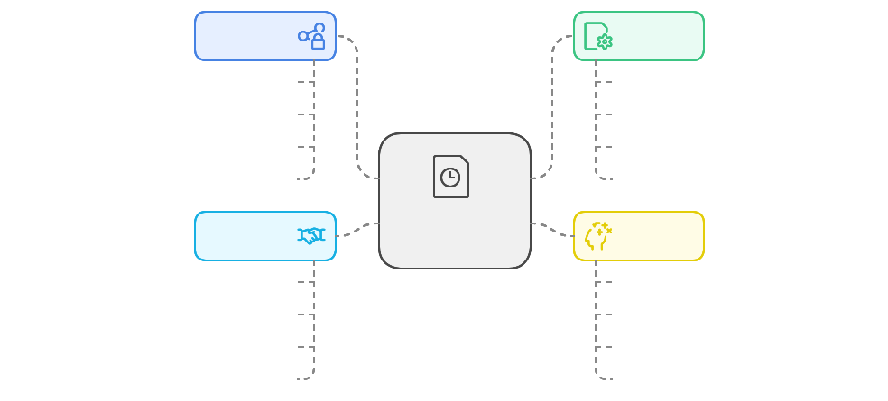

**Structure Type**
```
/shared/constants
├── /api                  # Constantes API
│   ├── endpoints.ts     # Points d'entrée API
│   ├── headers.ts      # En-têtes HTTP
│   └── status.ts       # Codes de statut
│
├── /config              # Configurations
│   ├── app.ts         # Configuration application
│   ├── theme.ts       # Configuration thème
│   └── features.ts    # Feature flags
│
├── /validation         # Règles de validation
│   ├── patterns.ts    # Expressions régulières
│   └── limits.ts      # Limites et contraintes
│
└── /ui                 # Constantes UI
    ├── breakpoints.ts # Points de rupture
    └── colors.ts      # Couleurs du thème
```

**Implémentation**

```typescript
// api/endpoints.ts
export const API_ENDPOINTS = {
  AUTH: {
    LOGIN: "/auth/login",
    REGISTER: "/auth/register",
    REFRESH: "/auth/refresh"
  },
  USERS: {
    BASE: "/users",
    PROFILE: (id: string) => `/users/${id}/profile`,
    SETTINGS: (id: string) => `/users/${id}/settings`
  }
} as const;

// validation/patterns.ts
export const VALIDATION_PATTERNS = {
  EMAIL: /^[^\s@]+@[^\s@]+\.[^\s@]+$/,
  PASSWORD: /^(?=.*[A-Za-z])(?=.*\d)[A-Za-z\d]{8,}$/,
  PHONE: /^\+?[\d\s-]{10,}$/
} as const;

// config/features.ts
export const FEATURES = {
  DARK_MODE: true,
  FILE_UPLOAD: true,
  NOTIFICATIONS: {
    ENABLED: true,
    MAX_COUNT: 5,
    DURATION: 3000
  }
} as const;

// ui/breakpoints.ts
export const BREAKPOINTS = {
  SM: 640,
  MD: 768,
  LG: 1024,
  XL: 1280,
  "2XL": 1536
} as const;
```

**Bonnes Pratiques**
- Utiliser des objets gelés (`as const`)
- Nommage en SCREAMING_SNAKE_CASE
- Documentation claire
- Organisation par domaine
- Typage strict

**À Éviter**
- Valeurs mutables
- Logique complexe
- Dépendances externes
- Valeurs calculées
- État ou comportement

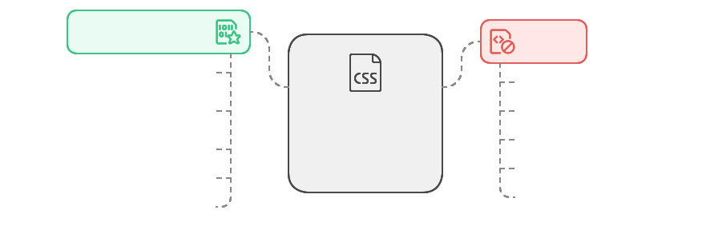

**Patterns Courants**

1. **Énumérations TypeScript**
```typescript
export const STATUS = {
  DRAFT: "DRAFT",
  PUBLISHED: "PUBLISHED",
  ARCHIVED: "ARCHIVED"
} as const;

export type Status = typeof STATUS[keyof typeof STATUS];
```

2. **Messages d'Erreur**
```typescript
export const ERROR_MESSAGES = {
  VALIDATION: {
    REQUIRED: "Ce champ est requis",
    EMAIL: "Email invalide",
    PASSWORD: "Mot de passe trop faible"
  },
  AUTH: {
    INVALID_CREDENTIALS: "Identifiants invalides",
    SESSION_EXPIRED: "Session expirée"
  }
} as const;
```

3. **Configuration d'API**
```typescript
export const API_CONFIG = {
  BASE_URL: process.env.VUE_APP_API_URL,
  TIMEOUT: 5000,
  RETRY: {
    MAX_ATTEMPTS: 3,
    DELAY: 1000
  },
  HEADERS: {
    CONTENT_TYPE: "application/json",
    ACCEPT_LANGUAGE: "fr-FR"
  }
} as const;
```

**Exemples d'Utilisation**

1. **Dans les Composants**
```typescript
import { BREAKPOINTS } from "@/shared/constants";

const isMobile = computed(() => 
  window.innerWidth < BREAKPOINTS.MD
);
```

2. **Dans les Services**
```typescript
import { API_ENDPOINTS } from "@/shared/constants";

async function fetchUserProfile(userId: string) {
  return await api.get(API_ENDPOINTS.USERS.PROFILE(userId));
}
```

3. **Dans les Validations**
```typescript
import { VALIDATION_PATTERNS } from "@/shared/constants";

function validateEmail(email: string): boolean {
  return VALIDATION_PATTERNS.EMAIL.test(email);
}
```

### 4. Composables Partagés (`/composables`)

Les composables sont des fonctions réutilisables qui encapsulent la logique commune et la réactivité Vue.js.

**Définition**
- Fonctions de composition Vue.js
- Logique réutilisable avec état réactif
- Hooks personnalisés
- Abstractions de comportements communs

**Objectifs**
- Réutiliser la logique entre composants
- Encapsuler les comportements complexes
- Simplifier les composants
- Faciliter les tests

**Pourquoi ?**
- Séparation des préoccupations
- Code DRY
- Meilleure maintenabilité
- Tests unitaires simplifiés

**Relations**
- Utilisés par les composants Vue
- Peuvent utiliser d'autres composables
- Consomment les services partagés
- Indépendants du domaine métier

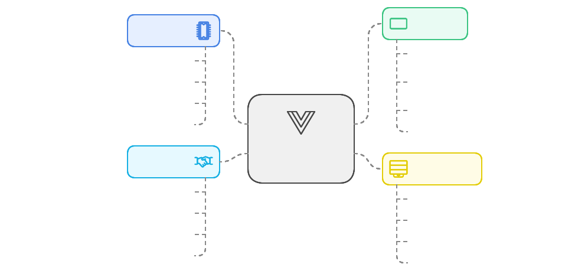

**Structure Type**
```
/shared/composables
├── /form                  # Composables de formulaire
│   ├── useForm.ts        # Gestion de formulaire
│   ├── useValidation.ts  # Validation de données
│   └── useField.ts       # Gestion de champ
│
├── /ui                   # Composables UI
│   ├── useBreakpoint.ts # Points de rupture responsive
│   ├── useTheme.ts      # Gestion du thème
│   └── useModal.ts      # Gestion des modales
│
└── /core                # Composables fondamentaux
    ├── useAsync.ts      # Gestion des appels async
    ├── useError.ts      # Gestion des erreurs
    └── useLoading.ts    # États de chargement
```

**Implémentation**

```typescript
// useAsync.ts
export function useAsync<T>() {
  const isLoading = ref(false);
  const error = ref<Error | null>(null);
  const data = ref<T | null>(null);

  async function execute(
    promise: Promise<T>,
    options: {
      onSuccess?: (data: T) => void;
      onError?: (error: Error) => void;
    } = {}
  ): Promise<void> {
    try {
      isLoading.value = true;
      error.value = null;
      
      data.value = await promise;
      options.onSuccess?.(data.value);
      
    } catch (e) {
      error.value = e as Error;
      options.onError?.(error.value);
      
    } finally {
      isLoading.value = false;
    }
  }

  return {
    isLoading: readonly(isLoading),
    error: readonly(error),
    data: readonly(data),
    execute
  };
}

// useForm.ts
export function useForm<T extends object>(initialData: T) {
  const form = reactive<T>({ ...initialData });
  const errors = reactive<Record<keyof T, string>>({} as Record<keyof T, string>);
  const isDirty = ref(false);
  const isValid = computed(() => Object.keys(errors).length === 0);

  watch(
    form,
    () => {
      isDirty.value = true;
    },
    { deep: true }
  );

  function validate(rules: ValidationRules<T>): boolean {
    clearErrors();
    
    for (const [field, value] of Object.entries(form)) {
      const fieldRules = rules[field];
      if (!fieldRules) continue;

      for (const rule of fieldRules) {
        const error = rule(value);
        if (error) {
          errors[field] = error;
          break;
        }
      }
    }

    return isValid.value;
  }

  function reset() {
    Object.assign(form, initialData);
    clearErrors();
    isDirty.value = false;
  }

  function clearErrors() {
    for (const key of Object.keys(errors)) {
      delete errors[key];
    }
  }

  return {
    form,
    errors: readonly(errors),
    isDirty: readonly(isDirty),
    isValid: readonly(isValid),
    validate,
    reset,
    clearErrors
  };
}

// useBreakpoint.ts
export function useBreakpoint() {
  const windowWidth = ref(window.innerWidth);
  
  const breakpoint = computed(() => {
    if (windowWidth.value < 640) return 'sm';
    if (windowWidth.value < 768) return 'md';
    if (windowWidth.value < 1024) return 'lg';
    if (windowWidth.value < 1280) return 'xl';
    return '2xl';
  });

  const isGreaterThan = (size: string) => {
    const breakpoints = {
      sm: 640,
      md: 768,
      lg: 1024,
      xl: 1280,
      '2xl': 1536
    };
    return windowWidth.value >= breakpoints[size];
  };

  onMounted(() => {
    window.addEventListener('resize', updateWidth);
  });

  onUnmounted(() => {
    window.removeEventListener('resize', updateWidth);
  });

  function updateWidth() {
    windowWidth.value = window.innerWidth;
  }

  return {
    breakpoint: readonly(breakpoint),
    isGreaterThan
  };
}
```

**Bonnes Pratiques**
- Noms préfixés par "use"
- Documentation claire des paramètres et retours
- Gestion propre des effets de bord
- Cleanup des listeners et subscriptions
- Types TypeScript stricts

**À Éviter**
- Logique métier spécifique
- État global non contrôlé
- Dépendances directes aux services externes
- Effets de bord non nettoyés
- Couplage avec des composants spécifiques

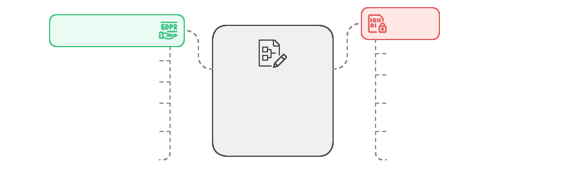

**Patterns Courants**

1. **État Réactif avec Cleanup**
```typescript
export function useSubscription(topic: string) {
  const messages = ref<Message[]>([]);
  
  const unsubscribe = subscribe(topic, (msg) => {
    messages.value.push(msg);
  });
  
  onUnmounted(() => {
    unsubscribe();
  });
  
  return { messages };
}
```

2. **Composition de Composables**
```typescript
export function useAuthenticatedUser() {
  const { user } = useAuth();
  const { execute: fetchProfile } = useAsync<UserProfile>();
  
  const profile = computed(() => {
    if (!user.value) return null;
    return fetchProfile(`/users/${user.value.id}/profile`);
  });
  
  return { profile };
}
```

3. **État Partagé**
```typescript
export function useSharedState() {
  const state = reactive({
    count: 0,
    increment() {
      this.count++;
    }
  });
  
  return {
    state: readonly(state),
    increment: state.increment
  };
}
```

**Exemples d'Utilisation**

1. **Dans les Composants**
```typescript
// UserForm.vue
const { form, errors, validate } = useForm({
  name: '',
  email: ''
});

const { execute, isLoading } = useAsync();

async function handleSubmit() {
  if (!validate(formRules)) return;
  
  await execute(submitForm(form));
}
```

2. **Composition de Comportements**
```typescript
// DataTable.vue
const { sort, filter } = useDataTable(items);
const { pagination } = usePagination(sort.filtered);
const { selection } = useSelection(pagination.items);
```

3. **Responsive Design**
```typescript
// Layout.vue
const { breakpoint, isGreaterThan } = useBreakpoint();

const showSidebar = computed(() => 
  isGreaterThan('lg') || store.forceSidebar
);
```

### 5. Composants UI Partagés (`/components`)

Les composants UI partagés sont des composants réutilisables qui forment la base du système de design de l'application.

**Définition**
- Composants Vue.js réutilisables
- Éléments d'interface utilisateur génériques
- Briques de base du système de design
- Indépendants du domaine métier

**Objectifs**
- Assurer la cohérence de l'interface
- Réduire la duplication de code
- Faciliter la maintenance
- Standardiser l'expérience utilisateur

**Pourquoi ?**
- Système de design unifié
- Développement plus rapide
- Meilleure maintenabilité
- Tests simplifiés

**Relations**
- Utilisés par tous les composants
- Indépendants du domaine
- Base pour les composants spécifiques
- Support pour les thèmes


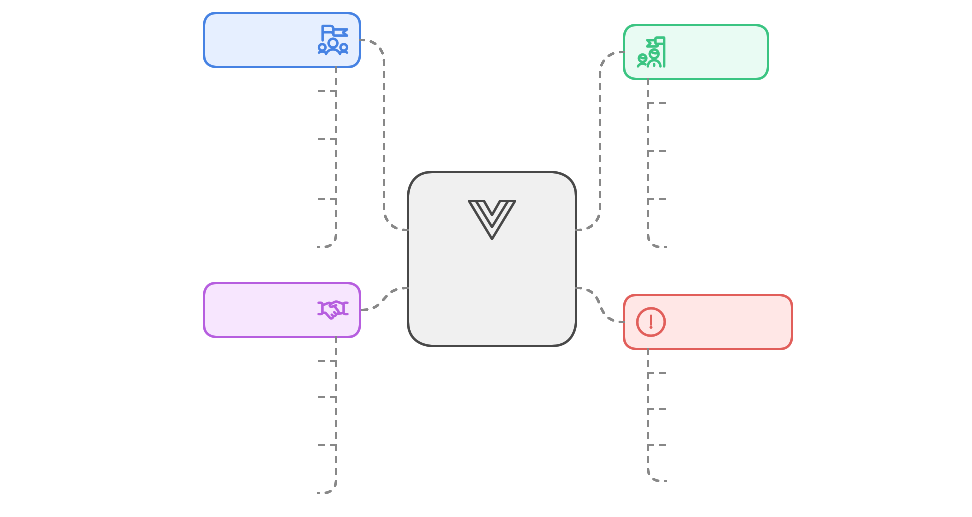

**Structure Type**
```
/shared/components
├── /atoms                  # Composants de base
│   ├── BaseButton.vue     # Boutons
│   ├── BaseInput.vue      # Champs de saisie
│   └── BaseIcon.vue       # Icônes
│
├── /molecules             # Composants composés
│   ├── FormField.vue     # Champs de formulaire
│   ├── SearchBar.vue     # Barre de recherche
│   └── Notification.vue  # Notifications
│
└── /organisms            # Composants complexes
    ├── DataTable.vue    # Tableaux de données
    ├── Modal.vue        # Fenêtres modales
    └── Sidebar.vue      # Barres latérales
```

**Implémentation**

```typescript
// BaseButton.vue
<script setup lang="ts">
interface Props {
  variant?: "primary" | "secondary" | "danger";
  size?: "sm" | "md" | "lg";
  disabled?: boolean;
  loading?: boolean;
  icon?: string;
}

const props = withDefaults(defineProps<Props>(), {
  variant: "primary",
  size: "md",
  disabled: false,
  loading: false
});

const emit = defineEmits<{
  (e: "click", event: MouseEvent): void;
}>();

const classes = computed(() => ({
  "base-button": true,
  [`base-button--${props.variant}`]: true,
  [`base-button--${props.size}`]: true,
  "base-button--disabled": props.disabled,
  "base-button--loading": props.loading
}));

function handleClick(event: MouseEvent) {
  if (!props.disabled && !props.loading) {
    emit("click", event);
  }
}
</script>

<template>
  <button
    :class="classes"
    :disabled="disabled || loading"
    @click="handleClick"
  >
    <BaseIcon
      v-if="loading"
      name="spinner"
      class="base-button__spinner"
    />
    <BaseIcon
      v-else-if="icon"
      :name="icon"
      class="base-button__icon"
    />
    <span class="base-button__content">
      <slot />
    </span>
  </button>
</template>

<style scoped lang="scss">
.base-button {
  @apply inline-flex items-center justify-center px-4 py-2 rounded-md;
  @apply transition-all duration-200 ease-in-out;
  @apply focus:outline-none focus:ring-2 focus:ring-offset-2;

  &--primary {
    @apply bg-primary-600 text-white;
    @apply hover:bg-primary-700;
    @apply focus:ring-primary-500;
  }

  &--secondary {
    @apply bg-gray-100 text-gray-700;
    @apply hover:bg-gray-200;
    @apply focus:ring-gray-500;
  }

  &--danger {
    @apply bg-red-600 text-white;
    @apply hover:bg-red-700;
    @apply focus:ring-red-500;
  }

  &--disabled {
    @apply opacity-50 cursor-not-allowed;
    @apply hover:bg-inherit;
  }

  &--loading {
    @apply cursor-wait;
  }

  &--sm { @apply text-sm px-3 py-1; }
  &--lg { @apply text-lg px-6 py-3; }

  &__spinner {
    @apply animate-spin mr-2;
  }

  &__icon {
    @apply mr-2;
  }
}
</style>

// FormField.vue
<script setup lang="ts">
interface Props {
  label: string;
  name: string;
  error?: string;
  required?: boolean;
}

const props = defineProps<Props>();
</script>

<template>
  <div class="form-field">
    <label :for="name" class="form-field__label">
      {{ label }}
      <span v-if="required" class="form-field__required">*</span>
    </label>
    
    <div class="form-field__input">
      <slot />
    </div>
    
    <p v-if="error" class="form-field__error">
      {{ error }}
    </p>
  </div>
</template>

<style scoped lang="scss">
.form-field {
  @apply space-y-1;

  &__label {
    @apply block text-sm font-medium text-gray-700;
  }

  &__required {
    @apply text-red-500 ml-1;
  }

  &__error {
    @apply text-sm text-red-600 mt-1;
  }
}
</style>
```

**Bonnes Pratiques**
- Composants atomiques et réutilisables
- Props et événements bien typés
- Documentation claire des props/events
- Styles encapsulés avec scoped
- Tests unitaires complets

**À Éviter**
- Logique métier
- État global
- Styles globaux
- Dépendances externes
- Composants trop spécifiques

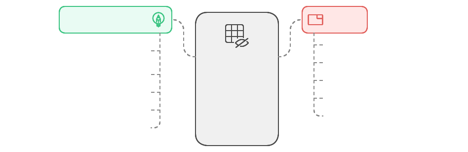

**Patterns Courants**

1. **Composition Pattern**
```typescript
// ComposableButton.vue
<script setup lang="ts">
const ButtonContent = {
  Root: defineComponent({ ... }),
  Icon: defineComponent({ ... }),
  Label: defineComponent({ ... })
};
</script>

<template>
  <ButtonContent.Root>
    <ButtonContent.Icon />
    <ButtonContent.Label />
  </ButtonContent.Root>
</template>
```

2. **Render Props Pattern**
```typescript
// DataList.vue
<script setup lang="ts">
interface Props<T> {
  items: T[];
  renderItem: (item: T) => VNode;
}
</script>

<template>
  <ul class="data-list">
    <li v-for="item in items" :key="item.id">
      {{ renderItem(item) }}
    </li>
  </ul>
</template>
```

3. **Provider Pattern**
```typescript
// ThemeProvider.vue
<script setup lang="ts">
const theme = inject('theme', ref('light'));

provide('theme', theme);
</script>

<template>
  <div :class="`theme-${theme}`">
    <slot />
  </div>
</template>
```

**Exemples d'Utilisation**

1. **Formulaire**
```typescript
<template>
  <form @submit.prevent="handleSubmit">
    <FormField
      label="Email"
      name="email"
      required
      :error="errors.email"
    >
      <BaseInput
        v-model="form.email"
        type="email"
        placeholder="john@example.com"
      />
    </FormField>

    <BaseButton
      type="submit"
      :loading="isSubmitting"
    >
      Submit
    </BaseButton>
  </form>
</template>
```

2. **Table de Données**
```typescript
<template>
  <DataTable
    :columns="columns"
    :data="items"
    :loading="isLoading"
    @sort="handleSort"
  >
    <template #empty>
      <EmptyState
        icon="database"
        title="No data found"
        description="Try adjusting your filters"
      />
    </template>
  </DataTable>
</template>
```

3. **Modal**
```typescript
<template>
  <Modal
    v-model="isOpen"
    title="Confirm Action"
    size="md"
  >
    <template #content>
      Are you sure you want to proceed?
    </template>

    <template #footer>
      <BaseButton
        variant="secondary"
        @click="close"
      >
        Cancel
      </BaseButton>
      <BaseButton
        variant="primary"
        :loading="isConfirming"
        @click="confirm"
      >
        Confirm
      </BaseButton>
    </template>
  </Modal>
</template>
```

## Règles d'Utilisation


### 1. Généricité
- **Principe**
  - Le code partagé doit être générique et réutilisable
  - Pas de dépendances vers les contextes métier
  - Pas de logique métier spécifique

- **Exemples**
```typescript
// ❌ Mauvais : Logique métier spécifique
export function calculateStoryPoints(story: Story): number {
  return story.subtasks.reduce((acc, task) => acc + task.points, 0);
}

// ✅ Bon : Fonction utilitaire générique
export function sum(numbers: number[]): number {
  return numbers.reduce((acc, num) => acc + num, 0);
}
```

### 2. Immutabilité
- **Principe**
  - Utiliser des constantes pour les valeurs fixes
  - Préférer les types readonly
  - Éviter les états mutables

- **Exemples**
```typescript
// ❌ Mauvais : État mutable
export let config = {
  apiUrl: "http://api.example.com"
};

// ✅ Bon : Configuration immutable
export const CONFIG = {
  API_URL: "http://api.example.com"
} as const;

// ✅ Bon : Types immutables
export interface UserInterface {
  readonly id: string;
  readonly email: string;
}
```

### 3. Performance
- **Principe**
  - Code optimisé et léger
  - Pas de dépendances lourdes
  - Memoization quand nécessaire

- **Exemples**
```typescript
// ❌ Mauvais : Calcul répété
export function getFullName(user: User): string {
  return `${user.firstName} ${user.lastName}`.trim();
}

// ✅ Bon : Résultat mémorisé
export const getFullName = memoize((user: User): string => {
  return `${user.firstName} ${user.lastName}`.trim();
});
```

### 4. Isolation
- **Principe**
  - Pas de dépendances circulaires
  - Interfaces claires et bien définies
  - Séparation des préoccupations

- **Exemples**
```typescript
// ❌ Mauvais : Couplage fort
import { UserService } from "@/contexts/user/services/UserService";

export function formatUserName(user: User): string {
  return UserService.formatName(user);
}

// ✅ Bon : Fonction isolée
export function formatName(firstName: string, lastName: string): string {
  return `${firstName} ${lastName}`.trim();
}
```

### 5. Documentation
- **Principe**
  - Documentation claire et complète
  - Types bien définis
  - Exemples d'utilisation

- **Exemples**
```typescript
/**
 * Formate une date selon le format spécifié
 * @param date - La date à formater
 * @param format - Le format souhaité (défaut: 'yyyy-MM-dd')
 * @returns La date formatée
 * @example
 * formatDate(new Date(), 'dd/MM/yyyy') // "25/12/2023"
 */
export function formatDate(date: Date, format: string = "yyyy-MM-dd"): string {
  // Implémentation...
}
```

### 6. Tests
- **Principe**
  - Tests unitaires complets
  - Tests de performance si nécessaire
  - Documentation des cas de test

- **Exemples**
```typescript
describe('formatDate', () => {
  it('should format date correctly', () => {
    const date = new Date('2023-12-25');
    expect(formatDate(date)).toBe('2023-12-25');
  });

  it('should handle custom format', () => {
    const date = new Date('2023-12-25');
    expect(formatDate(date, 'dd/MM/yyyy')).toBe('25/12/2023');
  });

  it('should throw for invalid date', () => {
    expect(() => formatDate(null as any)).toThrow();
  });
});
```

### 7. Versionnement
- **Principe**
  - API stable et rétrocompatible
  - Changements cassants bien documentés
  - Migration progressive

- **Exemples**
```typescript
// Version 1
export function parse(date: string): Date {
  return new Date(date);
}

// Version 2 - Rétrocompatible
export function parse(date: string, format?: string): Date {
  if (format) {
    return parseWithFormat(date, format);
  }
  // Comportement original préservé
  return new Date(date);
}
```

### 8. Bonnes Pratiques Supplémentaires

#### Organisation du Code
```typescript
// ❌ Mauvais : Tout dans un seul fichier
export function formatDate() { /* ... */ }
export function parseDate() { /* ... */ }
export function validateDate() { /* ... */ }

// ✅ Bon : Modules séparés et organisés
// date/format.ts
export function formatDate() { /* ... */ }

// date/parse.ts
export function parseDate() { /* ... */ }

// date/validate.ts
export function validateDate() { /* ... */ }
```

#### Gestion des Erreurs
```typescript
// ❌ Mauvais : Erreurs génériques
export function divide(a: number, b: number): number {
  if (b === 0) throw new Error("Error");
  return a / b;
}

// ✅ Bon : Erreurs typées et explicites
export class DivisionByZeroError extends Error {
  constructor() {
    super("Division by zero is not allowed");
    this.name = "DivisionByZeroError";
  }
}

export function divide(a: number, b: number): number {
  if (b === 0) throw new DivisionByZeroError();
  return a / b;
}
```

#### Validation des Entrées
```typescript
// ❌ Mauvais : Pas de validation
export function calculateAge(birthDate: Date): number {
  return new Date().getFullYear() - birthDate.getFullYear();
}

// ✅ Bon : Validation complète
export function calculateAge(birthDate: Date): number {
  if (!(birthDate instanceof Date) || isNaN(birthDate.getTime())) {
    throw new InvalidArgumentError("birthDate must be a valid Date");
  }
  
  if (birthDate > new Date()) {
    throw new InvalidArgumentError("birthDate cannot be in the future");
  }

  return new Date().getFullYear() - birthDate.getFullYear();
}
```

## Anti-Patterns

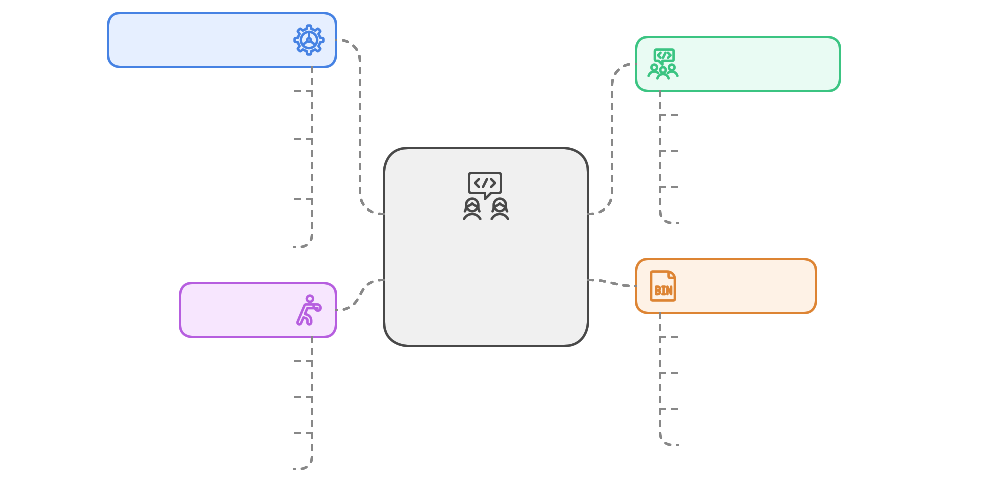

### 1. Couplage avec le Domaine
**❌ Problème**
- Dépendances directes vers les contextes métier
- Logique métier dans le code partagé
- Violation de la séparation des préoccupations

```typescript
// ❌ Mauvais : Code partagé couplé au domaine
export function formatStoryTitle(story: Story): string {
  return `${story.type} - ${story.title}`;
}

// ✅ Bon : Fonction générique de formatage
export function formatTitle(type: string, title: string): string {
  return `${type} - ${title}`;
}
```

### 2. Dépendances Circulaires
**❌ Problème**
- Modules interdépendants
- Code difficile à maintenir
- Problèmes de compilation

```typescript
// ❌ Mauvais : Dépendances circulaires
// userUtils.ts
import { formatStory } from './storyUtils';
export function formatUser(user) {
  return { ...user, stories: user.stories.map(formatStory) };
}

// storyUtils.ts
import { formatUser } from './userUtils';
export function formatStory(story) {
  return { ...story, author: formatUser(story.author) };
}

// ✅ Bon : Séparation des responsabilités
// formatters.ts
export const formatters = {
  user: (user, options = { withStories: false }) => ({
    ...user,
    stories: options.withStories ? user.stories.map(formatters.story) : []
  }),
  story: (story, options = { withAuthor: false }) => ({
    ...story,
    author: options.withAuthor ? formatters.user(story.author) : null
  })
};
```

### 3. État Global Non Contrôlé
**❌ Problème**
- État mutable partagé entre contextes
- Effets de bord difficiles à tracer
- Couplage temporel entre composants

```typescript
// ❌ Mauvais : État global mutable
export const globalState = reactive({
  currentUser: null,
  settings: {}
});

// ✅ Bon : État encapsulé dans un composable
export function useState<T>(initial: T) {
  const state = ref(initial);
  return {
    state: readonly(state),
    update: (value: T) => state.value = value
  };
}
```

### 4. Composants UI Trop Spécifiques
**❌ Problème**
- Composants dépendants du contexte
- Difficiles à réutiliser
- Trop de responsabilités

```typescript
// ❌ Mauvais : Composant couplé au domaine
const StoryCard = defineComponent({
  props: {
    story: {
      type: Object as PropType<Story>,
      required: true
    }
  },
  setup(props) {
    const store = useStoryStore();
    // Logique spécifique aux stories...
  }
});

// ✅ Bon : Composant générique
const Card = defineComponent({
  props: {
    title: String,
    description: String,
    status: String,
    onAction: Function as PropType<() => void>
  },
  // Logique générique de carte...
});
```

### 5. Sur-abstraction
**❌ Problème**
- Abstractions inutilement complexes
- Code difficile à comprendre
- Maintenance complexifiée

```typescript
// ❌ Mauvais : Sur-abstraction
type HandlerFunction<T, R> = (value: T) => R;
type MiddlewareFunction<T, R> = (handler: HandlerFunction<T, R>) => HandlerFunction<T, R>;

function createPipeline<T, R>(middlewares: MiddlewareFunction<T, R>[]): HandlerFunction<T, R> {
  return middlewares.reduce((handler, middleware) => middleware(handler));
}

// ✅ Bon : Simplicité et clarté
function processValue<T>(
  value: T,
  validators: ((value: T) => boolean)[],
  transform: (value: T) => T
): T {
  if (validators.every(validate => validate(value))) {
    return transform(value);
  }
  throw new Error('Validation failed');
}
```

### Recommandations pour Éviter les Anti-Patterns

1. **Principes de Base**
   - Suivre le principe SOLID
   - Respecter la séparation des préoccupations
   - Maintenir une documentation claire
   - Écrire des tests unitaires

2. **Revue de Code**
   - Vérifier les dépendances
   - Identifier les couplages
   - Valider la réutilisabilité
   - S'assurer de la clarté du code

3. **Maintenance**
   - Refactoring régulier
   - Mise à jour de la documentation
   - Suppression du code mort
   - Optimisation des performances

4. **Formation**
   - Partage des bonnes pratiques
   - Revues de code en équipe
   - Documentation des décisions
   - Veille technologique
