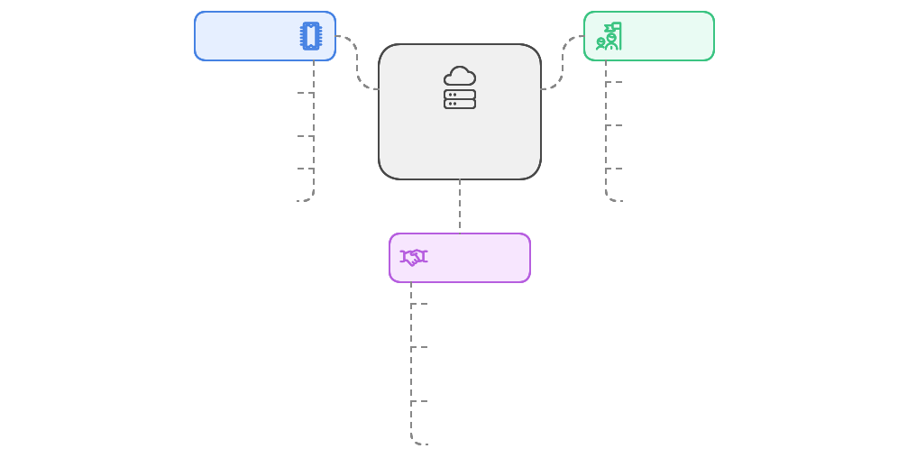
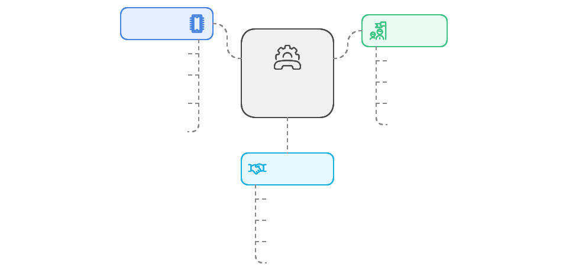
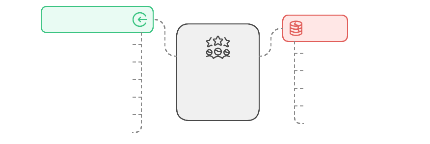
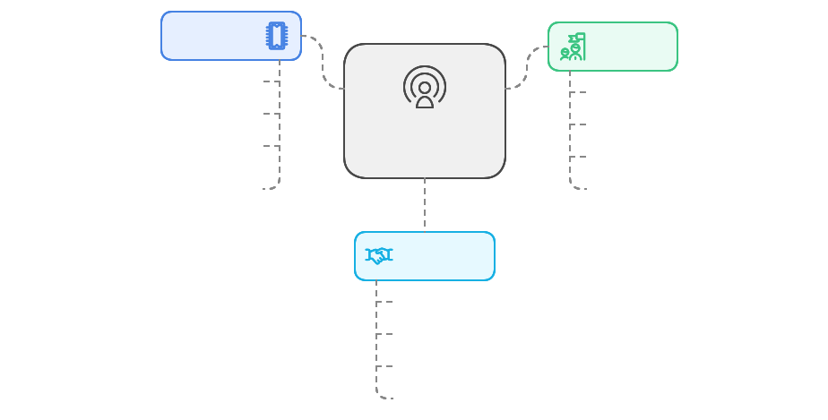
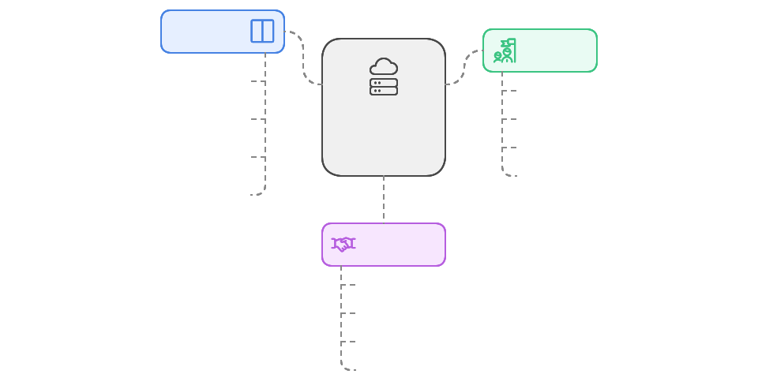
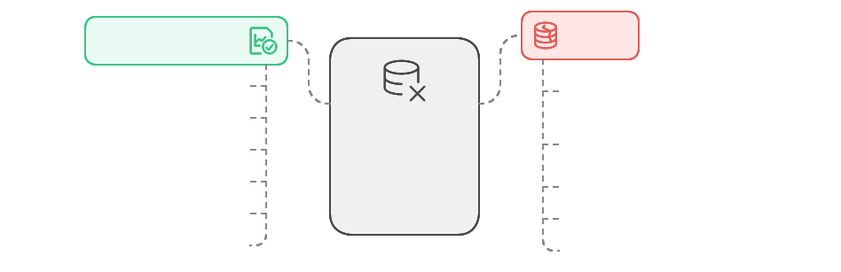
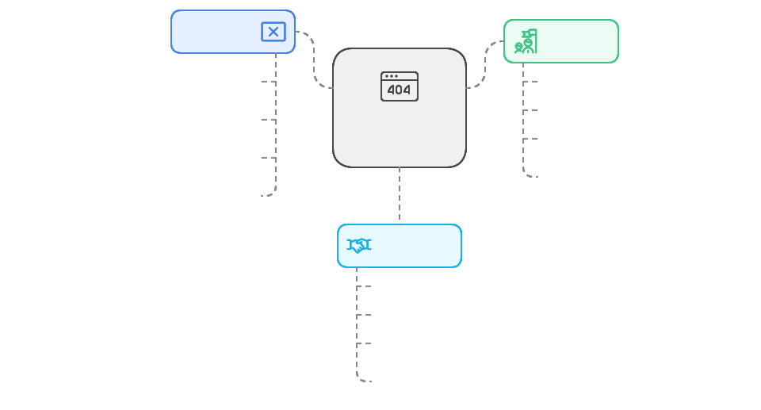

# Infrastructure Globale

## Vue d'ensemble

Le dossier `/infrastructure` contient les services et configurations techniques globaux qui sont partagés par tous les contextes de l'application. Cette couche gère les aspects techniques communs comme la configuration API, le logging, les événements, et le stockage.

## Structure

```
/infrastructure
├── /api                    # Configuration API
│   ├── /clients           # Clients HTTP
│   │   ├── axios.ts
│   │   └── fetch.ts
│   ├── /interceptors      # Intercepteurs de requêtes
│   │   ├── auth.ts
│   │   └── error.ts
│   └── /config           # Configuration API
│       ├── endpoints.ts
│       └── headers.ts
│
├── /error                 # Gestion des erreurs
│   ├── /handlers         # Gestionnaires d'erreurs
│   │   ├── api.ts
│   │   └── domain.ts
│   └── /mappers         # Mappers d'erreurs
│       └── error.ts
│
├── /events               # Bus d'événements
│   ├── /emitter         # Émetteur d'événements
│   │   └── eventBus.ts
│   └── /handlers        # Gestionnaires d'événements
│       └── eventHandlers.ts
│
├── /logger              # Service de logging
│   ├── /adapters       # Adaptateurs de logging
│   │   ├── console.ts
│   │   └── sentry.ts
│   └── /formatters     # Formateurs de logs
│       └── logFormatter.ts
│
└── /storage             # Stockage local
    ├── /adapters       # Adaptateurs de stockage
    │   ├── localStorage.ts
    │   └── sessionStorage.ts
    └── /encryption     # Chiffrement des données
        └── crypto.ts
```

## Composants Principaux

### 1. Configuration API (`/api`)

La configuration API fournit une couche d'abstraction pour toutes les communications HTTP de l'application.

**Définition**
- Centralise la configuration des clients HTTP
- Gère les intercepteurs de requêtes/réponses
- Standardise la gestion des erreurs
- Fournit une interface unifiée pour les appels API

**Objectifs**
- Isoler la logique de communication HTTP
- Standardiser le traitement des erreurs
- Faciliter la maintenance
- Optimiser les performances

**Relations**
- Utilisée par les repositories
- Communique avec les services externes
- Intègre avec le système d'authentification
- Support pour le monitoring





**Implémentation**

```typescript
// client.ts
export interface ApiClientConfigInterface {
  baseURL: string;
  timeout: number;
  retryAttempts: number;
  headers: Record<string, string>;
}

export class ApiClientService {
  private readonly axios: AxiosInstance;

  constructor(
    private readonly config: ApiClientConfigInterface,
    private readonly errorHandler: ErrorHandlerInterface
  ) {
    this.axios = axios.create({
      baseURL: config.baseURL,
      timeout: config.timeout,
      headers: config.headers
    });
    
    this.setupInterceptors();
  }

  private setupInterceptors(): void {
    this.axios.interceptors.request.use(
      this.addAuthToken,
      this.handleRequestError
    );

    this.axios.interceptors.response.use(
      this.handleResponse,
      this.handleResponseError
    );
  }

  private addAuthToken(config: AxiosRequestConfigInterface): AxiosRequestConfigInterface {
    const token = localStorage.getItem("auth_token");
    if (token) {
      config.headers.Authorization = `Bearer ${token}`;
    }
    return config;
  }

  async request<T>(config: ApiRequestConfig): Promise<Result<T>> {
    try {
      const response = await this.axios.request(config);
      return Result.ok(response.data);
    } catch (error) {
      return Result.fail(this.errorHandler.handle(error));
    }
  }
}

// interceptors/retry.ts
export class RetryInterceptor {
  constructor(private readonly maxRetries: number) {}

  intercept(error: AxiosError): Promise<any> {
    const config = error.config as ApiRequestConfig;
    
    if (!config || !this.shouldRetry(error, config)) {
      return Promise.reject(error);
    }

    config.retryCount = (config.retryCount || 0) + 1;
    const delay = this.calculateDelay(config.retryCount);
    
    return new Promise(resolve => {
      setTimeout(() => resolve(axios(config)), delay);
    });
  }

  private shouldRetry(error: AxiosError, config: ApiRequestConfig): boolean {
    return (
      config.retryCount < this.maxRetries &&
      error.response?.status >= 500
    );
  }
}
```

**Bonnes Pratiques**
- Configuration centralisée
- Intercepteurs modulaires
- Gestion des erreurs robuste
- Retry pattern pour la résilience
- Monitoring des performances
- Timeouts appropriés

**À Éviter**
- Logique métier dans les intercepteurs
- Configuration en dur
- Gestion d'état globale
- Couplage avec les frameworks
- Absence de timeout
  


**Patterns Courants**

1. **Retry Pattern**
```typescript
export class RetryStrategy {
  execute<T>(operation: () => Promise<T>, retries: number): Promise<T> {
    return operation().catch(error => {
      if (retries > 0) {
        return this.execute(operation, retries - 1);
      }
      throw error;
    });
  }
}
```

1. **Circuit Breaker**
```typescript
export class CircuitBreaker {
  private failures = 0;
  private readonly threshold = 5;
  private readonly resetTimeout = 60000;

  async execute<T>(operation: () => Promise<T>): Promise<T> {
    if (this.isOpen()) {
      throw new Error("Circuit breaker is open");
    }

    try {
      const result = await operation();
      this.reset();
      return result;
    } catch (error) {
      this.recordFailure();
      throw error;
    }
  }

  private isOpen(): boolean {
    return this.failures >= this.threshold;
  }
}
```

3. **Request Caching**
```typescript
export class RequestCache {
  private cache = new Map<string, CacheEntry>();

  async get<T>(key: string, operation: () => Promise<T>): Promise<T> {
    const cached = this.cache.get(key);
    if (cached && !this.isExpired(cached)) {
      return cached.data;
    }

    const data = await operation();
    this.cache.set(key, {
      data,
      timestamp: Date.now()
    });

    return data;
  }
}
```

**Exemples d'Utilisation**

1. **Dans les Repositories**
```typescript
export class StoryRepository {
  constructor(private readonly api: ApiClientService) {}

  async findById(id: string): Promise<Result<Story>> {
    return this.api.request<Story>({
      method: "GET",
      url: `/stories/${id}`,
      retryAttempts: 3
    });
  }
}
```

2. **Avec Circuit Breaker**
```typescript
export class ResilientApiClient {
  constructor(
    private readonly api: ApiClientService,
    private readonly circuitBreaker: CircuitBreaker
  ) {}

  async request<T>(config: ApiRequestConfig): Promise<Result<T>> {
    return this.circuitBreaker.execute(() => 
      this.api.request<T>(config)
    );
  }
}
```

3. **Avec Cache**
```typescript
export class CachedApiClient {
  constructor(
    private readonly api: ApiClientService,
    private readonly cache: RequestCache
  ) {}

  async get<T>(url: string): Promise<Result<T>> {
    return this.cache.get(url, () => 
      this.api.request<T>({ method: "GET", url })
    );
  }
}
```

### 2. Service de Logging (`/logger`)

Le service de logging fournit une interface unifiée pour la journalisation des événements et erreurs de l'application.

**Définition**
- Centralise la gestion des logs
- Abstrait les différentes destinations de logs
- Standardise le format des messages
- Gère les niveaux de logs

**Objectifs**
- Tracer les événements importants
- Faciliter le debugging
- Monitorer l'application
- Analyser les performances

**Relations**
- Utilisé par toutes les couches
- Intègre avec les services externes
- Support pour le monitoring
- Indépendant du domaine métier



**Implémentation**

```typescript
// logger.ts
export interface LoggerInterface {
  debug(message: string, context?: unknown): void;
  info(message: string, context?: unknown): void;
  warn(message: string, context?: unknown): void;
  error(message: string, error?: Error, context?: unknown): void;
}

export class Logger implements LoggerInterface {
  constructor(
    private readonly level: LogLevel,
    private readonly formatter: LogFormatterInterface,
    private readonly adapters: LogAdapterInterface[]
  ) {}

  error(message: string, error?: Error, context?: unknown): void {
    if (this.shouldLog("error")) {
      const logEntry = this.formatter.format({
        level: "error",
        message,
        error,
        context,
        timestamp: new Date()
      });

      this.adapters.forEach(adapter => 
        adapter.write(logEntry)
      );
    }
  }

  private shouldLog(level: LogLevel): boolean {
    const levels: Record<LogLevel, number> = {
      debug: 0,
      info: 1,
      warn: 2,
      error: 3
    };
    return levels[level] >= levels[this.level];
  }
}

// adapters/console.ts
export class ConsoleAdapter implements LogAdapterInterface {
  write(entry: LogEntry): void {
    const { level, message, error, context } = entry;
    
    switch (level) {
      case "error":
        console.error(message, error, context);
        break;
      case "warn":
        console.warn(message, context);
        break;
      default:
        console.log(message, context);
    }
  }
}

// formatters/json.ts
export class JsonFormatter implements LogFormatterInterface {
  format(entry: LogEntry): string {
    return JSON.stringify({
      timestamp: entry.timestamp.toISOString(),
      level: entry.level,
      message: entry.message,
      error: entry.error ? {
        name: entry.error.name,
        message: entry.error.message,
        stack: entry.error.stack
      } : undefined,
      context: entry.context
    });
  }
}
```

**Bonnes Pratiques**
- Niveaux de logs appropriés
- Contexte enrichi
- Rotation des fichiers
- Format structuré
- Performance optimisée
- Gestion des erreurs

**À Éviter**
- Logs sensibles
- Logs verbeux
- Blocage I/O
- Couplage avec le domaine
- Logs non structurés



**Patterns Courants**

1. **Decorator Pattern**
```typescript
export class LoggerDecorator implements LoggerInterface {
  constructor(
    private readonly logger: LoggerInterface,
    private readonly enricher: ContextEnricher
  ) {}

  error(message: string, error?: Error, context?: unknown): void {
    const enrichedContext = this.enricher.enrich(context);
    this.logger.error(message, error, enrichedContext);
  }
}
```

2. **Chain of Responsibility**
```typescript
export class LoggerChain implements LoggerInterface {
  private nextLogger?: LoggerInterface;

  setNext(logger: LoggerInterface): LoggerInterface {
    this.nextLogger = logger;
    return logger;
  }

  error(message: string, error?: Error, context?: unknown): void {
    this.log(message, error, context);
    if (this.nextLogger) {
      this.nextLogger.error(message, error, context);
    }
  }
}
```

3. **Builder Pattern**
```typescript
export class LoggerBuilder {
  private adapters: LogAdapterInterface[] = [];
  private level: LogLevel = "info";
  private formatter?: LogFormatterInterface;

  withAdapter(adapter: LogAdapterInterface): this {
    this.adapters.push(adapter);
    return this;
  }

  withLevel(level: LogLevel): this {
    this.level = level;
    return this;
  }

  build(): LoggerInterface {
    if (!this.formatter) {
      this.formatter = new JsonFormatter();
    }

    return new Logger(
      this.level,
      this.formatter,
      this.adapters
    );
  }
}
```

**Exemples d'Utilisation**

1. **Configuration Simple**
```typescript
const logger = new LoggerBuilder()
  .withAdapter(new ConsoleAdapter())
  .withAdapter(new FileAdapter("app.log"))
  .withLevel("info")
  .build();
```

2. **Avec Enrichissement**
```typescript
const logger = new LoggerDecorator(
  baseLogger,
  new RequestContextEnricher()
);

logger.info("User action", { userId: "123" });
```

3. **Avec Chaînage**
```typescript
const debugLogger = new FileLogger("debug.log");
const errorLogger = new SentryLogger();
const emailLogger = new EmailLogger();

debugLogger
  .setNext(errorLogger)
  .setNext(emailLogger);
```

### 3. Bus d'Événements (`/events`)

Le bus d'événements fournit un mécanisme de communication asynchrone entre les différentes parties de l'application.

**Définition**
- Mécanisme de publication/souscription
- Communication asynchrone
- Découplage des composants
- Gestion des événements du domaine

**Objectifs**
- Découpler les composants
- Faciliter la communication
- Améliorer la maintenabilité
- Permettre l'extensibilité

**Relations**
- Utilisé par toutes les couches
- Intègre avec le domaine
- Support pour les use cases
- Indépendant de l'infrastructure



**Implémentation**

```typescript
// eventBus.ts
export interface EventBusInterface {
  publish<T extends EventInterface>(event: T): Promise<void>;
  subscribe<T extends EventInterface>(
    eventType: string,
    handler: (event: T) => Promise<void>
  ): () => void;
}

export class EventBus implements EventBusInterface {
  private handlers: Map<string, Array<(event: EventInterface) => Promise<void>>>;

  constructor() {
    this.handlers = new Map();
  }

  async publish<T extends EventInterface>(event: T): Promise<void> {
    const handlers = this.handlers.get(event.type) || [];
    await Promise.all(
      handlers.map(handler => handler(event))
    );
  }

  subscribe<T extends EventInterface>(
    eventType: string,
    handler: (event: T) => Promise<void>
  ): () => void {
    const handlers = this.handlers.get(eventType) || [];
    handlers.push(handler as (event: EventInterface) => Promise<void>);
    this.handlers.set(eventType, handlers);

    // Retourne une fonction de cleanup
    return () => {
      const handlers = this.handlers.get(eventType) || [];
      const index = handlers.indexOf(handler as (event: EventInterface) => Promise<void>);
      if (index > -1) {
        handlers.splice(index, 1);
      }
    };
  }
}

// Implémentation avec gestion des erreurs et retry
export class ResilientEventBus implements EventBusInterface {
  constructor(
    private readonly eventBus: EventBusInterface,
    private readonly logger: LoggerInterface,
    private readonly retryStrategy: RetryStrategy
  ) {}

  async publish<T extends EventInterface>(event: T): Promise<void> {
    try {
      await this.retryStrategy.execute(
        () => this.eventBus.publish(event)
      );
    } catch (error) {
      this.logger.error('Failed to publish event', { event, error });
      throw error;
    }
  }

  subscribe<T extends EventInterface>(
    eventType: string,
    handler: (event: T) => Promise<void>
  ): () => void {
    const resilientHandler = async (event: T) => {
      try {
        await handler(event);
      } catch (error) {
        this.logger.error('Event handler failed', { eventType, event, error });
        throw error;
      }
    };

    return this.eventBus.subscribe(eventType, resilientHandler);
  }
}
```

**Bonnes Pratiques**
- Gestion des erreurs robuste
- Handlers asynchrones
- Cleanup des souscriptions
- Logging des événements
- Typage strict des événements
- Retry sur échec

**À Éviter**
- État global dans les événements
- Chaînage d'événements complexe
- Handlers synchrones bloquants
- Dépendances circulaires
- Events trop génériques


**Patterns Courants**

1. **Event Sourcing**
```typescript
export class EventSourcedBus implements EventBusInterface {
  constructor(
    private readonly eventStore: EventStore,
    private readonly eventBus: EventBusInterface
  ) {}

  async publish<T extends EventInterface>(event: T): Promise<void> {
    // Persister l'événement
    await this.eventStore.append(event);
    // Publier l'événement
    await this.eventBus.publish(event);
  }
}
```

2. **Event Replay**
```typescript
export class EventReplayService {
  constructor(private readonly eventBus: EventBusInterface) {}

  async replay(events: EventInterface[]): Promise<void> {
    for (const event of events) {
      await this.eventBus.publish(event);
    }
  }
}
```

3. **Event Filtering**
```typescript
export class FilteredEventBus implements EventBusInterface {
  constructor(
    private readonly eventBus: EventBusInterface,
    private readonly filter: EventFilter
  ) {}

  async publish<T extends EventInterface>(event: T): Promise<void> {
    if (this.filter.shouldProcess(event)) {
      await this.eventBus.publish(event);
    }
  }
}
```

**Exemples d'Utilisation**

1. **Dans les Use Cases**
```typescript
export class CreateStoryUseCase {
  constructor(private readonly eventBus: EventBusInterface) {}

  async execute(dto: CreateStoryDTO): Promise<void> {
    // Logique métier...
    await this.eventBus.publish(new StoryCreatedEvent(story));
  }
}
```

2. **Avec Monitoring**
```typescript
export class MonitoredEventBus implements EventBusInterface {
  constructor(
    private readonly eventBus: EventBusInterface,
    private readonly metrics: MetricsService
  ) {}

  async publish<T extends EventInterface>(event: T): Promise<void> {
    const start = Date.now();
    try {
      await this.eventBus.publish(event);
      this.metrics.recordSuccess(event.type, Date.now() - start);
    } catch (error) {
      this.metrics.recordError(event.type, error);
      throw error;
    }
  }
}
```

3. **Avec Validation**
```typescript
export class ValidatedEventBus implements EventBusInterface {
  constructor(
    private readonly eventBus: EventBusInterface,
    private readonly validator: EventValidator
  ) {}

  async publish<T extends EventInterface>(event: T): Promise<void> {
    const validationResult = await this.validator.validate(event);
    if (validationResult.isFailure) {
      throw new InvalidEventError(validationResult.error);
    }
    await this.eventBus.publish(event);
  }
}
```

### 4. Stockage Local (`/storage`)

Le service de stockage local fournit une abstraction unifiée pour la persistance des données côté client.

**Définition**
- Abstraction des mécanismes de stockage
- Gestion du cache local
- Chiffrement des données sensibles
- Interface unifiée de stockage

**Objectifs**
- Sécuriser les données stockées
- Optimiser les performances
- Gérer la persistance
- Faciliter la migration

**Relations**
- Utilisé par les repositories
- Support pour le cache
- Intègre avec la sécurité
- Indépendant du domaine



**Implémentation**

```typescript
// storage.ts
export interface StorageInterface {
  get<T>(key: string): Promise<Result<T>>;
  set<T>(key: string, value: T, options?: StorageOptions): Promise<Result<void>>;
  remove(key: string): Promise<Result<void>>;
  clear(): Promise<Result<void>>;
}

export interface StorageOptions {
  ttl?: number;          // Durée de vie en secondes
  encrypt?: boolean;     // Chiffrement des données
  compress?: boolean;    // Compression des données
}

export class SecureStorage implements StorageInterface {
  constructor(
    private readonly adapter: StorageAdapter,
    private readonly encryption: EncryptionService,
    private readonly compression: CompressionService
  ) {}

  async get<T>(key: string): Promise<Result<T>> {
    try {
      // 1. Récupérer les données
      const data = await this.adapter.get(key);
      if (!data) {
        return Result.ok(null);
      }

      // 2. Déchiffrer si nécessaire
      const decrypted = data.encrypted 
        ? await this.encryption.decrypt(data.value)
        : data.value;

      // 3. Décompresser si nécessaire
      const decompressed = data.compressed
        ? await this.compression.decompress(decrypted)
        : decrypted;

      // 4. Vérifier l'expiration
      if (this.isExpired(data.expiry)) {
        await this.remove(key);
        return Result.ok(null);
      }

      return Result.ok(JSON.parse(decompressed));
    } catch (error) {
      return Result.fail(new StorageError(error.message));
    }
  }

  async set<T>(
    key: string, 
    value: T, 
    options?: StorageOptions
  ): Promise<Result<void>> {
    try {
      // 1. Sérialiser les données
      const serialized = JSON.stringify(value);

      // 2. Compresser si nécessaire
      const compressed = options?.compress
        ? await this.compression.compress(serialized)
        : serialized;

      // 3. Chiffrer si nécessaire
      const encrypted = options?.encrypt
        ? await this.encryption.encrypt(compressed)
        : compressed;

      // 4. Créer les métadonnées
      const metadata = {
        value: encrypted,
        encrypted: options?.encrypt ?? false,
        compressed: options?.compress ?? false,
        expiry: options?.ttl 
          ? Date.now() + options.ttl * 1000 
          : null
      };

      // 5. Sauvegarder
      await this.adapter.set(key, metadata);
      return Result.ok();
    } catch (error) {
      return Result.fail(new StorageError(error.message));
    }
  }

  private isExpired(expiry: number | null): boolean {
    return expiry ? expiry < Date.now() : false;
  }
}

// adapters/localStorage.ts
export class LocalStorageAdapter implements StorageAdapter {
  async get(key: string): Promise<StorageData | null> {
    try {
      const item = localStorage.getItem(key);
      return item ? JSON.parse(item) : null;
    } catch {
      return null;
    }
  }

  async set(key: string, data: StorageData): Promise<void> {
    localStorage.setItem(key, JSON.stringify(data));
  }
}
```

**Bonnes Pratiques**
- Chiffrement des données sensibles
- Gestion des erreurs robuste
- Compression des données volumineuses
- Nettoyage automatique
- Validation des données
- Migrations de schéma

**À Éviter**
- Stockage de données sensibles en clair
- Dépendance directe à localStorage
- Absence de gestion d'erreurs
- Données non structurées
- Stockage excessif



**Patterns Courants**

1. **Adapter Pattern**
```typescript
export class IndexedDBAdapter implements StorageAdapter {
  constructor(private readonly db: IDBDatabase) {}

  async get(key: string): Promise<StorageData | null> {
    return new Promise((resolve, reject) => {
      const transaction = this.db.transaction(['storage'], 'readonly');
      const request = transaction.objectStore('storage').get(key);
      
      request.onsuccess = () => resolve(request.result);
      request.onerror = () => reject(request.error);
    });
  }
}
```

2. **Strategy Pattern**
```typescript
export class StorageStrategy {
  constructor(private readonly adapters: StorageAdapter[]) {}

  async get(key: string): Promise<StorageData | null> {
    for (const adapter of this.adapters) {
      const result = await adapter.get(key);
      if (result) return result;
    }
    return null;
  }
}
```

3. **Observer Pattern**
```typescript
export class ObservableStorage implements StorageInterface {
  private observers: Set<StorageObserver> = new Set();

  subscribe(observer: StorageObserver): () => void {
    this.observers.add(observer);
    return () => this.observers.delete(observer);
  }

  async set<T>(key: string, value: T): Promise<Result<void>> {
    const result = await this.storage.set(key, value);
    if (result.isSuccess) {
      this.notifyObservers({ type: 'set', key, value });
    }
    return result;
  }
}
```

**Exemples d'Utilisation**

1. **Cache de Données**
```typescript
export class CacheStorage {
  constructor(private readonly storage: StorageInterface) {}

  async getCached<T>(
    key: string,
    fetch: () => Promise<T>,
    ttl: number
  ): Promise<T> {
    const cached = await this.storage.get<T>(key);
    if (cached.isSuccess && cached.value) {
      return cached.value;
    }

    const fresh = await fetch();
    await this.storage.set(key, fresh, { ttl });
    return fresh;
  }
}
```

2. **Stockage Sécurisé**
```typescript
export class SecureUserStorage {
  constructor(private readonly storage: StorageInterface) {}

  async saveUserPreferences(
    userId: string,
    preferences: UserPreferences
  ): Promise<Result<void>> {
    return this.storage.set(
      `user:${userId}:preferences`,
      preferences,
      { 
        encrypt: true,
        ttl: 24 * 60 * 60 // 24 heures
      }
    );
  }
}
```

3. **Migration de Données**
```typescript
export class StorageMigration {
  constructor(private readonly storage: StorageInterface) {}

  async migrateSchema(
    fromVersion: number,
    toVersion: number
  ): Promise<Result<void>> {
    // Logique de migration
    const data = await this.storage.get('schema');
    if (data.isSuccess) {
      const migrated = await this.transform(data.value, fromVersion, toVersion);
      return this.storage.set('schema', migrated);
    }
    return data;
  }
}
```

### 5. Gestion des Erreurs (`/error`)

La gestion des erreurs fournit une approche unifiée pour traiter et transformer les erreurs à travers l'application.

**Définition**
- Centralise le traitement des erreurs
- Standardise les formats d'erreur
- Transforme les erreurs techniques
- Gère la journalisation des erreurs

**Objectifs**
- Uniformiser la gestion des erreurs
- Améliorer la traçabilité
- Faciliter le debugging
- Protéger les informations sensibles

**Relations**
- Utilisé par toutes les couches
- Intègre avec le logging
- Support pour le monitoring
- Interface avec les services externes



*Implémentation**

```typescript
// handler.ts
export interface ErrorHandlerInterface {
  handle(error: unknown): ErrorInterface;
  handleApiError(error: AxiosError): ErrorInterface;
  handleValidationError(error: ValidationError): ErrorInterface;
}

export class ErrorHandler implements ErrorHandlerInterface {
  constructor(
    private readonly logger: LoggerInterface,
    private readonly errorMapper: ErrorMapper
  ) {}

  handle(error: unknown): ErrorInterface {
    try {
      // 1. Logging de l'erreur brute
      this.logger.error('Error caught', { error });

      // 2. Transformation selon le type
      if (error instanceof AxiosError) {
        return this.handleApiError(error);
      }
      if (error instanceof ValidationError) {
        return this.handleValidationError(error);
      }
      if (error instanceof DomainError) {
        return this.handleDomainError(error);
      }

      // 3. Erreur par défaut
      return new ApplicationError(
        "Une erreur inattendue est survenue",
        error
      );
    } catch (handlingError) {
      // 4. Gestion des erreurs pendant le traitement
      this.logger.error('Error while handling error', { handlingError });
      return new ApplicationError(
        "Erreur système",
        handlingError
      );
    }
  }

  handleApiError(error: AxiosError): ErrorInterface {
    const status = error.response?.status;
    const data = error.response?.data;

    // Mapping des codes HTTP vers des erreurs métier
    switch (status) {
      case 401:
        return new UnauthorizedError(
          "Authentification requise",
          this.errorMapper.mapApiError(data)
        );
      case 403:
        return new ForbiddenError(
          "Accès non autorisé",
          this.errorMapper.mapApiError(data)
        );
      case 404:
        return new NotFoundError(
          "Ressource non trouvée",
          this.errorMapper.mapApiError(data)
        );
      case 422:
        return new ValidationError(
          "Données invalides",
          this.errorMapper.mapValidationErrors(data)
        );
      default:
        return new ApiError(
          "Erreur de communication avec le serveur",
          this.errorMapper.mapApiError(data)
        );
    }
  }

  private sanitizeError(error: unknown): SafeError {
    // Nettoyage des informations sensibles
    return {
      message: this.getSafeMessage(error),
      code: this.getErrorCode(error),
      context: this.getSafeContext(error)
    };
  }
}

// types.ts
export interface ErrorInterface {
  readonly message: string;
  readonly code: string;
  readonly cause?: unknown;
  readonly context?: Record<string, unknown>;
}

export class ApplicationError extends Error implements ErrorInterface {
  constructor(
    message: string,
    public readonly cause?: unknown,
    public readonly code: string = 'APP_ERROR',
    public readonly context?: Record<string, unknown>
  ) {
    super(message);
    this.name = this.constructor.name;
    
    // Capture de la stack trace
    if (Error.captureStackTrace) {
      Error.captureStackTrace(this, this.constructor);
    }
  }

  public toJSON(): Record<string, unknown> {
    return {
      name: this.name,
      message: this.message,
      code: this.code,
      context: this.context
    };
  }
}
```

**Bonnes Pratiques**
- Hiérarchie d'erreurs claire
- Messages d'erreur explicites
- Logging systématique
- Nettoyage des données sensibles
- Codes d'erreur standardisés
- Context enrichi

**À Éviter**
- Messages d'erreur génériques
- Fuites d'information sensible
- Erreurs non typées
- Logging inconsistant
- Gestion silencieuse des erreurs


**Patterns Courants**

1. **Error Factory**
```typescript
export class ErrorFactory {
  static createFrom(error: unknown): ErrorInterface {
    if (error instanceof AxiosError) {
      return this.createFromApiError(error);
    }
    if (error instanceof ValidationError) {
      return this.createFromValidationError(error);
    }
    return new ApplicationError("Erreur inconnue");
  }
}
```

1. **Error Decorator**
```typescript
export class ErrorDecorator implements ErrorHandlerInterface {
  constructor(
    private readonly handler: ErrorHandlerInterface,
    private readonly enricher: ContextEnricher
  ) {}

  handle(error: unknown): ErrorInterface {
    const handledError = this.handler.handle(error);
    return this.enricher.enrich(handledError);
  }
}
```

3. **Error Chain**
```typescript
export class ErrorChain {
  private handlers: ErrorHandlerInterface[] = [];

  addHandler(handler: ErrorHandlerInterface): this {
    this.handlers.push(handler);
    return this;
  }

  handle(error: unknown): ErrorInterface {
    for (const handler of this.handlers) {
      try {
        return handler.handle(error);
      } catch {
        continue;
      }
    }
    return new ApplicationError("Erreur non gérée");
  }
}
```

**Exemples d'Utilisation**

1. **Dans les Use Cases**
```typescript
export class CreateStoryUseCase {
  constructor(
    private readonly errorHandler: ErrorHandlerInterface
  ) {}

  async execute(dto: CreateStoryDTO): Promise<Result<void>> {
    try {
      // Logique métier...
    } catch (error) {
      const handledError = this.errorHandler.handle(error);
      return Result.fail(handledError);
    }
  }
}
```

2. **Avec Monitoring**
```typescript
export class MonitoredErrorHandler implements ErrorHandlerInterface {
  constructor(
    private readonly handler: ErrorHandlerInterface,
    private readonly metrics: MetricsService
  ) {}

  handle(error: unknown): ErrorInterface {
    const handledError = this.handler.handle(error);
    this.metrics.recordError(handledError);
    return handledError;
  }
}
```

3. **Avec Notification**
```typescript
export class NotifyingErrorHandler implements ErrorHandlerInterface {
  constructor(
    private readonly handler: ErrorHandlerInterface,
    private readonly notifier: ErrorNotifier
  ) {}

  handle(error: unknown): ErrorInterface {
    const handledError = this.handler.handle(error);
    
    if (this.shouldNotify(handledError)) {
      this.notifier.notify(handledError);
    }
    
    return handledError;
  }

  private shouldNotify(error: ErrorInterface): boolean {
    return error instanceof CriticalError;
  }
}
```

## Bonnes Pratiques

1. **Configuration Centralisée**
   ```typescript
   // config.ts
   export const API_CONFIG = {
     BASE_URL: process.env.VUE_APP_API_URL,
     TIMEOUT: 5000,
     RETRY_ATTEMPTS: 3,
     DEFAULT_HEADERS: {
       "Content-Type": "application/json",
       "Accept": "application/json"
     }
   } as const;
   ```

2. **Gestion des Erreurs**
   ```typescript
   // types.ts
   export class ApplicationError extends Error {
     constructor(
       message: string,
       public readonly cause?: unknown
     ) {
       super(message);
       this.name = this.constructor.name;
     }
   }
   ```

3. **Interfaces Claires**
   ```typescript
   export interface CacheInterface {
     get<T>(key: string): Promise<T | null>;
     set<T>(key: string, value: T, options?: CacheOptions): Promise<void>;
     delete(key: string): Promise<void>;
     clear(): Promise<void>;
   }
   ```

4. **Gestion des Dépendances**
   ```typescript
   // ❌ Mauvais : Couplage fort avec les implémentations
   class ApiService {
     constructor(private axios: AxiosInstance) {}
   }

   // ✅ Bon : Interface abstraite
   class ApiService {
     constructor(private httpClient: HttpClientInterface) {}
   }
   ```

5. **Monitoring et Logging**
   ```typescript
   export class MonitoredService {
     constructor(
       private readonly service: ServiceInterface,
       private readonly metrics: MetricsService,
       private readonly logger: LoggerInterface
     ) {}

     async execute<T>(operation: string, params: unknown): Promise<T> {
       const start = Date.now();
       try {
         const result = await this.service.execute<T>(params);
         this.metrics.recordSuccess(operation, Date.now() - start);
         return result;
       } catch (error) {
         this.metrics.recordError(operation, error);
         this.logger.error(`Error in ${operation}`, { error, params });
         throw error;
       }
     }
   }
   ```

6. **Gestion du Cache**
   ```typescript
   export class CacheService implements CacheInterface {
     constructor(
       private readonly storage: StorageInterface,
       private readonly serializer: SerializerInterface
     ) {}

     async get<T>(key: string): Promise<T | null> {
       const data = await this.storage.get(key);
       if (!data) return null;

       if (this.isExpired(data.expiry)) {
         await this.delete(key);
         return null;
       }

       return this.serializer.deserialize<T>(data.value);
     }
   }
   ```

7. **Sécurité**
   ```typescript
   export class SecureService {
     constructor(
       private readonly service: ServiceInterface,
       private readonly encryption: EncryptionService,
       private readonly validator: ValidationService
     ) {}

     async process(data: unknown): Promise<void> {
       // 1. Validation des entrées
       if (!this.validator.isValid(data)) {
         throw new ValidationError("Invalid input");
       }

       // 2. Chiffrement des données sensibles
       const encrypted = await this.encryption.encrypt(data);

       // 3. Traitement sécurisé
       await this.service.process(encrypted);
     }
   }
   ```

8. **Performance**
   ```typescript
   export class OptimizedService {
     private cache = new Map<string, CacheEntry>();

     constructor(
       private readonly service: ServiceInterface,
       private readonly compression: CompressionService
     ) {}

     async getData(key: string): Promise<unknown> {
       // 1. Vérifier le cache
       const cached = this.cache.get(key);
       if (cached && !this.isExpired(cached)) {
         return cached.data;
       }

       // 2. Récupérer et compresser
       const data = await this.service.getData(key);
       const compressed = await this.compression.compress(data);

       // 3. Mettre en cache
       this.cache.set(key, {
         data: compressed,
         timestamp: Date.now()
       });

       return compressed;
     }
   }
   ```

9. **Tests**
   ```typescript
   describe('ApiService', () => {
     let service: ApiService;
     let mockHttpClient: jest.Mocked<HttpClientInterface>;

     beforeEach(() => {
       mockHttpClient = {
         get: jest.fn(),
         post: jest.fn()
       };
       service = new ApiService(mockHttpClient);
     });

     it('should handle network errors', async () => {
       mockHttpClient.get.mockRejectedValue(new NetworkError());
       
       await expect(service.getData())
         .rejects
         .toThrow(ServiceError);
     });
   });
   ```

10. **Documentation**
    ```typescript
    /**
     * Service de gestion du cache avec support de l'expiration et de la compression.
     * @implements {CacheInterface}
     */
    export class CacheService implements CacheInterface {
      /**
       * Récupère une valeur du cache.
       * @template T - Type de la valeur stockée
       * @param {string} key - Clé de cache
       * @returns {Promise<T | null>} Valeur ou null si non trouvée/expirée
       * @throws {CacheError} En cas d'erreur de lecture
       */
      async get<T>(key: string): Promise<T | null> {
        // Implementation...
      }
    }
    ```

### À Éviter

1. **État Global**
   ```typescript
   // ❌ Mauvais : État global mutable
   export const globalConfig = {
     apiUrl: 'http://api.example.com'
   };

   // ✅ Bon : Configuration immutable
   export const CONFIG = {
     API_URL: 'http://api.example.com'
   } as const;
   ```

2. **Couplage Fort**
   ```typescript
   // ❌ Mauvais : Dépendance directe
   import { AxiosInstance } from 'axios';

   // ✅ Bon : Interface abstraite
   interface HttpClientInterface {
     get<T>(url: string): Promise<T>;
   }
   ```

3. **Logique Métier**
   ```typescript
   // ❌ Mauvais : Logique métier dans l'infrastructure
   class UserApi {
     validateUserData(user: User) {
       // Validation métier ici
     }
   }

   // ✅ Bon : Pure infrastructure
   class UserApi {
     async createUser(userData: unknown): Promise<ApiResponse> {
       // Uniquement communication HTTP
     }
   }
   ```

### Recommandations Supplémentaires

1. **Isolation des Services Externes**
   ```typescript
   export class ExternalServiceAdapter {
     constructor(
       private readonly service: ExternalServiceInterface,
       private readonly errorMapper: ErrorMapper,
       private readonly retryStrategy: RetryStrategy
     ) {}

     async execute<T>(operation: () => Promise<T>): Promise<Result<T>> {
       try {
         return Result.ok(
           await this.retryStrategy.execute(operation)
         );
       } catch (error) {
         return Result.fail(
           this.errorMapper.map(error)
         );
       }
     }
   }
   ```

2. **Gestion des Ressources**
   ```typescript
   export class ResourceManager {
     private resources = new Map<string, Resource>();

     async acquire(key: string): Promise<Resource> {
       if (this.resources.has(key)) {
         return this.resources.get(key)!;
       }

       const resource = await this.createResource(key);
       this.resources.set(key, resource);
       return resource;
     }

     async release(key: string): Promise<void> {
       const resource = this.resources.get(key);
       if (resource) {
         await resource.dispose();
         this.resources.delete(key);
       }
     }
   }
   ```

3. **Configuration Environnement**
   ```typescript
   export class EnvironmentConfig {
     private readonly config: Record<string, unknown>;

     constructor(environment: string) {
       this.config = this.loadConfig(environment);
       Object.freeze(this.config);
     }

     get<T>(key: string): T {
       if (!(key in this.config)) {
         throw new ConfigError(`Missing config key: ${key}`);
       }
       return this.config[key] as T;
     }
   }
   ```

## Anti-Patterns à Éviter

### 1. One Thing To Rule Them All
**❌ Problème**
- Une seule instance pour toute l'application
- Couplage fort entre les composants
- Difficile à maintenir et tester

```typescript
// ❌ Mauvais : Service singleton global
export class GlobalApiService {
  private static instance: GlobalApiService;
  
  private constructor() {}
  
  static getInstance(): GlobalApiService {
    if (!this.instance) {
      this.instance = new GlobalApiService();
    }
    return this.instance;
  }
}

// ✅ Bon : Services injectables et testables
export class ApiService {
  constructor(
    private readonly config: ApiConfig,
    private readonly logger: LoggerInterface
  ) {}
}
```

### 2. God Service
**❌ Problème**
- Service avec trop de responsabilités
- Difficile à maintenir
- Couplage fort

```typescript
// ❌ Mauvais : Service qui fait tout
export class InfrastructureService {
  async handleRequest() { /* ... */ }
  async saveToDatabase() { /* ... */ }
  logError() { /* ... */ }
  validateData() { /* ... */ }
  sendEmail() { /* ... */ }
}

// ✅ Bon : Services avec responsabilité unique
export class HttpService {
  async handleRequest() { /* ... */ }
}

export class DatabaseService {
  async save() { /* ... */ }
}
```

### 3. Leaky Abstractions
**❌ Problème**
- Détails d'implémentation exposés
- Couplage avec les frameworks
- Difficile à changer d'implémentation

```typescript
// ❌ Mauvais : Fuite des détails d'implémentation
export class StorageService {
  async save(key: string, value: any) {
    // Exposition directe de l'API localStorage
    localStorage.setItem(key, JSON.stringify(value));
  }
}

// ✅ Bon : Abstraction propre
export class StorageService implements StorageInterface {
  constructor(private readonly adapter: StorageAdapter) {}

  async save(key: string, value: unknown): Promise<Result<void>> {
    return this.adapter.save(key, value);
  }
}
```

### 4. Configuration Éparpillée
**❌ Problème**
- Configuration dispersée
- Valeurs en dur
- Difficile à maintenir

```typescript
// ❌ Mauvais : Configuration dispersée
export class ApiService {
  private baseUrl = "http://api.example.com";
  private timeout = 5000;
}

export class CacheService {
  private ttl = 3600;
}

// ✅ Bon : Configuration centralisée
export const CONFIG = {
  api: {
    baseUrl: process.env.API_URL,
    timeout: 5000
  },
  cache: {
    ttl: 3600
  }
} as const;
```

### 5. État Global Mutable
**❌ Problème**
- État partagé non contrôlé
- Effets de bord imprévisibles
- Difficile à déboguer

```typescript
// ❌ Mauvais : État global mutable
export const globalState = {
  isLoading: false,
  user: null,
  settings: {}
};

// ✅ Bon : État encapsulé et immutable
export class ApplicationState {
  private state: Readonly<AppState>;

  setState(newState: Partial<AppState>): void {
    this.state = Object.freeze({
      ...this.state,
      ...newState
    });
  }
}
```

### Recommandations pour Éviter les Anti-Patterns

1. **Principes SOLID**
```typescript
// Principe de Responsabilité Unique
export class LoggerService {
  constructor(
    private readonly formatter: LogFormatter,
    private readonly transport: LogTransport
  ) {}

  log(message: string): void {
    const formatted = this.formatter.format(message);
    this.transport.send(formatted);
  }
}
```

2. **Inversion des Dépendances**
```typescript
// Dépendre des abstractions
export interface CacheStorage {
  get<T>(key: string): Promise<T | null>;
  set<T>(key: string, value: T): Promise<void>;
}

export class CacheService {
  constructor(private readonly storage: CacheStorage) {}
}
```

3. **Immutabilité**
```typescript
export class ConfigService {
  private readonly config: Readonly<AppConfig>;

  constructor(config: AppConfig) {
    this.config = Object.freeze(config);
  }

  get<T>(key: keyof AppConfig): T {
    return this.config[key] as T;
  }
}
```

### Impact des Anti-Patterns

1. **Sur la Maintenance**
   - Code difficile à comprendre
   - Modifications risquées
   - Tests complexes
   - Documentation obsolète

2. **Sur la Performance**
   - Goulots d'étranglement
   - Utilisation mémoire excessive
   - Temps de réponse dégradés
   - Scalabilité limitée

3. **Sur la Fiabilité**
   - Bugs difficiles à reproduire
   - Comportements imprévisibles
   - Erreurs en cascade
   - Données incohérentes

### Solutions et Bonnes Pratiques

1. **Architecture Claire**
```typescript
// Structure modulaire et testable
export class InfrastructureModule {
  static register(): Provider[] {
    return [
      LoggerService,
      { provide: CacheInterface, useClass: RedisCache },
      { provide: StorageInterface, useClass: S3Storage }
    ];
  }
}
```

2. **Tests Robustes**
```typescript
describe('ApiService', () => {
  let service: ApiService;
  let mockHttp: jest.Mocked<HttpClient>;

  beforeEach(() => {
    mockHttp = {
      get: jest.fn(),
      post: jest.fn()
    };
    service = new ApiService(mockHttp);
  });

  it('should handle errors', async () => {
    mockHttp.get.mockRejectedValue(new Error());
    await expect(service.getData()).rejects.toThrow();
  });
});
```

3. **Documentation Claire**
```typescript
/**
 * Service de cache avec support de l'expiration
 * @implements {CacheInterface}
 */
export class CacheService implements CacheInterface {
  /**
   * Récupère une valeur du cache
   * @template T Type de la valeur
   * @param {string} key - Clé de cache
   * @returns {Promise<T | null>} Valeur ou null si expirée
   * @throws {CacheError} En cas d'erreur de lecture
   */
  async get<T>(key: string): Promise<T | null> {
    // Implementation...
  }
}
```

