# Structure des Dossiers 🏗️

## 1. Vue d'Ensemble

La structure du projet suit les principes de Clean Architecture et Domain-Driven Design (DDD), avec une organisation modulaire par contextes métiers. Cette organisation favorise :
- La séparation des préoccupations 🎯
- L'isolation des domaines métier 🔒
- La scalabilité du projet 📈
- La maintenabilité du code 🛠️

## 2. Structure minimale 📁
  ```bash
  /src
  ├── /assets                 # Ressources statiques essentielles de l'application
  │   ├── /images            # Images et icônes nécessaires au démarrage
  │   └── /styles            # Styles de base et configuration minimale
  │       └── /scss          # SCSS fondamentaux (variables, mixins, reset)
  │
  ├── /contexts              # Organisation minimale des domaines métier
  │   └── /{context}         # Ex: 'auth' pour l'authentification de base
  │       ├── /application   # Logique applicative essentielle
  │       │   ├── /dtos     # Objets de transfert de données basiques
  │       │   └── /use-cases # Cas d'utilisation principaux
  │       ├── /domain        # Modèles et règles métier fondamentaux
  │       │   ├── /entities  # Entités métier de base
  │       │   └── /repositories # Interfaces repository essentielles
  │       ├── /infrastructure # Implémentations techniques minimales
  │       │   └── /repositories # Implémentations repository concrètes
  │       └── /presentation  # Composants UI spécifiques au domaine
  │           ├── /components # Composants Vue.js basiques
  │           └── /views     # Pages principales du domaine
  │
  ├── /infrastructure        # Configuration technique minimale
  │   ├── /api              # Configuration API de base
  │   ├── /config           # Configuration application minimale
  │   └── /router           # Routes essentielles de l'application
  │
  ├── /initialization       # Bootstrap minimal de l'application
  │   └── /plugins         # Plugins Vue.js essentiels uniquement
  │
  ├── /presentation        # Composants UI partagés essentiels
  │   ├── /components      # Composants Vue.js réutilisables basiques
  │   ├── /layouts         # Layout principal de l'application
  │   └── /views           # Pages globales (Home, NotFound)
  │
  ├── /shared              # Utilitaires partagés essentiels
  │   ├── /config          # Configuration partagée minimale
  │   └── /utils           # Fonctions utilitaires basiques
  │
  └── /store               # État global minimal (Pinia)
      └── /modules         # Modules store essentiels (auth, app)
  ```

Git ne permet pas de commit des dossiers vide (à part mettre un fichier `.gitkeep` dans chaque dossier).
Voici un script Bash pour créer les dossiers vides :

```bash
#!/bin/bash

# Couleurs pour les messages
GREEN='\033[0;32m'
NC='\033[0m' # No Color

echo "🚀 Création de la structure minimale du projet..."

# Création de tous les dossiers
mkdir -p src/{assets/{images,styles/scss},contexts/auth/{application/{dtos,use-cases},domain/{entities,repositories},infrastructure/repositories,presentation/{components,views}},infrastructure/{api,config,router},initialization/plugins,presentation/{components,layouts,views},shared/{config,utils},store/modules}

# Création des fichiers .gitkeep pour les dossiers vides
find src -type d -empty -exec touch {}/.gitkeep \;

echo -e "\n✨ ${GREEN}Structure minimale créée avec succès!${NC}"
```

## 3. Structure complète 📁

```bash
/src
├── /assets                      # Ressources statiques pour l'interface utilisateur et médias
│   ├── /animations              # Animations Lottie, transitions et animations interactives
│   ├── /audio                   # Fichiers audio, sons d'interface et effets sonores
│   ├── /fonts                   # Polices personnalisées, icon fonts et variantes typographiques
│   ├── /icons                   # Icônes SVG, icon sets et pictogrammes vectoriels
│   ├── /images                  # Images, assets graphiques et ressources visuelles optimisées
│   ├── /styles                  # Styles globaux, thèmes et configuration visuelle
│   │   └── /scss                # Modules SCSS, variables et mixins pour la stylisation
│   └── /video                   # Ressources vidéo, animations et contenus multimédia
│
├── /contexts                    # Domaines métier isolés suivant les principes DDD
│   └── /{context}               # Contexte métier autonome avec ses propres règles et modèles
│       ├── /application         # Couche applicative orchestrant les cas d'utilisation
│       │   ├── /commands        # Commandes CQRS pour les opérations modifiant l'état
│       │   ├── /dtos            # Objets de transfert de données entre les couches
│       │   ├── /ports           # Interfaces définissant les contrats entre couches
│       │   ├── /queries         # Requêtes CQRS pour les opérations de lecture
│       │   ├── /services        # Services applicatifs coordonnant la logique métier
│       │   ├── /use-cases       # Implémentation des cas d'utilisation métier
│       │   └── /validators      # Validation des données entrantes et règles métier
│       ├── /domain              # Cœur métier contenant les règles et invariants
│       │   ├── /entities        # Entités métier avec identité et cycle de vie
│       │   ├── /errors          # Erreurs métier spécifiques au domaine
│       │   ├── /events          # Événements domaine pour la communication
│       │   ├── /factories       # Création d'entités complexes et agrégats
│       │   ├── /policies        # Règles métier et politiques du domaine
│       │   ├── /repositories    # Interfaces d'accès aux données du domaine
│       │   ├── /services        # Services encapsulant la logique métier complexe
│       │   └── /value-objects   # Objets immuables représentant des concepts métier
│       ├── /infrastructure      # Implémentations techniques et adaptateurs externes
│       │   ├── /adapters        # Adaptateurs pour services et APIs externes
│       │   ├── /persistence     # Implémentation de la persistance des données
│       │   ├── /repositories    # Implémentation concrète des repositories
│       │   └── /services        # Implémentation des services techniques
│       └── /presentation        # Interface utilisateur et interactions
│           ├── /components      # Composants UI spécifiques au contexte
│           ├── /composables     # Logique réutilisable avec la Composition API
│           ├── /stores          # Gestion d'état locale au contexte
│           ├── /views           # Pages et vues du contexte métier
│           ├── /locales         # Traductions spécifiques au contexte
│           │   ├── /en          # Traductions anglaises du contexte
│           │   └── /fr          # Traductions françaises du contexte
│           ├── /mixins          # Mixins Vue.js partagés
│           ├── /transitions     # Animations et transitions entre vues
│           └── /views           # Pages et vues du contexte métier
│
├── /docs                        # Documentation complète du projet et guides
│   ├── /api                     # Documentation des APIs et interfaces publiques
│   ├── /architecture            # Documentation détaillée de l'architecture
│   └── /guides                  # Guides techniques et documentation développeur
│
├── /infrastructure              # Configuration et services techniques globaux
│   ├── /api                     # Configuration des clients API et intercepteurs
│   ├── /cache                   # Stratégies de mise en cache et configuration
│   ├── /config                  # Configuration globale de l'application
│   ├── /events                  # Système d'événements et bus de messages
│   ├── /i18n                    # Configuration multilingue et traductions
│   │   ├── /config              # Configuration du système de traduction
│   │   └── /loaders             # Chargeurs de traductions dynamiques
│   ├── /logging                 # Configuration des logs et monitoring
│   ├── /monitoring              # Télémétrie, métriques et surveillance
│   ├── /router                  # Configuration du routage et navigation
│   ├── /security                # Sécurité, authentification et autorisation
│   ├── /services                # Services techniques partagés
│   └── /websocket               # Configuration des connexions WebSocket
│
├── /initialization              # Bootstrap et initialisation de l'application
│   └── /plugins                 # Configuration des plugins Vue.js et intégrations
│
├── /presentation                # Composants et logique UI partagés globalement
│   ├── /components              # Composants Vue.js réutilisables
│   ├── /composables             # Logique réutilisable avec la Composition API
│   ├── /directives              # Directives Vue.js personnalisées
│   ├── /filters                 # Filtres pour la transformation de données
│   ├── /locales                 # Traductions spécifiques globales
│   │   ├── /en                  # Traductions spécifiques globales anglaises
│   │   └── /fr                  # Traductions spécifiques globales françaises
│   ├── /layouts                 # Layouts et templates de page réutilisables
│   ├── /mixins                  # Mixins Vue.js partagés
│   ├── /stores                  # Gestion d'état globale partagée
│   ├── /transitions             # Animations et transitions entre vues
│   └── /views                   # Pages et vues partagées globalement
│
├── /shared                      # Code partagé et utilitaires communs
│   ├── /config                  # Configuration partagée entre modules
│   ├── /constants               # Constantes et énumérations globales
│   ├── /core                    # Classes et interfaces fondamentales
│   │   ├── /base-classes        # Classes abstraites et modèles de base
│   │   ├── /interfaces          # Interfaces et types fondamentaux
│   │   └── /types               # Types TypeScript partagés
│   ├── /decorators              # Décorateurs TypeScript réutilisables
│   ├── /enums                   # Énumérations et types constants
│   ├── /errors                  # Gestion globale des erreurs
│   ├── /guards                  # Type guards et validations TypeScript
│   ├── /hooks                   # Hooks réutilisables
│   ├── /mixins                  # Mixins partagés entre composants
│   ├── /ui                      # Composants UI atomiques et primitifs
│   │   └── /components          # Système de design modulaire
│   │       ├── /atoms           # Composants UI les plus basiques
│   │       ├── /molecules       # Composants combinant des atomes
│   │       └── /organisms       # Composants complexes et autonomes
│   ├─ /utils                   # Fonctions utilitaires partagées
│   └── /validators              # Validateurs et règles de validation
│
├── /store                       # Gestion d'état globale avec Pinia
│   ├── /actions                 # Actions Pinia partagées entre stores
│   ├── /composables             # Hooks personnalisés pour les stores
│   ├── /helpers                 # Fonctions utilitaires pour les stores
│   ├── /modules                 # Modules de store par fonctionnalité
│   └── /plugins                 # Plugins et middlewares Pinia
│
└── /workers                     # Web Workers pour le traitement parallèle
    ├── /service                 # Service Workers pour le cache et offline
    └── /web                     # Web Workers pour calculs intensifs
```

Voici un script Bash pour créer la structure complète :

```bash
#!/bin/bash

# Couleurs pour les messages
GREEN='\033[0;32m'
NC='\033[0m' # No Color

echo "🚀 Création de la structure complète du projet..."

# Création de tous les dossiers
mkdir -p src/{assets/{animations,audio,fonts,icons,images,styles/scss,video},contexts/{context}/{application/{commands,dtos,ports,queries,services,use-cases,validators},domain/{entities,errors,events,factories,policies,repositories,services,value-objects},infrastructure/{adapters,persistence,repositories,services},presentation/{components,composables,stores,views,locales/{en,fr},mixins,transitions}},docs/{api,architecture,guides},infrastructure/{api,cache,config,events,i18n/{config,loaders},logging,monitoring,router,security,services,websocket},initialization/plugins,presentation/{components,composables,directives,filters,locales/{en,fr},layouts,mixins,stores,transitions,views},shared/{config,constants,core/{base-classes,interfaces,types},decorators,enums,errors,guards,hooks,mixins,ui/components/{atoms,molecules,organisms},utils,validators},store/{actions,composables,helpers,modules,plugins},workers/{service,web}}

# Création des fichiers .gitkeep pour les dossiers vides
find src -type d -empty -exec touch {}/.gitkeep \;

echo -e "\n✨ ${GREEN}Structure complète créée avec succès!${NC}"
```

## 4. Structure Racine 📁

```bash
src/
├── assets/           # Ressources statiques (images, styles, fonts, etc.)
├── contexts/         # Contextes métiers isolés (DDD)
├── docs/            # Documentation technique et guides
├── infrastructure/  # Services techniques et configuration
├── initialization/  # Bootstrap et plugins de l'application
├── presentation/    # Composants et logique UI partagés
├── shared/          # Code et utilitaires communs
├── store/           # Gestion d'état globale (Pinia)
└── workers/         # Web et Service Workers
```

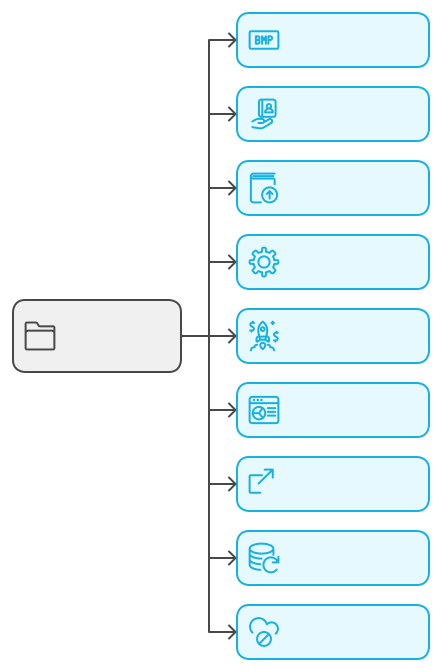

La structure racine du projet est organisée selon les principes de Clean Architecture et DDD, avec une séparation claire des responsabilités :

### 🎨 Assets
- Centralise toutes les ressources statiques
- Inclut les styles, images, fonts, et médias
- Permet une gestion optimisée des assets avec Vite

### 🎯 Contexts
- Implémente les domaines métier isolés
- Suit les principes DDD avec des bounded contexts
- Chaque contexte est autonome et encapsulé

### 📚 Docs
- Contient la documentation technique
- Guides de développement et d'architecture
- Documentation des APIs et interfaces

### ⚙️ Infrastructure
- Services techniques globaux
- Configuration de l'application
- Gestion des connexions externes (API, WebSocket)

### 🚀 Initialization
- Bootstrap de l'application
- Configuration des plugins Vue.js
- Initialisation des services essentiels

### 🎭 Presentation
- Composants UI partagés globalement
- Layouts et vues communes
- Logique de présentation réutilisable

### 🔄 Shared
- Code utilitaire commun
- Types et interfaces partagés
- Composants UI atomiques

### 📦 Store
- Gestion d'état globale avec Pinia
- Actions et mutations partagées
- Configuration des stores

### ⚡ Workers
- Web Workers pour le traitement parallèle
- Service Workers pour le mode offline
- Optimisation des performances

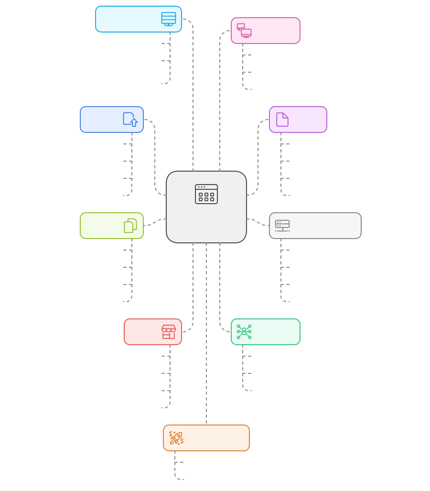

Cette organisation permet de :
- Maintenir une séparation claire des responsabilités
- Faciliter la navigation dans le code
- Améliorer la maintenabilité
- Supporter la scalabilité du projet

## 5. Organisation des Contextes Métiers 🎯

### Structure d'un Contexte
```bash
contexts/{context}/
├── application/         # Couche applicative orchestrant les cas d'utilisation
│   ├── commands/       # Commandes CQRS pour les opérations modifiant l'état
│   │   ├── CreateStoryCommand.ts
│   │   └── UpdateStoryCommand.ts
│   ├── dtos/          # Objets de transfert de données entre les couches
│   │   ├── StoryDTO.ts
│   │   └── StoryResponseDTO.ts
│   ├── ports/         # Interfaces définissant les contrats entre couches
│   │   ├── StoryServicePort.ts
│   │   └── NotificationPort.ts
│   ├── queries/       # Requêtes CQRS pour les opérations de lecture
│   │   ├── GetStoryQuery.ts
│   │   └── ListStoriesQuery.ts
│   ├── services/      # Services applicatifs coordonnant la logique métier
│   │   └── StoryApplicationService.ts
│   ├── use-cases/     # Implémentation des cas d'utilisation métier
│   │   ├── CreateStory/
│   │   │   ├── CreateStoryUseCase.ts
│   │   │   ├── CreateStoryDTO.ts
│   │   │   └── __tests__/
│   │   └── UpdateStory/
│   └── validators/    # Validation des données entrantes et règles métier
│       └── StoryValidator.ts
│
├── domain/           # Cœur métier contenant les règles et invariants
│   ├── entities/     # Entités métier avec identité et cycle de vie
│   │   ├── Story.ts
│   │   ├── StoryAggregate.ts
│   │   └── __tests__/
│   ├── errors/       # Erreurs métier spécifiques au domaine
│   │   └── StoryErrors.ts
│   ├── events/       # Événements domaine pour la communication
│   │   ├── StoryCreated.ts
│   │   └── StoryUpdated.ts
│   ├── factories/    # Création d'entités complexes et agrégats
│   │   └── StoryFactory.ts
│   ├── policies/     # Règles métier et politiques du domaine
│   │   └── StoryPolicies.ts
│   ├── repositories/ # Interfaces d'accès aux données du domaine
│   │   └── StoryRepositoryInterface.ts
│   ├── services/     # Services encapsulant la logique métier complexe
│   │   └── StoryDomainService.ts
│   └── value-objects/# Objets immuables représentant des concepts métier
│       ├── StoryId.ts
│       ├── StoryStatus.ts
│       └── __tests__/
│
├── infrastructure/   # Implémentations techniques et adaptateurs externes
│   ├── adapters/     # Adaptateurs pour services et APIs externes
│   │   └── NotificationAdapter.ts
│   ├── persistence/  # Implémentation de la persistance des données
│   │   ├── entities/
│   │   └── mappers/
│   ├── repositories/ # Implémentation concrète des repositories
│   │   └── StoryRepository.ts
│   └── services/    # Implémentation des services techniques
│       └── StoryInfraService.ts
│
└── presentation/    # Interface utilisateur et interactions
    ├── components/  # Composants UI spécifiques au contexte
    │   ├── StoryCard/
    │   │   ├── StoryCard.vue
    │   │   ├── StoryCard.spec.ts
    │   │   └── useStoryCard.ts
    │   └── StoryList/
    ├── composables/ # Logique réutilisable avec la Composition API
    │   └── useStoryActions.ts
    ├── stores/     # Gestion d'état locale au contexte
    │   └── storyStore.ts
    ├── views/      # Pages et vues du contexte métier
    │   └── StoryBoard.vue
    ├── locales/    # Traductions spécifiques au contexte
    │   ├── en/     # Traductions anglaises
    │   └── fr/     # Traductions françaises
    ├── mixins/     # Mixins Vue.js partagés
    │   └── storyMixins.ts
    └── transitions/# Animations et transitions entre vues
        └── storyTransitions.ts
```

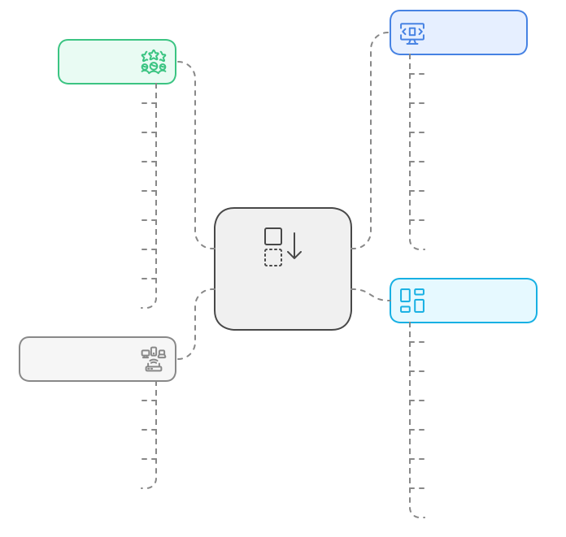

Cette structure de contexte suit les principes de Clean Architecture avec une séparation claire en couches :

### 📦 Application Layer
- Orchestre les cas d'utilisation de l'application
- Implémente le pattern CQRS (Command Query Responsibility Segregation)
- Gère la validation et la transformation des données
- Coordonne les interactions entre les couches

**Composants clés :**
- `commands/` : Opérations modifiant l'état (write)
- `queries/` : Opérations de lecture (read)
- `use-cases/` : Implémentation des cas d'utilisation
- `ports/` : Interfaces pour l'inversion de dépendance

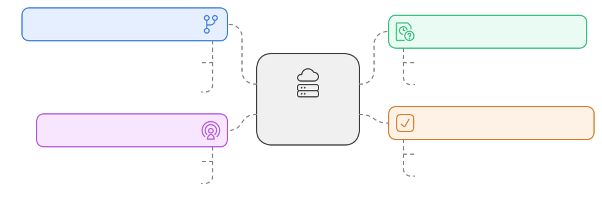

### 🎯 Domain Layer
- Contient la logique métier pure
- Définit les règles et invariants du domaine
- Implémente le DDD tactique
- Reste indépendant des détails techniques

**Éléments essentiels :**
- `entities/` : Objets avec identité et cycle de vie
- `value-objects/` : Objets immuables sans identité
- `events/` : Communication entre agrégats
- `policies/` : Règles métier explicites

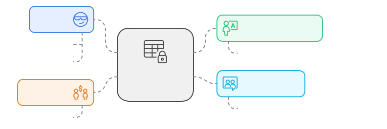

### ⚙️ Infrastructure Layer
- Fournit les implémentations techniques
- Gère la persistance et les services externes
- Implémente les adaptateurs
- Configure les détails techniques

**Composants techniques :**
- `adapters/` : Intégration avec services externes
- `persistence/` : Stockage des données
- `repositories/` : Implémentation du pattern Repository
- `services/` : Services techniques spécifiques

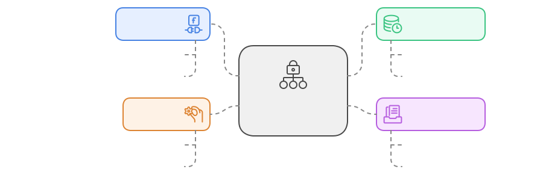

### 🎨 Presentation Layer
- Gère l'interface utilisateur
- Implémente les composants Vue.js
- Gère l'état local et les interactions
- S'occupe de l'internationalisation

**Éléments UI :**
- `components/` : Composants Vue.js réutilisables
- `composables/` : Logique réutilisable (Composition API)
- `stores/` : État local au contexte
- `views/` : Pages et vues principales

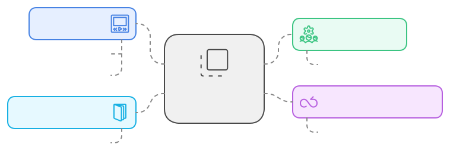

### Avantages de cette Structure
- ✅ Séparation claire des responsabilités
- ✅ Testabilité améliorée
- ✅ Maintenance facilitée
- ✅ Évolutivité du code
- ✅ Réutilisation des composants
- ✅ Isolation des changements

### Principes de Design
1. **Dependency Rule** : Les dépendances pointent vers l'intérieur
2. **Interface Segregation** : Interfaces spécifiques par cas d'usage
3. **Single Responsibility** : Chaque module a une seule raison de changer
4. **Open/Closed** : Ouvert à l'extension, fermé à la modification

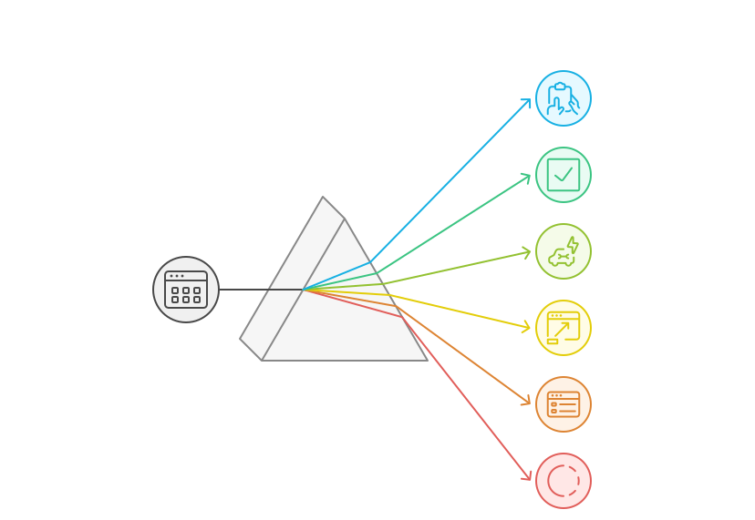

Cette organisation permet de :
- 🎯 Maintenir un code propre et organisé
- 🔄 Faciliter les changements et évolutions
- 📦 Réutiliser les composants efficacement
- 🧪 Tester chaque couche indépendamment

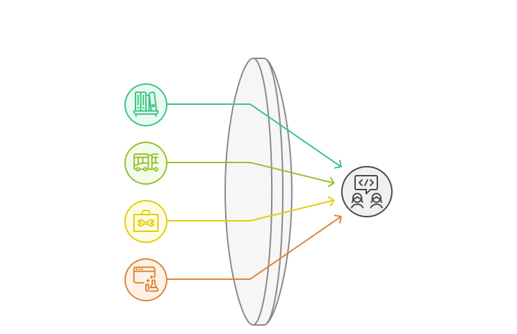


## 6. Code Partagé 🔄

```bash
shared/
├── config/                  # Configuration partagée entre modules
│   ├── constants.ts
│   └── settings.ts
├── constants/              # Constantes et énumérations globales
│   ├── app.constants.ts
│   └── validation.constants.ts
├── core/                   # Classes et interfaces fondamentales
│   ├── base-classes/       # Classes abstraites et modèles de base
│   │   ├── Entity.ts
│   │   ├── ValueObject.ts
│   │   └── AggregateRoot.ts
│   ├── interfaces/        # Interfaces et types fondamentaux
│   │   ├── Repository.interface.ts
│   │   └── Mapper.interface.ts
│   └── types/            # Types TypeScript partagés
│       ├── Result.type.ts
│       └── Either.type.ts
├── decorators/           # Décorateurs TypeScript réutilisables
│   ├── validate.decorator.ts
│   └── log.decorator.ts
├── enums/               # Énumérations et types constants
│   ├── status.enum.ts
│   └── error-codes.enum.ts
├── errors/              # Gestion globale des erreurs
│   ├── AppError.ts
│   └── ValidationError.ts
├── guards/              # Type guards et validations TypeScript
│   ├── isString.guard.ts
│   └── isNumber.guard.ts
├── hooks/              # Hooks réutilisables
│   ├── useValidation.ts
│   └── useLoading.ts
├── mixins/             # Mixins partagés entre composants
│   ├── validationMixin.ts
│   └── loadingMixin.ts
├── ui/                 # Composants UI atomiques et primitifs
│   └── components/     # Système de design modulaire
│       ├── atoms/      # Composants UI les plus basiques
│       │   ├── Button/
│       │   │   ├── Button.vue
│       │   │   └── Button.spec.ts
│       │   └── Input/
│       ├── molecules/  # Composants combinant des atomes
│       │   └── Form/
│       │       ├── Form.vue
│       │       └── Form.spec.ts
│       └── organisms/ # Composants complexes et autonomes
│           └── DataTable/
│               ├── DataTable.vue
│               └── DataTable.spec.ts
├── utils/             # Fonctions utilitaires partagées
│   ├── date.utils.ts
│   ├── string.utils.ts
│   └── validation.utils.ts
└── validators/        # Validateurs et règles de validation
    ├── string.validator.ts
    └── number.validator.ts
```

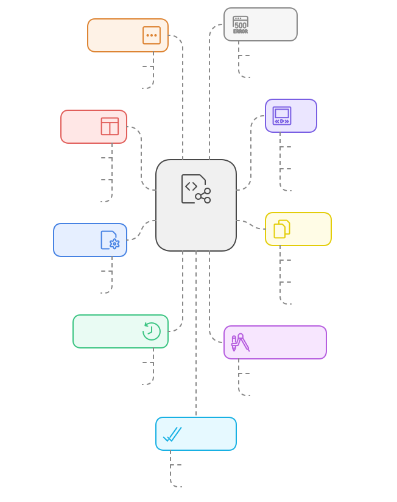

Cette organisation du code partagé suit une architecture modulaire et réutilisable :

### 🛠️ Configuration et Constantes
- **config/** : Configuration partagée entre modules
  - Paramètres globaux de l'application
  - Configuration des services partagés
  - Settings réutilisables

- **constants/** : Constantes et énumérations globales
  - Valeurs constantes de l'application
  - Messages d'erreur standardisés
  - Configurations statiques


### 🏗️ Core
- **base-classes/** : Classes abstraites fondamentales
  - Modèles de base pour les entités
  - Classes abstraites réutilisables
  - Patterns communs

- **interfaces/** : Contrats fondamentaux
  - Interfaces de base pour l'architecture
  - Types génériques réutilisables
  - Contrats techniques communs

- **types/** : Types TypeScript partagés
  - Types utilitaires communs
  - Types de résultats et erreurs
  - Types génériques réutilisables

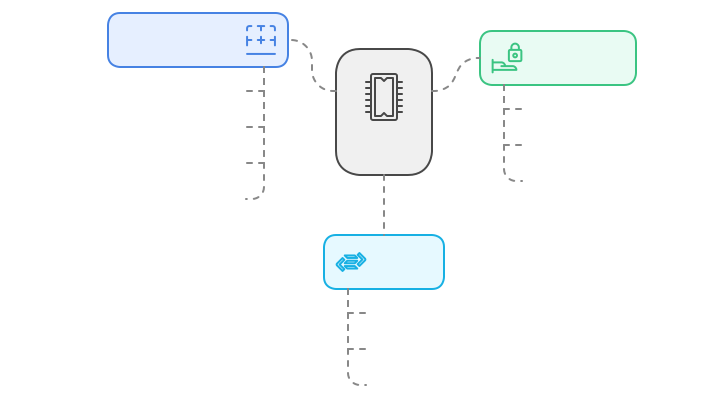

### 🎨 Composants UI
- **atoms/** : Composants atomiques
  - Boutons, inputs, labels
  - Éléments UI de base
  - Composants sans dépendances

- **molecules/** : Composants moléculaires
  - Formulaires, cards, listes
  - Combinaisons d'atomes
  - Patterns UI réutilisables

- **organisms/** : Composants complexes
  - DataTables, modals, wizards
  - Composants autonomes
  - Fonctionnalités complètes

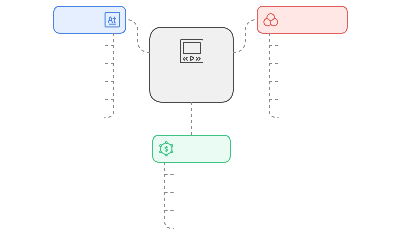

### 🔧 Utilitaires et Validation
- **utils/** : Fonctions utilitaires
  - Manipulation de dates
  - Formatage de strings
  - Fonctions pures réutilisables

- **validators/** : Règles de validation
  - Validateurs de données
  - Règles de validation communes
  - Schémas de validation


### 🎯 Avantages Clés
1. **Réutilisabilité**
   - Code partagé entre contextes
   - Réduction de la duplication
   - Composants génériques

2. **Maintenabilité**
   - Organisation claire
   - Responsabilités définies
   - Documentation intégrée

3. **Testabilité**
   - Tests unitaires facilités
   - Composants isolés
   - Couverture de code optimisée

4. **Performance**
   - Code optimisé
   - Chargement modulaire
   - Bundle splitting efficace

### 📝 Bonnes Pratiques
1. **Nommage**
   - Conventions cohérentes
   - Noms descriptifs
   - Documentation claire

2. **Tests**
   - Tests unitaires pour chaque composant
   - Tests d'intégration
   - Documentation des tests

3. **Documentation**
   - JSDoc pour les fonctions
   - README par module
   - Exemples d'utilisation

4. **Architecture**
   - SOLID principles
   - Clean Code
   - DRY (Don't Repeat Yourself)

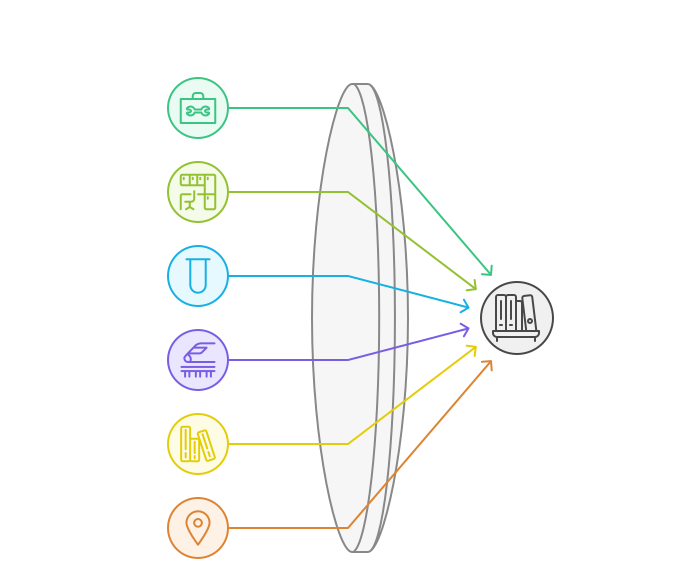

## 7. Infrastructure Globale 🔧

```bash
infrastructure/
├── api/                # Configuration des clients API et intercepteurs
│   ├── client.ts       # Client HTTP principal
│   ├── interceptors/   # Intercepteurs de requêtes/réponses
│   └── endpoints.ts    # Configuration des endpoints
├── cache/             # Stratégies de mise en cache et configuration
│   ├── storage.ts     # Gestion du stockage local
│   └── strategies/    # Stratégies de cache différentes
├── config/            # Configuration globale de l'application
│   ├── app.config.ts  # Configuration principale
│   ├── env.config.ts  # Variables d'environnement
│   └── di.config.ts   # Configuration de l'injection de dépendances
├── events/            # Système d'événements et bus de messages
│   ├── eventBus.ts    # Bus d'événements global
│   └── handlers/      # Gestionnaires d'événements
├── i18n/              # Configuration multilingue et traductions
│   ├── config/        # Configuration du système de traduction
│   │   └── i18n.config.ts
│   └── loaders/       # Chargeurs de traductions dynamiques
│       └── asyncLoader.ts
├── logging/           # Configuration des logs et monitoring
│   ├── logger.ts      # Service de logging
│   └── formatters/    # Formateurs de logs
├── monitoring/        # Télémétrie, métriques et surveillance
│   ├── metrics.ts     # Collecte de métriques
│   └── telemetry.ts   # Configuration télémétrie
├── router/            # Configuration du routage et navigation
│   ├── index.ts       # Configuration principale
│   ├── guards/        # Guards de navigation
│   └── middleware/    # Middleware de routage
├── security/          # Sécurité, authentification et autorisation
│   ├── auth.ts        # Service d'authentification
│   ├── encryption.ts  # Services de cryptage
│   └── guards/        # Guards de sécurité
├── services/          # Services techniques partagés
│   ├── analytics/     # Service d'analytics
│   ├── error/         # Gestion globale des erreurs
│   └── storage/       # Service de stockage
└── websocket/         # Configuration des connexions WebSocket
    ├── client.ts      # Client WebSocket
    └── handlers/      # Gestionnaires de messages
```

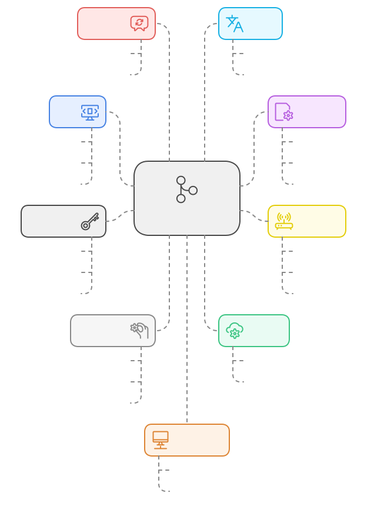

Cette infrastructure technique fournit les fondations de l'application :

### 🌐 API et Communication
- **api/** : Gestion des communications HTTP
  - Client HTTP centralisé
  - Intercepteurs pour les requêtes/réponses
  - Configuration des endpoints

- **websocket/** : Communication temps réel
  - Client WebSocket unifié
  - Gestion des messages en temps réel
  - Reconnexion automatique


### 🔧 Configuration et Services
- **config/** : Configuration globale
  - Variables d'environnement
  - Injection de dépendances
  - Paramètres de l'application

- **services/** : Services techniques
  - Analytics et tracking
  - Gestion des erreurs
  - Stockage persistant


### 🛡️ Sécurité et Cache
- **security/** : Protection de l'application
  - Authentification des utilisateurs
  - Autorisation des actions
  - Cryptage des données sensibles

- **cache/** : Optimisation des performances
  - Stratégies de mise en cache
  - Gestion du stockage local
  - Invalidation intelligente


### 📊 Monitoring et Logs
- **logging/** : Traçabilité
  - Logs structurés
  - Niveaux de log configurables
  - Formatage personnalisé

- **monitoring/** : Surveillance
  - Métriques applicatives
  - Télémétrie
  - Alertes et notifications


### 🌍 Internationalisation et Events
- **i18n/** : Support multilingue
  - Chargement dynamique
  - Gestion des traductions
  - Formatage localisé

- **events/** : Communication interne
  - Bus d'événements global
  - Handlers spécialisés
  - Communication inter-modules


### 🛣️ Routing et Navigation
- **router/** : Gestion des routes
  - Configuration des routes
  - Guards de navigation
  - Middleware personnalisé

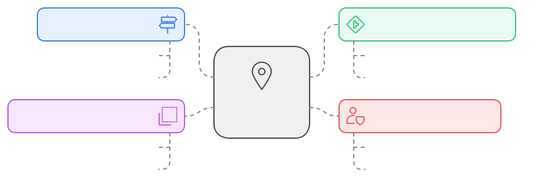

### ✨ Avantages
1. **Modularité**
   - Services indépendants
   - Configuration centralisée
   - Maintenance simplifiée

2. **Sécurité**
   - Protection des données
   - Authentification robuste
   - Logging sécurisé

3. **Performance**
   - Stratégies de cache
   - Optimisation des requêtes
   - Gestion efficace des ressources

4. **Maintenabilité**
   - Organisation claire
   - Services découplés
   - Documentation intégrée

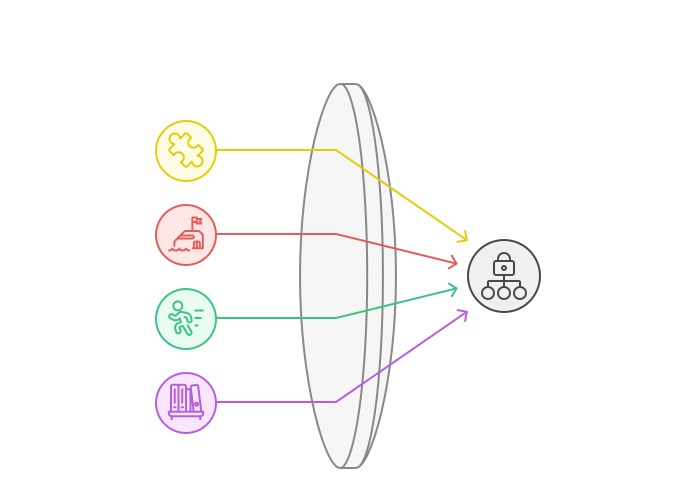

### 🔍 Bonnes Pratiques
1. **Configuration**
   - Variables d'environnement
   - Configuration par environnement
   - Validation des configurations

2. **Sécurité**
   - Authentification JWT
   - HTTPS forcé
   - Protection XSS/CSRF

3. **Performance**
   - Cache intelligent
   - Compression des données
   - Optimisation des requêtes

4. **Monitoring**
   - Logs structurés
   - Métriques temps réel
   - Alertes configurables

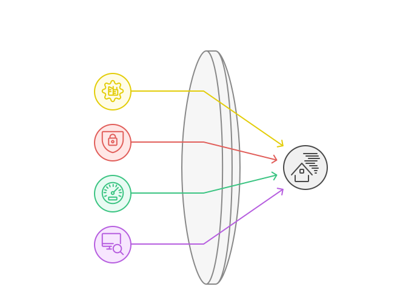

## 8. Assets et Ressources 🎨

```bash
assets/
├── animations/           # Animations Lottie et transitions interactives
│   ├── loading/         # Animations de chargement
│   └── transitions/     # Animations de transition
├── audio/              # Fichiers audio et sons d'interface
│   ├── notifications/  # Sons de notification
│   └── effects/       # Effets sonores
├── fonts/             # Polices personnalisées et variantes
│   ├── inter/         # Famille de police Inter
│   │   ├── Inter-Regular.woff2
│   │   └── Inter-Bold.woff2
│   └── roboto/        # Famille de police Roboto
│       ├── Roboto-Regular.woff2
│       └── Roboto-Bold.woff2
├── icons/             # Icônes SVG et pictogrammes
│   ├── actions/       # Icônes d'action
│   ├── navigation/    # Icônes de navigation
│   └── status/        # Icônes de statut
├── images/           # Images et ressources visuelles
│   ├── backgrounds/  # Images d'arrière-plan
│   ├── logos/        # Logos et marques
│   └── illustrations/ # Illustrations et graphiques
├── styles/           # Styles globaux et configuration
│   └── scss/         # Organisation SCSS
│       ├── base/     # Styles de base
│       │   ├── _reset.scss
│       │   ├── _typography.scss
│       │   └── _variables.scss
│       ├── components/ # Styles des composants
│       │   ├── _buttons.scss
│       │   └── _forms.scss
│       ├── layouts/   # Styles des layouts
│       │   ├── _grid.scss
│       │   └── _containers.scss
│       ├── themes/    # Thèmes et variations
│       │   ├── _light.scss
│       │   └── _dark.scss
│       └── utilities/ # Classes utilitaires
│           ├── _spacing.scss
│           └── _colors.scss
└── video/            # Ressources vidéo et animations
    ├── backgrounds/  # Vidéos d'arrière-plan
    └── tutorials/    # Vidéos tutorielles
```

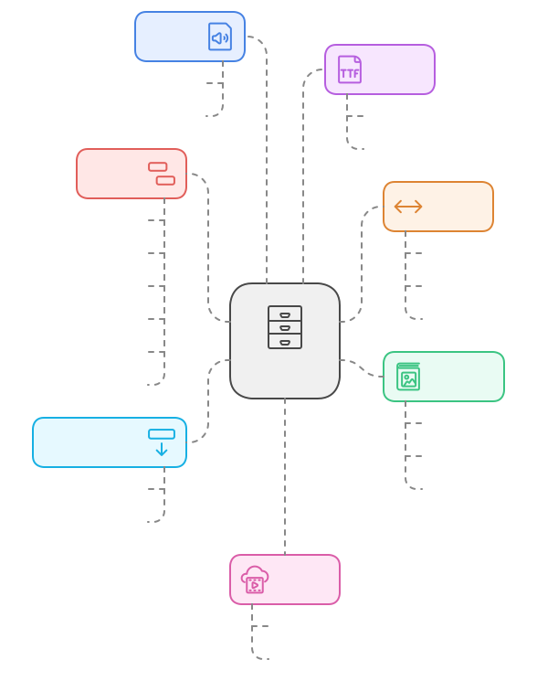

### Organisation et Gestion des Assets 🗂️

#### 1. Animations et Interactivité 🎬
- **animations/**
  - Animations Lottie optimisées
  - Transitions fluides
  - Feedback visuel interactif
  - Indicateurs de chargement

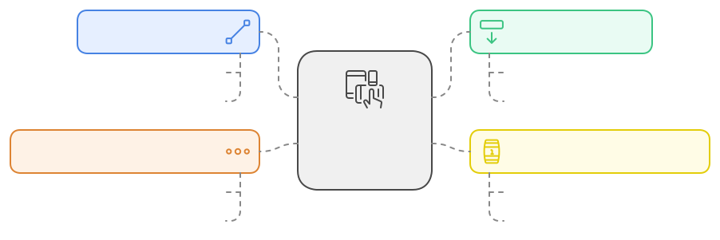

#### 2. Audio et Son 🔊
- **audio/**
  - Sons d'interface cohérents
  - Notifications audio
  - Effets sonores optimisés
  - Feedback utilisateur

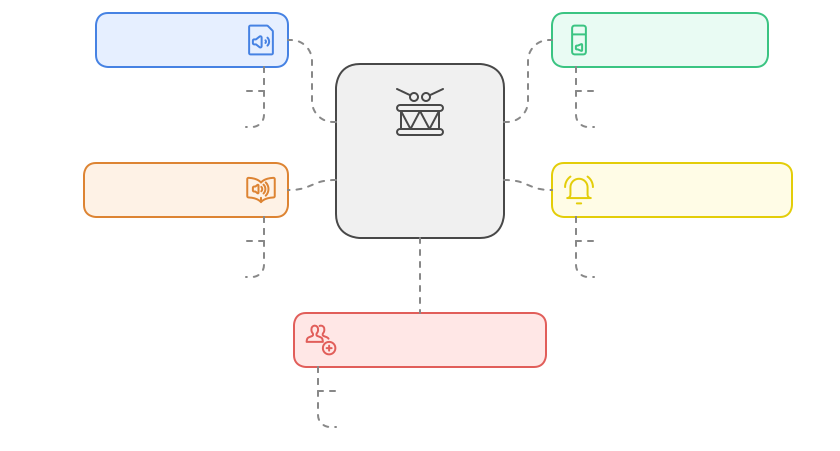

#### 3. Typographie 📝
- **fonts/**
  - Polices web optimisées (woff2)
  - Variantes typographiques
  - Chargement optimisé
  - Support multilingue

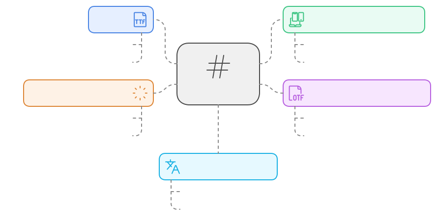

#### 4. Iconographie 🎨
- **icons/**
  - SVG optimisés
  - Sets d'icônes cohérents
  - Organisation par contexte
  - Support du dark mode

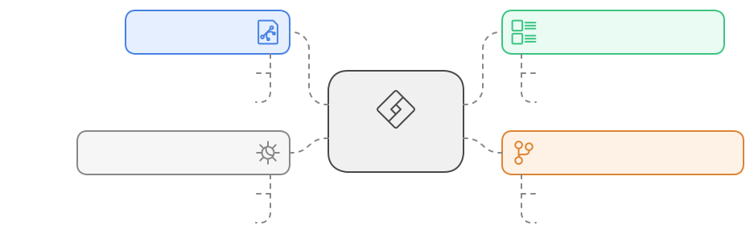

#### 5. Images et Visuels 🖼️
- **images/**
  - Images optimisées (WebP)
  - Versions responsive
  - Lazy loading
  - Placeholders

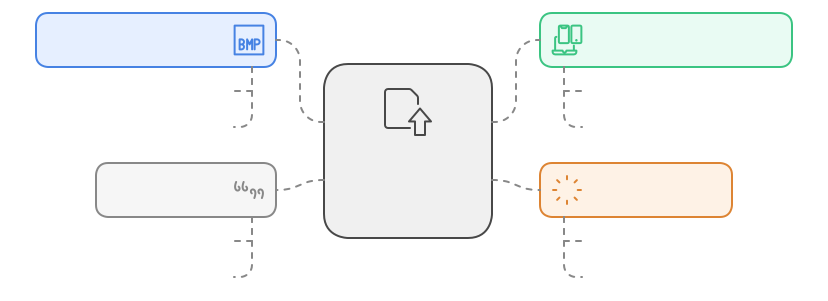

#### 6. Styles et Thèmes 🎭
- **styles/scss/**
  - Architecture SCSS modulaire
  - Variables et mixins
  - Thèmes configurables
  - Utilitaires réutilisables

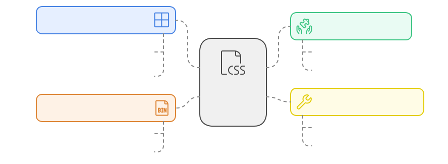

#### 7. Vidéo et Animation 🎥
- **video/**
  - Formats optimisés
  - Versions compressées
  - Chargement adaptatif
  - Fallbacks

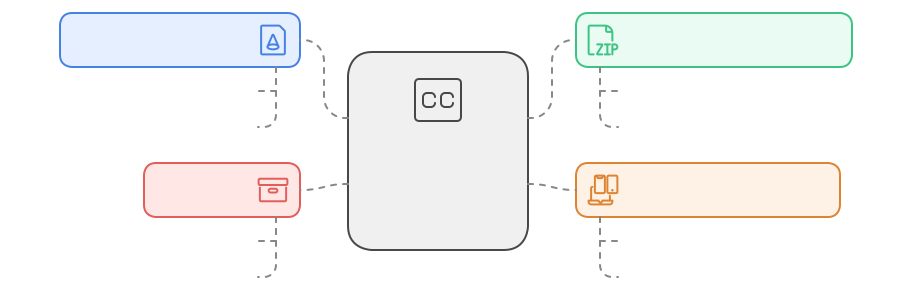

### Bonnes Pratiques 📚

1. **Optimisation**
   - Compression des assets
   - Formats modernes (WebP, AVIF)
   - Lazy loading systématique
   - Bundle splitting

2. **Organisation**
   - Structure claire
   - Nommage cohérent
   - Versionning des assets
   - Documentation des usages

3. **Performance**
   - Préchargement critique
   - Optimisation des tailles
   - Mise en cache efficace
   - CDN pour la distribution

4. **Maintenance**
   - Sources originales préservées
   - Processus d'optimisation documenté
   - Guidelines de contribution
   - Revue régulière des assets

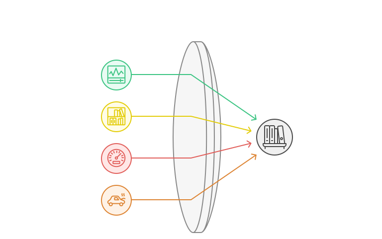

### Avantages ✨

- 🚀 Performance optimisée
- 🎨 Cohérence visuelle
- 📱 Support responsive
- 🌓 Thèmes dynamiques
- ♿ Accessibilité améliorée
- 🔄 Maintenance simplifiée

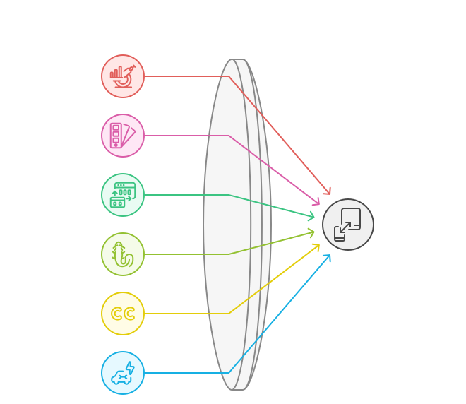

## 9. Conventions de Nommage 📝

### Fichiers
```typescript
// Entités (PascalCase)
Story.ts
StoryAggregate.ts

// Value Objects (PascalCase + ValueObject)
StoryIdValueObject.ts
StoryStatusValueObject.ts

// Use Cases (PascalCase + UseCase)
CreateStoryUseCase.ts
UpdateStoryUseCase.ts

// DTOs (PascalCase + DTO)
CreateStoryDTO.ts
UpdateStoryRequestDTO.ts

// Composants Vue (PascalCase.vue)
StoryCard.vue
StoryList.vue

// Composables (camelCase + use)
useStoryActions.ts
useStoryValidation.ts

// Stores (camelCase + Store)
storyStore.ts
userStore.ts

// Tests (*.spec.ts ou *.test.ts)
Story.spec.ts
CreateStoryUseCase.test.ts
```

### Dossiers
```bash
# Contextes (kebab-case)
user-management/
story-mapping/

# Couches (kebab-case)
value-objects/
use-cases/

# Tests (kebab-case)
__tests__/
__mocks__/
```
## 10. Organisation des Tests 🧪

```bash
contexts/story/
├── domain/
│   └── __tests__/          # Tests unitaires domaine
│       ├── entities/
│       └── value-objects/
├── application/
│   └── __tests__/          # Tests unitaires application
│       └── use-cases/
├── infrastructure/
│   └── __tests__/          # Tests d'intégration
│       └── repositories/
└── presentation/
    └── __tests__/          # Tests de composants
        └── components/
```

## 11. Bonnes Pratiques 🎯

### 1. Organisation des Imports
```typescript
// 1. Imports externes
import { ref, computed } from "vue";
import { defineStore } from "pinia";

// 2. Imports du domaine
import { Story } from "@domain/story/entities/Story";
import { StoryId } from "@domain/story/value-objects/StoryId";

// 3. Imports de l'application
import { CreateStoryUseCase } from "@application/story/use-cases/CreateStoryUseCase";

// 4. Imports de l'infrastructure
import { StoryRepository } from "@infrastructure/story/repositories/StoryRepository";

// 5. Imports partagés
import { Result } from "@shared/core/Result";
```

### 2. Co-location des Tests
```typescript
// src/contexts/story/domain/entities/Story.ts
export class Story {
  // Implémentation...
}

// src/contexts/story/domain/entities/__tests__/Story.spec.ts
describe('Story', () => {
  // Tests...
});
```

### 3. Barrel Files
```typescript
// src/contexts/story/domain/index.ts
export * from './entities/Story';
export * from './value-objects/StoryId';
export * from './repositories/StoryRepositoryInterface';
```

## 12. Documentation 📚

### README par Contexte
```markdown
# Contexte Story

## Description
Gestion des stories utilisateur dans le système.

## Structure
- `domain/`: Logique métier
- `application/`: Cas d'utilisation
- `infrastructure/`: Implémentation technique
- `presentation/`: Interface utilisateur

## Utilisation
...
```

### Documentation des Interfaces
```typescript
/**
 * Interface de repository pour les stories
 * @interface StoryRepositoryInterface
 */
export interface StoryRepositoryInterface {
  /**
   * Trouve une story par son ID
   * @param id - L'ID de la story
   * @returns Promise<Result<Story>> - La story trouvée
   */
  findById(id: StoryId): Promise<Result<Story>>;
}
```

## 13. Anti-patterns à Éviter ❌

1. **Dépendances Circulaires**
   - Éviter les imports circulaires entre modules
   - Utiliser des interfaces pour découpler

2. **God Objects**
   - Éviter les classes/composants trop gros
   - Respecter le principe de responsabilité unique

3. **Couplage Fort**
   - Éviter les dépendances directes entre contextes
   - Utiliser des événements ou des interfaces

4. **Duplication de Code**
   - Extraire le code commun dans shared
   - Utiliser l'héritage ou la composition

